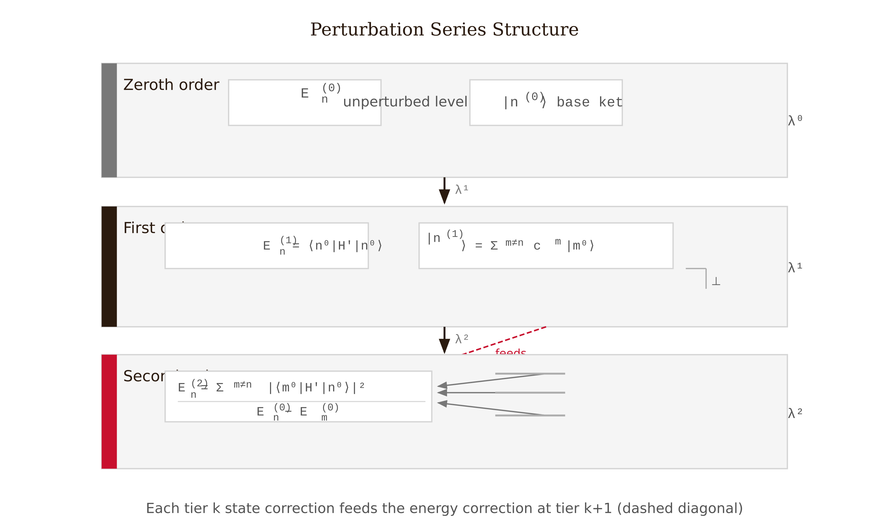
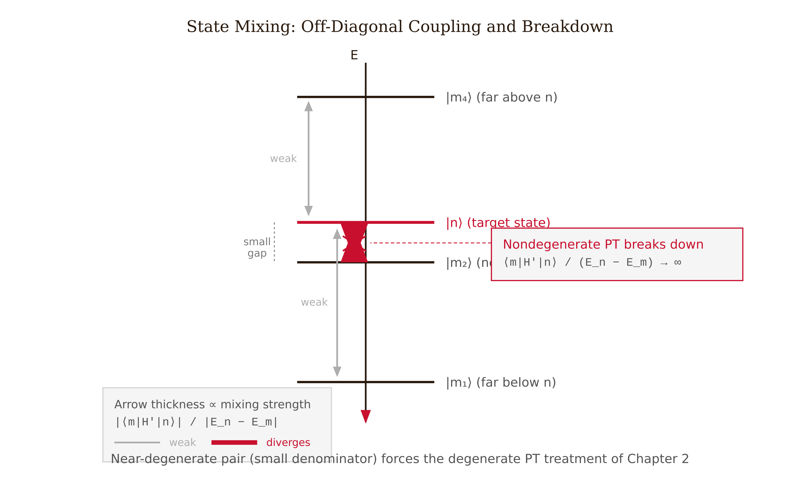
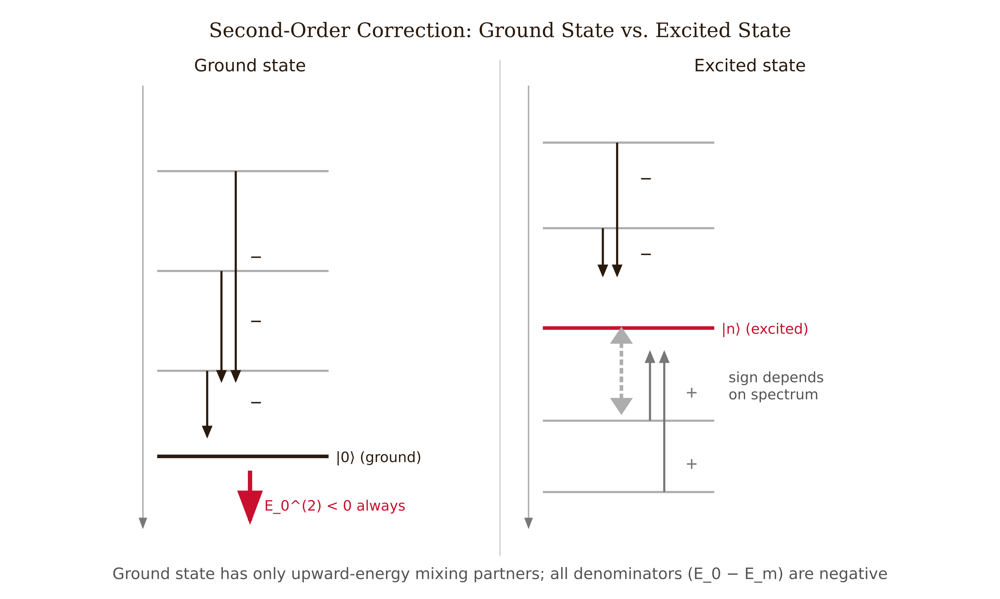
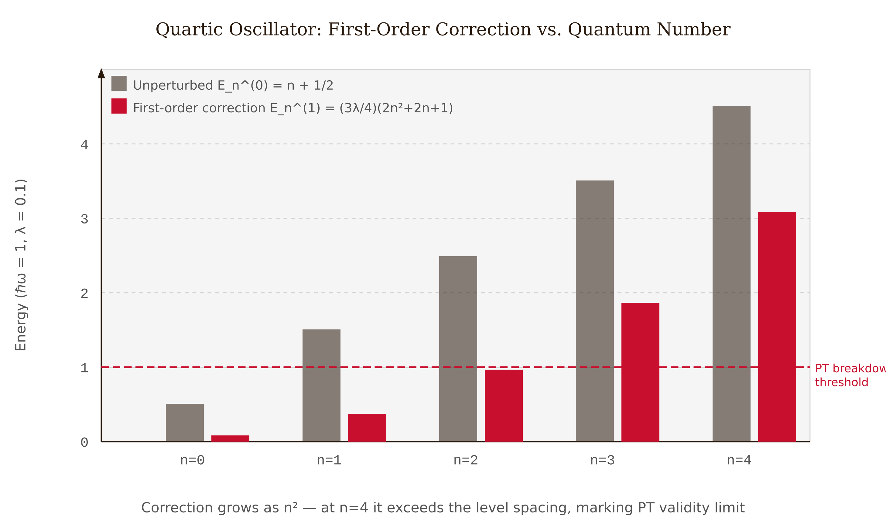
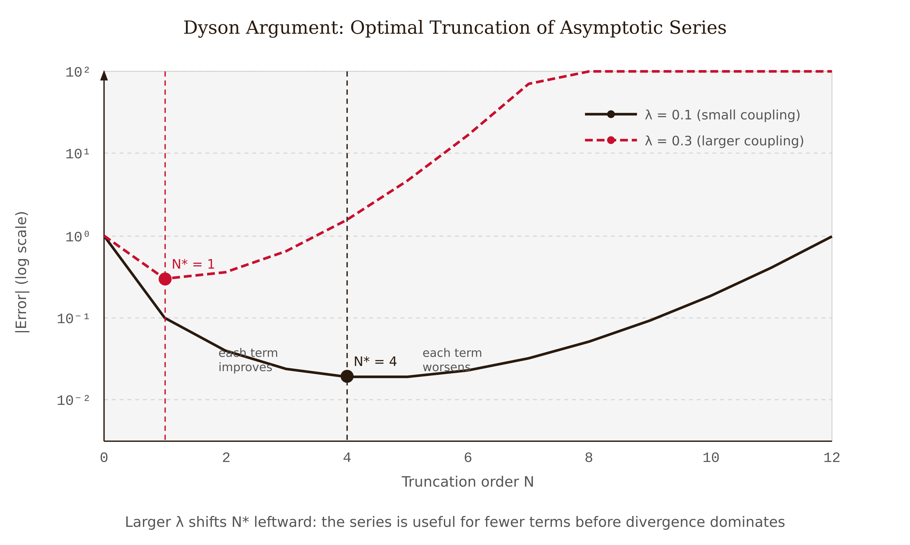

# Chapter 1 — Time-Independent Perturbation Theory

Most real quantum systems cannot be solved exactly. Helium has two electrons interacting through a Coulomb repulsion that cannot be separated; the ammonia molecule has a potential energy surface with no closed-form eigenstates; an electron in a doped semiconductor sits in a complicated crystal field. Yet physicists calculate energy levels for all of these systems, often to high precision. The method that makes this possible is perturbation theory.

Perturbation theory works when the Hamiltonian of interest is close to a Hamiltonian we can solve exactly. We identify the solvable part, treat the difference as a small correction, and expand the energies and states in powers of a small parameter $\lambda$. The zeroth-order term is the known answer; each higher-order term adds a correction. This chapter develops the non-degenerate case, where no two unperturbed energy levels coincide.

---

## The Setup

We begin with a Hamiltonian $\hat{H}_0$ whose eigenstates $|n^{(0)}\rangle$ and eigenvalues $E_n^{(0)}$ are known exactly. The physical Hamiltonian is:

$$\hat{H} = \hat{H}_0 + \lambda\hat{H}',$$

where $\hat{H}'$ is the perturbation and $\lambda$ is a dimensionless small parameter. When $\lambda = 0$ we recover the solvable problem; when $\lambda = 1$ we have the physical Hamiltonian. We can imagine $\lambda$ as a dial that we slowly turn from zero.

We expand both the energy and the state as power series in $\lambda$:

$$E_n = E_n^{(0)} + \lambda E_n^{(1)} + \lambda^2 E_n^{(2)} + \cdots, \qquad |n\rangle = |n^{(0)}\rangle + \lambda|n^{(1)}\rangle + \lambda^2|n^{(2)}\rangle + \cdots$$

Substituting into $\hat{H}|n\rangle = E_n|n\rangle$ and collecting terms at each power of $\lambda$ generates a sequence of equations, one for each order. We adopt the normalization convention $\langle n^{(0)}|n^{(k)}\rangle = 0$ for all $k \geq 1$: the correction kets are orthogonal to the zeroth-order state.

*Figure 1.1 — Perturbation series structure: the three-tier hierarchy showing how the state at order k feeds the energy at order k+1, with the normalization constraint at first order.*

---

## First-Order Energy Correction

At order $\lambda^1$ the Schrödinger equation gives:

$$\hat{H}_0|n^{(1)}\rangle + \hat{H}'|n^{(0)}\rangle = E_n^{(0)}|n^{(1)}\rangle + E_n^{(1)}|n^{(0)}\rangle.$$

We take the inner product with $\langle n^{(0)}|$. The term $\langle n^{(0)}|\hat{H}_0|n^{(1)}\rangle = E_n^{(0)}\langle n^{(0)}|n^{(1)}\rangle = 0$ by the normalization convention and Hermiticity of $\hat{H}_0$. The $E_n^{(0)}\langle n^{(0)}|n^{(1)}\rangle$ term on the right also vanishes. What remains is:

$$\boxed{E_n^{(1)} = \langle n^{(0)}|\hat{H}'|n^{(0)}\rangle.}$$

The first-order energy shift is the expectation value of the perturbation in the unperturbed state. No sum over states, no diagonalization — just one matrix element. If we can evaluate that integral, we have the leading correction.

---

## First-Order State Correction

To find the corrected state, we take the inner product of the first-order equation with $\langle m^{(0)}|$ for $m \neq n$. Since $\langle m^{(0)}|\hat{H}_0 = E_m^{(0)}\langle m^{(0)}|$:

$$(E_m^{(0)} - E_n^{(0)})\langle m^{(0)}|n^{(1)}\rangle + \langle m^{(0)}|\hat{H}'|n^{(0)}\rangle = 0.$$

Inserting completeness:

$$\boxed{|n^{(1)}\rangle = \sum_{m \neq n}\frac{\langle m^{(0)}|\hat{H}'|n^{(0)}\rangle}{E_n^{(0)} - E_m^{(0)}}\,|m^{(0)}\rangle.}$$

The perturbation mixes unperturbed states together. The amount of mixing between $|m\rangle$ and $|n\rangle$ depends on two things: how strongly the perturbation connects them (the numerator) and how far apart they are in energy (the denominator). States with a small energy gap mix the most.

*Figure 1.2 — State mixing mechanism: arrow thickness encodes mixing amplitude, with distant levels mixing weakly and the near-degenerate pair signaling the divergence that demands the degenerate treatment of Chapter 2.*

Note the denominator: when $E_m^{(0)} \to E_n^{(0)}$, the formula diverges. This does not mean perturbation theory itself has failed; it means the basis choice within the nearly-degenerate subspace was wrong. The resolution — choosing the correct basis before expanding — is degenerate perturbation theory, the subject of Chapter 2.

---

## Second-Order Energy Correction

Using the first-order state correction, the second-order energy correction is:

$$\boxed{E_n^{(2)} = \sum_{m \neq n}\frac{|\langle m^{(0)}|\hat{H}'|n^{(0)}\rangle|^2}{E_n^{(0)} - E_m^{(0)}}.}$$

The numerator is a squared absolute value and is always non-negative. The denominator changes sign depending on whether state $m$ lies above or below state $n$ in energy. For the **ground state**, every other state sits above it, so every denominator is negative, every term is negative, and therefore:

> **The second-order correction to the ground-state energy is always negative, for any perturbation whatsoever.**

*Figure 1.4 — Second-order sign structure: the ground state receives only negative contributions (all levels above), while excited states receive mixed contributions whose net sign is not guaranteed.*

This result holds regardless of the specific form of the perturbation. Whatever we add to the ground-state Hamiltonian — a quartic potential, an electric field, a magnetic field — the second-order correction pushes the ground-state energy down.

It is also worth noting the staggered relationship between energy and state corrections: the energy at order $k$ requires only the state at order $k-1$. The first-order energy requires only the zeroth-order state; the second-order energy requires the first-order state.

---

## Worked Example — The Quartic Oscillator

We add a quartic term to the harmonic oscillator:

$$\hat{H} = \underbrace{\frac{\hat{p}^2}{2m} + \tfrac{1}{2}m\omega^2\hat{x}^2}_{\hat{H}_0} + \lambda\hat{x}^4.$$

The unperturbed problem has $E_n^{(0)} = \hbar\omega(n + \tfrac{1}{2})$ and the ladder-operator algebra. The perturbation is $\hat{H}' = \hat{x}^4$.

**First-order correction.** We express $\hat{x}$ in terms of raising and lowering operators:

$$\hat{x} = \sqrt{\frac{\hbar}{2m\omega}}(\hat{a}_+ + \hat{a}_-), \qquad \hat{x}^4 = \left(\frac{\hbar}{2m\omega}\right)^2(\hat{a}_+ + \hat{a}_-)^4.$$

Expanding $(\hat{a}_+ + \hat{a}_-)^4$ gives 16 terms. When we evaluate the expectation value $\langle n|\cdot|n\rangle$, only terms that return to the same level survive — those that apply equal numbers of raising and lowering operators. A systematic count (normal-ordering or direct bookkeeping) gives:

$$\langle n|\hat{x}^4|n\rangle = \left(\frac{\hbar}{2m\omega}\right)^2(6n^2 + 6n + 3).$$

In natural units ($\hbar = m = \omega = 1$):

$$E_n^{(1)} = \frac{3\lambda}{4}(2n^2 + 2n + 1).$$

For the ground state ($n = 0$): $E_0^{(1)} = 3\lambda/4$. For $n = 4$: $E_4^{(1)} = 30.75\lambda$ — an order of magnitude larger at the same $\lambda$. The correction grows as $n^2$, so perturbation theory is less reliable for highly excited states, whose wave functions extend further and sample the $\hat{x}^4$ term more strongly.

*Figure 1.3 — Quartic oscillator energy corrections: the first-order correction grows as n², so the perturbative expansion loses control at lower coupling for higher quantum numbers.*

**When does it break?** A useful diagnostic is the ratio $|E_n^{(1)}|/\hbar\omega$. When this ratio approaches 1, the first-order correction has become comparable to the level spacing and the expansion is no longer controlled. For $n = 0$ in natural units, this occurs around $\lambda \sim 0.3$–$0.4$; for $n = 4$ it happens around $\lambda \sim 0.05$–$0.10$. The second-order correction is negative for the ground state (as the theorem requires), and its magnitude provides a sharper breakdown diagnostic: when $|E_n^{(2)}|$ becomes comparable to $|E_{n+1}^{(0)} - E_n^{(0)}|$, the expansion is unreliable.

---

## When Perturbation Theory Breaks: The Dyson Argument

The perturbative expansion raises an important question about convergence.

Consider the quartic oscillator at negative $\lambda$. The perturbation $\lambda\hat{x}^4$ is now negative, making the potential $V(x) = \tfrac{1}{2}m\omega^2 x^2 + \lambda x^4$ go to $-\infty$ as $|x| \to \infty$. For any $\lambda < 0$, however small, there is no bound ground state — the particle can escape to $x \to \infty$ and gain infinite energy. The system is unstable.

This means the energy $E_0(\lambda)$, viewed as a function of the complex variable $\lambda$, has a singularity on the negative real axis. Any Taylor series in $\lambda$ about zero has a radius of convergence that cannot reach that singularity. Therefore the radius of convergence is zero. The series diverges for every nonzero $\lambda$.

Freeman Dyson made this argument in 1952 for quantum electrodynamics: flip the sign of the fine-structure constant $\alpha$, electrons repel each other, the QED vacuum destabilizes, the energy is non-analytic at $\alpha = 0$, and the perturbation series has zero radius of convergence. Bender and Wu confirmed it numerically for the quartic oscillator in 1969: the series coefficients grow as $k!$, ensuring divergence for every nonzero $\lambda$. [verify]

**And yet the series is useful.** Truncating at the optimal order — the term where the partial-sum error is minimized before the factorial growth takes over — gives a result that is exponentially close to the true energy. The error at optimal truncation is of order $e^{-\text{const}/\lambda}$: exponentially small, invisible to any finite-order expansion.

Two practical conclusions follow. First, the fact that successive terms keep decreasing does not guarantee convergence — they can decrease for many orders before turning around. Optimal truncation, not convergence, is the appropriate criterion. Second, the near-degeneracy problem is more dangerous in practice than the divergence problem: a small denominator $E_n^{(0)} - E_m^{(0)}$ can make the second-order term large even at tiny $\lambda$. We should always check $|\langle m|\hat{H}'|n\rangle|/|E_n^{(0)} - E_m^{(0)}|$ before trusting first-order results.

*Figure 1.5 — Optimal truncation of a divergent asymptotic series: the error decreases to a minimum at N* before factorial growth takes over, and larger coupling shifts N* to lower order.*

---

## References

- Griffiths, D.J. and Schroeter, D.F. (2018). *Introduction to Quantum Mechanics*, 3rd ed. Cambridge University Press. §7.1–7.2. [verify]
- Townsend, J.S. (2012). *A Modern Approach to Quantum Mechanics*, 2nd ed. University Science Books. Ch. 11. [verify]
- Bender, C.M. and Wu, T.T. (1969). "Anharmonic oscillator." *Physical Review*, 184(5), 1231–1260. https://doi.org/10.1103/PhysRev.184.1231 [verify]
- Dyson, F.J. (1952). "Divergence of perturbation theory in quantum electrodynamics." *Physical Review*, 85(4), 631–632. https://doi.org/10.1103/PhysRev.85.631 [verify]

