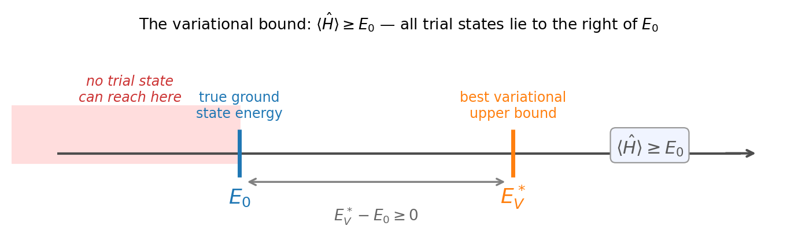
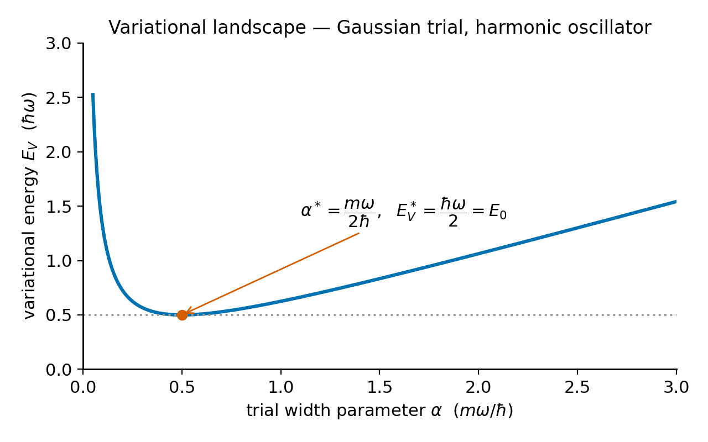
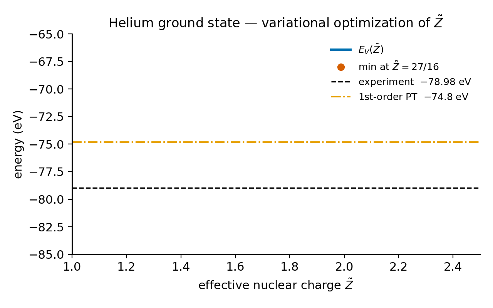
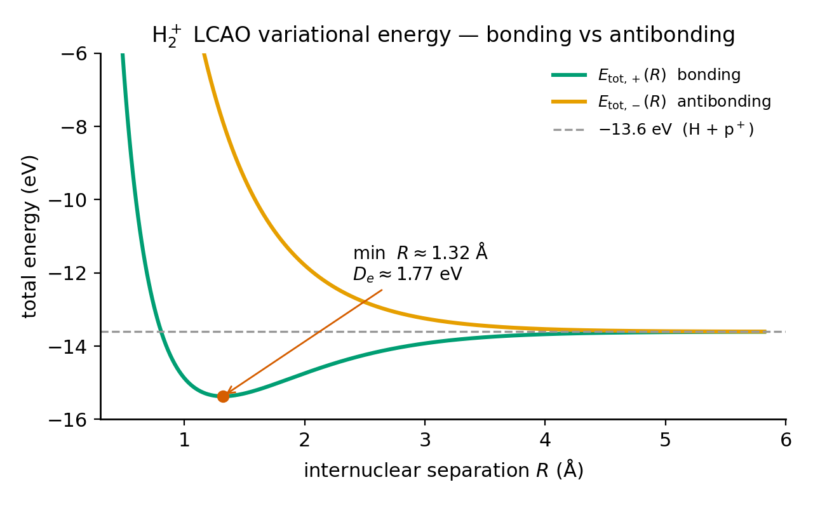
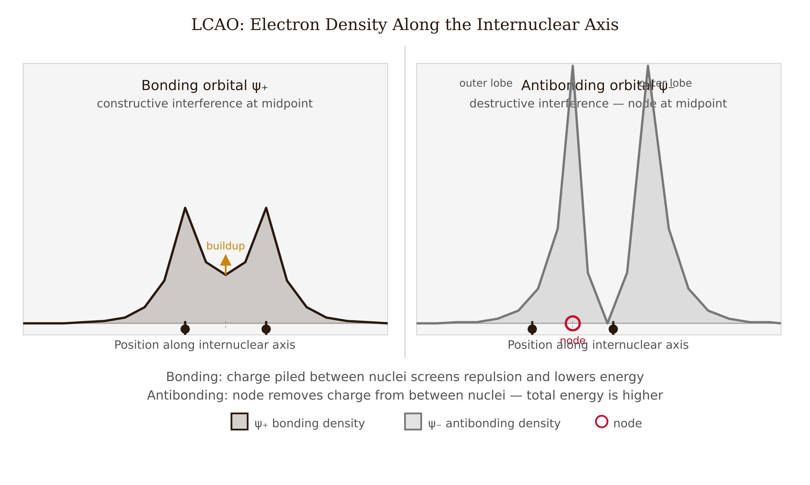
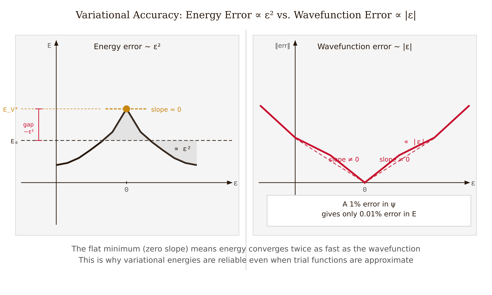

# Chapter 3 — The Variational Principle

In 1929, Egil Hylleraas was working in Copenhagen on the ground-state energy of helium. Helium has two electrons whose mutual repulsion makes the Schrödinger equation unseparable. No closed-form solution existed.

Hylleraas wrote down a trial wave function with the correct symmetry and the right qualitative physics — each electron near the nucleus, with an adjustment for the other's presence — and computed the expectation value of the full Hamiltonian. He knew this was not the exact ground state. A theorem guaranteed, however, that any normalized trial state has an energy expectation value at or above the true ground-state energy. Minimizing over a family of trial states gives a guaranteed upper bound.

With a single variational parameter, Hylleraas obtained $-77.5$ eV. Experiment gave $-78.98$ eV, an error of about 2% — and he knew with certainty that he was wrong in the right direction. With six parameters he reached $-78.7$ eV. With dozens of terms depending explicitly on the inter-electron distance, subsequent workers pushed agreement to eleven significant figures. Every result remained an upper bound. The theorem held throughout.

This is the variational principle. It underlies a large fraction of quantum mechanics and quantum chemistry.

---

## The Theorem and Its Proof

Let $\hat{H}$ have a discrete spectrum with eigenvalues $E_0 \leq E_1 \leq E_2 \leq \cdots$ and eigenstates $|n\rangle$. For any normalized state $|\psi\rangle$:

$$\boxed{\langle\psi|\hat{H}|\psi\rangle \geq E_0.}$$

The proof is three lines. We expand $|\psi\rangle$ in the exact eigenbasis: $|\psi\rangle = \sum_n c_n|n\rangle$. Normalization gives $\sum_n|c_n|^2 = 1$. Then:

$$\langle\hat{H}\rangle = \sum_n|c_n|^2 E_n \geq E_0\sum_n|c_n|^2 = E_0.$$

The inequality holds because every $E_n \geq E_0$. Equality holds if and only if $c_n = 0$ for every $n > 0$, meaning $|\psi\rangle = e^{i\phi}|0\rangle$ — the trial state is the exact ground state up to a global phase.

Several important properties follow from this proof.

The method cannot go below. There is no normalized state with $\langle\hat{H}\rangle < E_0$. If we minimize over a trial family and obtain a result below the known exact energy, we have made an error — possibly a normalization mistake or a sign in the kinetic energy. The theorem serves as a sanity check.

Lower means a tighter bound. Within a fixed trial family, a lower variational energy is a tighter upper bound. The goal is to push the bound down. However, a tight energy does not automatically mean an accurate wave function — this point is important and we return to it.

No small parameter is needed. Perturbation theory requires $\lambda\hat{H}'$ to be small. The variational method requires only that we can compute $\langle\hat{H}\rangle$. For systems with no obvious small parameter — helium, most molecules — the variational approach is the natural tool.

<!-- → [DIAGRAM: number line showing E_0 at left, E_V^* somewhere to the right, and the region "no trial state can reach" extending left of E_0 — illustrating the one-sided nature of the bound] -->

*Figure 3.1 — number line showing E_0 at left, E_V^* somewhere to the right, and the region "no trial state can reach" extending left of E_0 —…*

---

## The Optimization Procedure

We choose a trial function $\psi(\mathbf{r};\alpha)$ depending on one or more variational parameters $\alpha = (\alpha_1, \alpha_2, \ldots)$ and define the variational energy:

$$E_V(\alpha) = \frac{\langle\psi(\alpha)|\hat{H}|\psi(\alpha)\rangle}{\langle\psi(\alpha)|\psi(\alpha)\rangle}.$$

The denominator handles trial functions that are not normalized for every $\alpha$. We minimize $E_V$ by setting $\partial E_V/\partial\alpha_i = 0$ for each $i$ and solving. The minimum $E_V^* = \min_\alpha E_V(\alpha)$ is the best upper bound achievable within this trial family.

**A first example: the harmonic oscillator.** We take $\psi(x;\alpha) = Ae^{-\alpha x^2}$, normalized with $A = (2\alpha/\pi)^{1/4}$. The expectation values are:

$$\langle\hat{T}\rangle = \frac{\hbar^2\alpha}{2m}, \qquad \langle\hat{V}\rangle = \frac{m\omega^2}{8\alpha}.$$

So $E_V(\alpha) = \hbar^2\alpha/(2m) + m\omega^2/(8\alpha)$. Setting $\partial E_V/\partial\alpha = 0$ gives $\alpha^* = m\omega/(2\hbar)$. Substituting back: $E_V^* = \hbar\omega/2 = E_0$.

The trial function gives the exact ground-state energy because the true ground state of the harmonic oscillator is itself a Gaussian. The trial family contains the exact answer. When this happens, the variational method finds it exactly. It does not always happen.

<!-- → [CHART: E_V(α) as a parabola-like curve for the harmonic oscillator, minimum marked at α* with E_V* = ℏω/2, the curve labeled to show it approaches ∞ on both ends — illustrating the optimization landscape] -->

*Figure 3.2 — E_V(α) as a parabola-like curve for the harmonic oscillator, minimum marked at α* with E_V* = ℏω/2, the curve labeled to show it approaches…*

---

## The Rayleigh–Ritz Method

When the trial function is a linear combination of $N$ basis functions — $|\psi\rangle = \sum_{j=1}^N c_j|\phi_j\rangle$ — optimizing over the coefficients $\{c_j\}$ reduces to a linear algebra problem. Setting $\partial E_V/\partial c_i^* = 0$ gives:

$$\mathbf{H}\mathbf{c} = E_V\,\mathbf{S}\mathbf{c},$$

where $H_{ij} = \langle\phi_i|\hat{H}|\phi_j\rangle$ is the Hamiltonian matrix and $S_{ij} = \langle\phi_i|\phi_j\rangle$ is the overlap matrix. This is the **generalized eigenvalue problem**. When the basis is orthonormal ($\mathbf{S} = \mathbf{I}$) it reduces to the ordinary eigenvalue problem.

The lowest eigenvalue is the best upper bound on $E_0$ achievable in the $N$-dimensional trial space. As $N \to \infty$ and the basis becomes complete, the lowest eigenvalue converges to $E_0$ from above. This is the foundation of computational quantum chemistry: Hartree–Fock minimizes the energy over all possible single Slater determinants; configuration interaction adds more determinants; at the limit of a complete basis, the exact energy is recovered. Each step is an application of the same theorem.

**An illustrative numerical example.** For the hydrogen atom, the exact ground state has energy $-0.5$ Hartree. Using four Gaussian basis functions $\chi_p(r) = e^{-\alpha_p r^2}$ with appropriately chosen exponents, the generalized eigenvalue problem gives $E_V = -0.4993$ Hartree — an error of only 0.14%. No differential equation was solved. The Hamiltonian matrix elements were integrals over Gaussians, computable analytically. Scale this to hundreds of basis functions and you have modern quantum chemistry.

---

## Helium: A Worked Calculation

Helium has nuclear charge $Z = 2$ and two electrons at positions $\mathbf{r}_1$ and $\mathbf{r}_2$. The Hamiltonian is:

$$\hat{H} = \frac{\hat{p}_1^2}{2m} + \frac{\hat{p}_2^2}{2m} - \frac{Ze^2}{4\pi\epsilon_0 r_1} - \frac{Ze^2}{4\pi\epsilon_0 r_2} + \frac{e^2}{4\pi\epsilon_0|\mathbf{r}_1 - \mathbf{r}_2|}.$$

The last term — electron-electron repulsion — makes the equation unseparable.

**The trial function.** We place each electron in a hydrogen-like 1s orbital with an adjustable effective nuclear charge $\tilde{Z}$ instead of the bare $Z = 2$:

$$\psi(\mathbf{r}_1,\mathbf{r}_2;\tilde{Z}) = \frac{\tilde{Z}^3}{\pi a_0^3}\,e^{-\tilde{Z}(r_1+r_2)/a_0}.$$

The single parameter $\tilde{Z}$ encodes screening: each electron partially shielding the nucleus from the other. If $\tilde{Z} < Z$, each electron "sees" less than the full nuclear charge because the other electron sits, on average, between them.

**The trick: rewrite the Hamiltonian.** We add and subtract $\tilde{Z}e^2/(4\pi\epsilon_0 r)$ for each electron:

$$\hat{H} = \underbrace{\left[\frac{\hat{p}_1^2}{2m} - \frac{\tilde{Z}e^2}{4\pi\epsilon_0 r_1}\right]}_{\hat{H}_1(\tilde{Z})} + \underbrace{\left[\frac{\hat{p}_2^2}{2m} - \frac{\tilde{Z}e^2}{4\pi\epsilon_0 r_2}\right]}_{\hat{H}_2(\tilde{Z})} + \frac{(\tilde{Z}-Z)e^2}{4\pi\epsilon_0}\left(\frac{1}{r_1} + \frac{1}{r_2}\right) + \frac{e^2}{4\pi\epsilon_0|\mathbf{r}_1-\mathbf{r}_2|}.$$

The trial state is the exact eigenstate of $\hat{H}_1(\tilde{Z}) + \hat{H}_2(\tilde{Z})$ with eigenvalue $2E_1(\tilde{Z}) = -\tilde{Z}^2/2\times 2$ Hartree. Computing $\langle\hat{H}\rangle$ then requires two additional integrals: the expectation of $1/r$ in a hydrogen-like 1s state, which is $\langle 1/r\rangle = \tilde{Z}/a_0$, and the electron-electron repulsion integral, which evaluates to $5\tilde{Z}/(8a_0)$ after expanding $1/|\mathbf{r}_1 - \mathbf{r}_2|$ in Legendre polynomials. The full variational energy in atomic units is:

$$E_V(\tilde{Z}) = \tilde{Z}^2 - 2Z\tilde{Z} + \frac{5}{8}\tilde{Z} \quad\text{(in Hartree)}.$$

**Minimize.** Setting $\partial E_V/\partial\tilde{Z} = 0$:

$$2\tilde{Z} - 2Z + \frac{5}{8} = 0 \quad\Longrightarrow\quad \tilde{Z}^* = Z - \frac{5}{16}.$$

For helium with $Z = 2$:

$$\boxed{\tilde{Z}^* = 2 - \frac{5}{16} = \frac{27}{16} \approx 1.6875.}$$

<!-- → [CHART: E_V(Z̃) parabola for helium — x-axis from 1 to 2.5, y-axis in eV from -85 to -65, minimum marked at Z̃=27/16, horizontal dashed lines at -77.5 eV (variational), -78.98 eV (experimental), and -74.8 eV (first-order PT)] -->

*Figure 3.3 — E_V(Z̃) parabola for helium — x-axis from 1 to 2.5, y-axis in eV from -85 to -65, minimum marked at Z̃=27/16, horizontal dashed lines at…*

**Physical interpretation.** Each electron sees an effective nuclear charge of $27/16$ rather than $2$. The reduction by $5/16$ is the screening contribution: the other electron shields approximately $5/16$ of a proton charge. This is the quantitative version of the electron-shielding concept that runs through all of atomic physics and chemistry. Hylleraas's calculation was the first time screening was derived from first principles rather than assumed.

**The numerical result.**

$$E_V^* = -\left(\frac{27}{16}\right)^2\,\text{Hartree} \approx -77.5\,\text{eV}.$$

Experiment: $-78.98$ eV. Error: about $2\%$. First-order perturbation theory, treating the electron-electron repulsion as a perturbation at fixed $Z = 2$, gives $-74.8$ eV — an error of about $5\%$. The variational method outperforms perturbation theory because it optimizes over the parameter that matters most (the effective charge) rather than holding the unmodified Hamiltonian fixed.

**How to do better.** More flexible trial functions extend the bound downward. With a two-parameter trial that adds angular correlation, the bound reaches $-77.8$ eV. With Hylleraas-type functions depending explicitly on the inter-electron distance $r_{12}$, the helium ground-state energy is known to eleven significant figures. Every result is an upper bound.

---

## H₂⁺: Where Chemical Bonds Come From

The hydrogen molecular ion H₂⁺ — one electron, two protons separated by distance $R$ — is the simplest molecule. The variational approach with a minimal trial basis is particularly instructive because it shows where bonds come from.

**The trial function.** Let $|A\rangle$ and $|B\rangle$ be hydrogen 1s orbitals centered on each proton. The trial function is a linear combination of atomic orbitals (LCAO):

$$|\psi_\pm\rangle = \frac{|A\rangle \pm |B\rangle}{\sqrt{2 \pm 2S_{AB}}},$$

where $S_{AB} = \langle A|B\rangle$ is the overlap integral:

$$S_{AB}(R) = e^{-R/a_0}\!\left(1 + \frac{R}{a_0} + \frac{R^2}{3a_0^2}\right).$$

At $R = 0$, $S_{AB} = 1$; at $R \to \infty$, $S_{AB} \to 0$. The symmetric combination $|+\rangle$ is the bonding orbital; the antisymmetric $|-\rangle$ is the antibonding orbital.

**The variational energies.** Computing the Hamiltonian matrix elements $H_{AA} = \langle A|\hat{H}|A\rangle$ and $H_{AB} = \langle A|\hat{H}|B\rangle$ — standard integrals in prolate spheroidal coordinates — gives:

$$E_\pm(R) = \frac{H_{AA} \pm H_{AB}}{1 \pm S_{AB}}.$$

Adding the proton-proton repulsion $e^2/(4\pi\epsilon_0 R)$ to get the total energy:

- $E_\text{total,+}(R)$: has a **minimum** at $R \approx 1.3$ Å (experiment: $1.06$ Å) with a binding energy of about $1.77$ eV (experiment: $2.65$ eV). The LCAO trial overestimates the bond length and underestimates the binding energy because the fixed atomic orbitals cannot distort as the protons approach.

- $E_\text{total,-}(R)$: purely repulsive. No minimum. An electron in the antibonding orbital does not bind the two protons.

<!-- → [CHART: E_total,+(R) (teal, solid) and E_total,-(R) (orange, solid) vs. R in Å, from 0.3 to 6 Å; horizontal dashed line at -13.6 eV; minimum of bonding curve marked; both curves converging to -13.6 eV at large R] -->

*Figure 3.4 — E_total,+(R) (teal, solid) and E_total,-(R) (orange, solid) vs. R in Å, from 0.3 to 6 Å*

**Why does only one orbital bind?** The bonding orbital $|+\rangle$ builds up electron density between the two protons — the wave function adds constructively in the midplane. That density is simultaneously attracted to both nuclei, pulling them together. The antibonding orbital $|-\rangle$ has a nodal plane between the protons where the wave function vanishes by destructive interference; the electron density is pushed outward, providing no bonding contribution and effectively increasing repulsion.

*Figure 3.5 — Bonding and antibonding electron density: constructive interference concentrates charge between the nuclei for the bonding orbital; destructive interference leaves a node at the midplane for the antibonding orbital.*

There is also a kinetic energy contribution. The bonding orbital is smooth and spread over a larger volume; its kinetic energy is lower. The antibonding orbital has sharper curvature around the nodal plane; its kinetic energy is higher. Both contributions — reduced potential energy from density between nuclei, and reduced kinetic energy from delocalization — work in the same direction for the bonding case. Every covalent bond in chemistry is a version of this story.

---

## Limits of the Method

**The bound is one-sided.** The variational principle gives a guaranteed upper bound and nothing else. It does not tell us how far below $E_V^*$ the true ground state lies. A poor trial function can give a tight bound while the wave function itself is quite wrong.

This matters for applications. The energy is a bilinear functional of the wave function, and a first-order error in $\psi$ produces only a second-order error in $\langle\hat{H}\rangle$. The energy converges to $E_0$ at a quadratic rate in the wave-function error. A wave function that is $10\%$ wrong in shape can still recover $99\%$ of the binding energy. If we need the wave function itself — to compute transition matrix elements, electron densities, or response properties — a tight variational energy is not sufficient evidence of wave-function quality. These two convergences must be tracked separately.

*Figure 3.6 — Energy converges faster than the wavefunction: a first-order error in the trial state produces only a second-order error in the energy, so a tight variational bound does not guarantee an accurate wavefunction.*

**Excited states require extra work.** The theorem directly bounds only the ground state. To bound an excited-state energy, we need either knowledge of the exact ground state (to impose the orthogonality constraint $\langle\psi|\psi_0\rangle = 0$) or a symmetry that excludes the ground state from the trial space. If the ground state is even-parity, a trial function in the odd-parity sector cannot overlap with it, and $\langle\hat{H}\rangle \geq E_1$. Symmetry is the operative tool in practice.

**Trial family dependence.** The variational energy is the minimum over a specific family of trial states. Choosing the wrong family — wrong symmetry, wrong nodal structure, wrong asymptotic behavior — gives a bound that may sit far above $E_0$. A trial function that does not decay at infinity will not give a good bound on a bound state. Choosing the trial family is where physical reasoning earns its keep.

---

## Exercises

**Warm-up**

1. *[Variational theorem from scratch]* Prove $\langle\psi|\hat{H}|\psi\rangle \geq E_0$ for any normalized $|\psi\rangle$. (a) Expand in the exact eigenbasis and use normalization. (b) State precisely when equality holds and interpret it physically. (c) Does the proof require anything beyond Hermiticity and a discrete spectrum? Identify the step where the discrete spectrum enters.
*What this tests: the core proof; when the bound is saturated; what assumptions are actually used.*

2. *[Infinite square well trial function]* For the well of width $L$, the exact ground-state energy is $E_0 = \pi^2\hbar^2/(2mL^2)$. Take the trial function $\psi_\text{trial}(x) = Ax(L-x)$ for $0 < x < L$. (a) Normalize $\psi_\text{trial}$ and find $A$. (b) Compute $\langle\hat{T}\rangle$ using integration by parts twice. (c) Since there is no potential inside the well, $E_V = \langle\hat{T}\rangle$. Find the ratio $E_V/E_0$ and verify the bound. (d) What feature of $x(L-x)$ makes it a reasonable guess?
*What this tests: normalization, kinetic-energy matrix element, verification of the bound; understanding why the trial function is plausible.*

3. *[Delta function potential]* For $\hat{H} = -(\hbar^2/2m)d^2/dx^2 - \alpha\delta(x)$, use $\psi(x;b) = (b/\pi)^{1/4}e^{-bx^2/2}$. (a) Compute $\langle\hat{T}\rangle = \hbar^2 b/(4m)$. (b) Use $\langle\delta(x)\rangle = |\psi(0)|^2 = \sqrt{b/\pi}$ to find $\langle\hat{V}\rangle$. (c) Minimize $E_V(b)$ over $b$. (d) The exact ground state has $E_0 = -m\alpha^2/(2\hbar^2)$; the variational result is $E_V = -m\alpha^2/(\pi\hbar^2)$. Compute the ratio $E_V/E_0$ and verify the bound. Explain why the variational result is not exact here.
*What this tests: variational integral with a delta function; understanding what happens when the trial family does not contain the exact solution.*

**Application**

4. *[Helium ground-state calculation]* Using the trial function from the text with parameter $\tilde{Z}$: (a) write out $E_V(\tilde{Z})$ as a sum of three terms: $2E_1(\tilde{Z})$, the screening correction, and the electron-electron repulsion $5\tilde{Z}e^2/(8\cdot 4\pi\epsilon_0 a_0)$; (b) differentiate and find the optimal $\tilde{Z}^* = Z - 5/16$; (c) evaluate $E_V(\tilde{Z}^*)$ in eV for $Z = 2$; (d) compare to first-order perturbation theory ($-74.8$ eV) and experiment ($-78.98$ eV) — which is closer and why?
*What this tests: the complete helium calculation; physical interpretation of the effective charge; comparison of variational and perturbative methods.*

5. *[H₂⁺ asymptotic limits]* For H₂⁺ at large separation $R \to \infty$: (a) verify that $S_{AB}(R) \to 0$ and $H_{AB} \to 0$, so $E_+(R) \to H_{AA}$; (b) identify $H_{AA}$ as the hydrogen ground-state energy plus a perturbation from the distant proton; (c) at $R \to 0$, the two nuclear charges merge into a single $Z = 2$ (helium nucleus) — what energy should $E_+(R)$ approach, and does the LCAO trial function give the correct limit?
*What this tests: asymptotic analysis of LCAO energies; the connection between H₂⁺ at small R and helium; limits of the minimal basis.*

6. *[Gaussian trial for hydrogen]* Take $\phi(r;\alpha) = (2\alpha/\pi)^{3/4}e^{-\alpha r^2}$ as a trial state for hydrogen. (a) Compute $\langle\hat{T}\rangle = 3\hbar^2\alpha/(2m)$ in 3D. (b) Compute $\langle V\rangle = -(e^2/4\pi\epsilon_0)\sqrt{8\alpha/\pi}$ using $\int_0^\infty r\,e^{-2\alpha r^2}\,dr = 1/(4\alpha)$. (c) Minimize $E_V(\alpha)$ and find $\alpha^*$. (d) What fraction of the exact binding energy ($-13.6$ eV) does one Gaussian capture?
*What this tests: 3D variational integrals; understanding why a Gaussian trial misses some of the exact energy for an exponential ground state.*

**Synthesis**

7. *[Anharmonic oscillator]* For the 3D harmonic oscillator $\hat{H} = \hat{p}^2/2m + m\omega^2r^2/2$: (a) show that the Gaussian trial function gives the exact ground-state energy $3\hbar\omega/2$; (b) for the anharmonic perturbation $+\lambda r^4$ ($\lambda > 0$ small), show that the optimal Gaussian width $\alpha^*(\lambda)$ shifts from its harmonic value; (c) compute the leading correction to $E_V^*$ at first order in $\lambda$ and compare to first-order perturbation theory.
*What this tests: proving exactness within the trial family; perturbative analysis of the anharmonic correction within the Gaussian family; connecting the variational and perturbative approaches.*

8. *[Rayleigh–Ritz with two basis functions]* For the infinite square well, take $\phi_1 = \sqrt{30/L^5}\,x(L-x)$ and $\phi_2 = \sqrt{840/L^7}\,x(L-x)^2$ on $[0,L]$. (a) Compute the $2\times 2$ Hamiltonian matrix $H_{ij} = \langle\phi_i|-(\hbar^2/2m)d^2/dx^2|\phi_j\rangle$. (b) Check whether $\phi_1$ and $\phi_2$ are orthogonal; if not, compute the overlap matrix $S_{ij}$. (c) Find the lowest eigenvalue and compare to $E_0 = \pi^2\hbar^2/(2mL^2)$. (d) By how much did the second basis function improve the variational bound?
*What this tests: constructing the Rayleigh–Ritz matrix; generalized eigenvalue problem; quantifying the improvement from a richer trial space.*

**Challenge**

9. *[Upper bound on excited states via symmetry]* The infinite square well has even-parity ground state ($\psi_1 \propto \cos(\pi x/L)$ on $[-L/2, L/2]$). A trial function with odd parity cannot overlap with $\psi_1$. (a) Show that for any odd-parity normalized $|\psi\rangle$, $\langle\psi|\hat{H}|\psi\rangle \geq E_2$ (the first excited state energy). (b) Take the trial function $\psi_\text{trial}(x) = Ax(L^2/4 - x^2)$ on $[-L/2, L/2]$. Verify it is odd. Compute $E_V$ and compare to the exact $E_2 = 4\pi^2\hbar^2/(2mL^2)$. (c) Why can we not use the same approach to bound $E_3$ without additional orthogonality constraints?
*What this tests: using symmetry to access excited-state bounds; seeing why the ground-state restriction is the critical step; understanding the limits of the symmetry approach.*

---

## References

Hylleraas, E. A. (1929). Neue Berechnung der Energie des Heliums im Grundzustande, sowie des tiefsten Terms von Ortho-Helium. *Zeitschrift für Physik*, 54, 347–366.

Hartree, D. R. (1928). The wave mechanics of an atom with a non-Coulomb central field. *Mathematical Proceedings of the Cambridge Philosophical Society*, 24, 89–110.

Fock, V. (1930). Näherungsmethode zur Lösung des quantenmechanischen Mehrkörperproblems. *Zeitschrift für Physik*, 61, 126–148.

Griffiths, D. J., & Schroeter, D. F. (2018). *Introduction to Quantum Mechanics* (3rd ed.). Cambridge University Press. Chapter 7.

Townsend, J. S. (2012). *A Modern Approach to Quantum Mechanics* (2nd ed.). University Science Books. Chapter 6.

Shankar, R. (1994). *Principles of Quantum Mechanics* (2nd ed.). Springer. Chapter 16.

Jensen, F. (2017). *Introduction to Computational Chemistry* (3rd ed.). Wiley. Chapter 5. (Gaussian-type orbitals and the Rayleigh–Ritz method in practice.)

