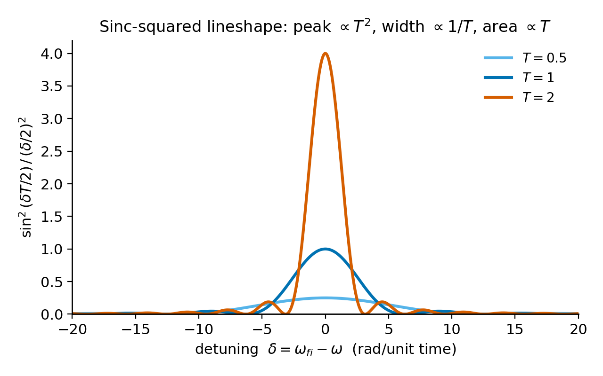
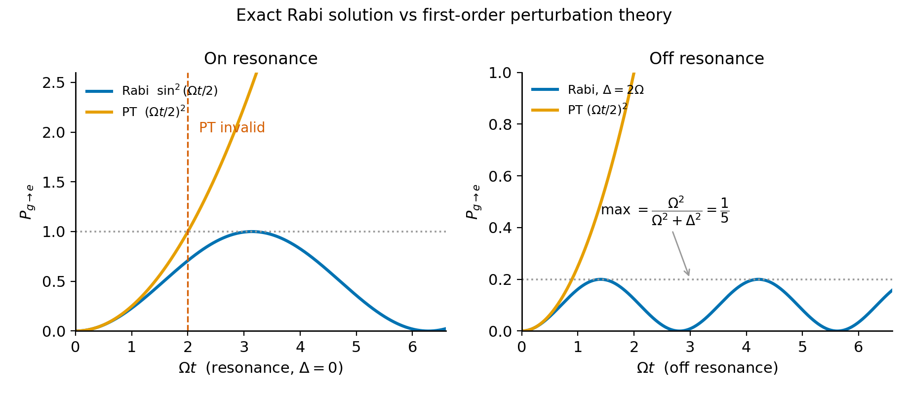

# Chapter 5 — Time-Dependent Perturbation Theory and Transitions

In January 1938 at Columbia University, Isidor Rabi's group passed a beam of LiCl molecules through three magnets. The first selected a particular nuclear spin orientation. The second — the interaction region — carried an oscillating radio-frequency field. The third analyzed what emerged. As the RF frequency was swept, the beam intensity dropped sharply at one specific value: the molecules had been flipped, driven from one spin state to the other. The resonance was narrow and well-defined.

The two-state system Rabi was driving — a spin-up nuclear state and a spin-down nuclear state, separated by energy $\hbar\omega_0$, coupled by an oscillating perturbation — is physically identical to an atom in a laser field, an NMR sample in a coil, a superconducting qubit driven by a microwave pulse, a trapped ion manipulated by a Raman laser pair, or an electron spin in an ESR apparatus. Every quantum control experiment built since 1938 is Rabi's apparatus in different molecular form.

This chapter answers two questions that apply to all of them: what is the probability of finding the system in the excited state at time $t$, and when does perturbation theory give the right answer?

---

## The Interaction Picture

The Schrödinger equation for $\hat{H} = \hat{H}_0 + \hat{H}'(t)$ mixes two things: the eigenstates of $\hat{H}_0$ (which we know) and the perturbation (which is what we want to study). The interaction picture separates them.

We define a new state vector by rotating out the trivial $\hat{H}_0$ evolution:

$$|\tilde{\psi}(t)\rangle = e^{i\hat{H}_0 t/\hbar}\,|\psi(t)\rangle.$$

Substituting into the full Schrödinger equation, the $\hat{H}_0$ terms on both sides cancel exactly, leaving:

$$i\hbar\,\partial_t|\tilde{\psi}(t)\rangle = \tilde{H}'(t)\,|\tilde{\psi}(t)\rangle,$$

where $\tilde{H}'(t) = e^{i\hat{H}_0 t/\hbar}\hat{H}'(t)e^{-i\hat{H}_0 t/\hbar}$ is the perturbation in the interaction picture.

The interaction-picture state evolves only under $\hat{H}'(t)$. When $\hat{H}'(t) = 0$, it freezes completely. All the interesting dynamics — the transitions we want to compute — live in the perturbation. The fast $\hat{H}_0$ oscillations have been rotated away.

We expand in the unperturbed eigenstates $|n\rangle$:

$$|\tilde{\psi}(t)\rangle = \sum_n c_n(t)\,|n\rangle,$$

with initial condition $c_n(0) = \delta_{ni}$ (starting in state $|i\rangle$). Projecting onto the final state $\langle f|$:

$$i\hbar\,\dot{c}_f = \sum_n c_n(t)\,\langle f|\hat{H}'(t)|n\rangle\,e^{i\omega_{fn}t},$$

where $\omega_{fn} = (E_f - E_n)/\hbar$ is the **Bohr frequency** for the $n \to f$ transition. This is exact. Every $c_f$ is coupled to every other $c_n$, which is why the full problem is hard. The factor $e^{i\omega_{fn}t}$ is the interaction-picture phase: the oscillation from $\hat{H}_0$ evolution is now explicit in the coupling equation.

---

## The First-Order Amplitude and Why It Is a Fourier Transform

To solve the coupled equations, we replace every $c_n(t)$ on the right-hand side with its initial value: $c_n(t) \approx \delta_{ni}$. This is the first-order approximation — we treat the system as remaining mostly in $|i\rangle$ throughout. Integrating from 0 to $t$:

$$\boxed{c_f^{(1)}(t) = \frac{1}{i\hbar}\int_0^t\langle f|\hat{H}'(t')|i\rangle\,e^{i\omega_{fi}t'}\,dt'.}$$

The transition probability is $P_{i\to f}(t) = |c_f^{(1)}(t)|^2$.

This formula says that the transition amplitude is the **Fourier transform** of the perturbation matrix element $\langle f|\hat{H}'(t)|i\rangle$, evaluated at the Bohr frequency $\omega_{fi} = (E_f - E_i)/\hbar$.

Resonance in this framework is Fourier resonance. The perturbation drives the transition efficiently when it has a Fourier component at the frequency matching the energy difference between initial and final states. If the perturbation oscillates at the wrong frequency, the phase factor in the integral oscillates and the integral cancels. If it oscillates at $\omega_{fi}$, the integral accumulates coherently.

This interpretation covers several important cases in one framework. A sudden kick (delta function in time) has a flat Fourier spectrum and drives all transitions equally. A slow quasi-static perturbation has a narrow spectrum near zero and drives nothing. A resonant sinusoidal perturbation drives the one transition it is tuned to.

---

## The Resonance Lineshape

We take $\hat{H}'(t) = \hat{V}\cos(\omega t)$ and write $\cos\omega t = \frac{1}{2}(e^{i\omega t} + e^{-i\omega t})$. Near resonance $\omega \approx \omega_{fi}$, one exponential combines with $e^{i\omega_{fi}t}$ to oscillate at $e^{i(\omega_{fi}+\omega)t}$ — rapidly varying, averaging to nearly zero over any appreciable time. The other combines to give $e^{i(\omega_{fi}-\omega)t}$ — slowly varying near resonance, building up coherently. Dropping the fast term (the **rotating-wave approximation**, valid when $|V_{fi}| \ll \hbar\omega_0$) and integrating gives:

$$\boxed{P_{i\to f}(t) = \frac{|V_{fi}|^2}{\hbar^2}\cdot\frac{\sin^2\!\left[\frac{(\omega_{fi}-\omega)\,t}{2}\right]}{\left(\frac{\omega_{fi}-\omega}{2}\right)^2}.}$$

This is the **sinc-squared lineshape**. Several results follow directly.

At resonance ($\omega = \omega_{fi}$), taking the $\delta\to 0$ limit where $\delta = \omega_{fi} - \omega$, the function $\sin^2(\delta t/2)/(\delta/2)^2 \to t^2$, so:

$$P_{i\to f}^\text{resonance}(t) = \frac{|V_{fi}|^2}{\hbar^2}\cdot\frac{t^2}{4}.$$

On-resonance probability grows as $t^2$. The peak height grows as $t^2$; the width to the first zero narrows as $2\pi/t$; the area under the central peak grows as $t$. As $t\to\infty$, the sinc-squared sharpens into $(\pi t/2)\,\delta(\omega_{fi}-\omega)$ — a delta function at resonance whose coefficient grows linearly in time. This is the gateway to Fermi's golden rule.

**The failure mode.** At resonance, $P_{i\to f}(t) = |V_{fi}|^2 t^2/(4\hbar^2)$. This grows without bound. Eventually it exceeds 1. A probability exceeding 1 is a diagnostic: first-order perturbation theory has broken down.

The cause is the approximation $c_i(t) \approx 1$ throughout the integration. Once probability flows into $|f\rangle$, the population in $|i\rangle$ has decreased, and the rate of further transfer should slow. The first-order equations ignore this depletion: they continue drawing from $|i\rangle$ as though nothing has changed. The exact two-level solution accounts for this feedback; first-order PT does not.

<!-- → [CHART: sinc-squared lineshape P(δ, T) vs. detuning δ for three values of T — showing the central peak sharpening as T increases, with annotations for peak height ∝ T², width ∝ 1/T, and area ∝ T; the evolution toward a delta function should be visible; this is the key figure connecting finite-time perturbation to the Fermi golden rule limit] -->

*Figure 5.1 — sinc-squared lineshape P(δ, T) vs. detuning δ for three values of T — showing the central peak sharpening as T increases, with annotations…*

---

## The Exact Rabi Solution

The two-level problem has an exact analytical solution. Two states $|g\rangle$ and $|e\rangle$, energies 0 and $\hbar\omega_0$. The drive Hamiltonian is:

$$\hat{H}'(t) = \hbar\Omega\cos(\omega t)\,(|e\rangle\langle g| + |g\rangle\langle e|).$$

The quantity $\Omega = |V_{fi}|/\hbar$ is the **Rabi frequency**. In the rotating-wave approximation, the Schrödinger equation reduces to two coupled first-order ODEs:

$$\dot{c}_g = -\frac{i\Omega}{2}\,e^{-i\Delta t}\,c_e, \qquad \dot{c}_e = -\frac{i\Omega}{2}\,e^{+i\Delta t}\,c_g,$$

where $\Delta = \omega - \omega_0$ is the **detuning**. These are solved exactly by differentiating to obtain a second-order ODE and applying initial conditions $c_g(0) = 1$, $c_e(0) = 0$. The result:

$$\boxed{P_{g\to e}(t) = \frac{\Omega^2}{\Omega^2+\Delta^2}\,\sin^2\!\left(\frac{\sqrt{\Omega^2+\Delta^2}}{2}\,t\right).}$$

This is the **Rabi formula**. It is exact within the RWA — no perturbative approximation.

We define the **generalized Rabi frequency** $\Omega_\text{gen} = \sqrt{\Omega^2 + \Delta^2}$. Then:

$$P_{g\to e}(t) = \frac{\Omega^2}{\Omega_\text{gen}^2}\,\sin^2\!\left(\frac{\Omega_\text{gen}\,t}{2}\right).$$

**On resonance** ($\Delta = 0$, $\Omega_\text{gen} = \Omega$):

$$P_{g\to e}(t) = \sin^2\!\left(\frac{\Omega t}{2}\right).$$

The population oscillates between 0 and 1. At $t = \pi/\Omega$ — a **$\pi$-pulse** — the entire population is in $|e\rangle$. At $t = 2\pi/\Omega$ it is back in $|g\rangle$. This is Rabi oscillation. It is what Rabi's molecular beam showed in 1938, and it is what every qubit readout protocol relies on today.

**Off resonance** ($\Delta \neq 0$): the maximum achievable probability is $\Omega^2/(\Omega^2+\Delta^2) < 1$. Full population transfer is impossible away from resonance. The oscillation is faster (frequency $\Omega_\text{gen} > \Omega$) but shallower. Resonance is required for complete inversion.

**Comparison to first-order PT at resonance.** PT gives $P^\text{PT}_{g\to e}(t) = (\Omega t/2)^2$ — a parabola. The exact formula gives $\sin^2(\Omega t/2)$ — a bounded oscillation. For $\Omega t \ll 1$, expanding $\sin^2 x \approx x^2$ shows they agree. For $\Omega t \sim 1$, they diverge. At the first $\pi$-pulse ($\Omega t = \pi$): exact $P = 1$; PT predicts $(\pi/2)^2 \approx 2.47$. PT has predicted a probability of 247%.

The reason PT fails is worth stating precisely. PT assumes the amplitude in $|i\rangle$ is constant — $c_i(t) \approx 1$ — even as probability drains out of it. The exact solution feeds the depleted $|i\rangle$ population back in during the return half of the Rabi cycle; PT misses the return entirely. The regime of validity is $\Omega t \ll 1$: small coupling times short time. Outside that window, the Rabi formula is required.

<!-- → [CHART: Rabi oscillation vs. PT parabola — two-panel figure: (left) on resonance, showing sin²(Ωt/2) and (Ωt/2)² on the same axes with a dashed horizontal line at P=1, the PT curve rising above it, and a red label "PT invalid" after the crossing; (right) off resonance at Δ=2Ω, showing the capped oscillation at max P=1/5 from the Rabi formula vs. the PT approximation; this is the central diagnostic figure of the chapter] -->

*Figure 5.2 — Rabi oscillation vs. PT parabola — two-panel figure: (left) on resonance, showing sin²(Ωt/2) and (Ωt/2)² on the same axes with a dashed…*

---

## Worked Example: The $\pi$-Pulse and the PT Breakdown

A two-level atom with transition energy $\hbar\omega_0 = 2.00$ eV is driven by a resonant laser. The coupling strength is $\hbar\Omega = 0.010$ eV. The atom starts in the ground state.

**When does the atom first reach $P = 1$?** On resonance, $\sin^2(\Omega t/2) = 1$ when $\Omega t/2 = \pi/2$, so $t_\pi = \pi/\Omega$.

Converting: $\Omega = (0.010\,\text{eV}\times1.602\times10^{-19}\,\text{J/eV})/(1.055\times10^{-34}\,\text{J·s}) = 1.519\times10^{13}$ rad/s.

$$t_\pi = \frac{\pi}{1.519\times10^{13}} \approx 2.07\times10^{-13}\,\text{s} = 0.21\,\text{ps.}$$

**When does first-order PT predict $P = 1$, and what is the exact probability at that moment?** PT predicts $(\Omega t/2)^2 = 1$ when $\Omega t/2 = 1$, so $t_\text{PT} = 2/\Omega \approx 0.13$ ps.

At $t = t_\text{PT}$, the exact probability is:

$$P_{g\to e}(t_\text{PT}) = \sin^2\!\left(\frac{\Omega \cdot t_\text{PT}}{2}\right) = \sin^2(1) \approx 0.708.$$

At the moment PT declares complete population transfer, the real atom has moved only 71% of its population into the excited state. The remaining 29% is still in the ground state, and the Rabi oscillation is about to carry it back. PT missed the return entirely because it assumed $c_g = 1$ throughout.

**The coupling-strength limit.** If instead $\hbar\Omega = 10^{-6}$ eV, the $\pi$-pulse time grows by a factor of $10^4$, to about 2100 ps. More importantly, the window $\Omega t \ll 1$ — where PT is accurate — now covers most of the evolution before spontaneous emission destroys the coherence. In that regime, first-order PT is reliable for all practical purposes. PT fails not because coupling is "small" in some abstract sense but because the product $\Omega t$ approaches 1. Time matters as much as coupling strength.

---

## From Discrete to Continuum: Fermi's Golden Rule in Preview

The sinc-squared lineshape at long times sharpens into a delta function. For a transition into a single discrete state, this would produce an infinitely narrow resonance. But real atoms emit photons into the vacuum: infinitely many electromagnetic modes, forming a continuum, each slightly different in frequency. When there is a continuum of final states, the delta function is always satisfied: there is always some mode whose frequency matches the transition energy, and the rate of transition becomes constant rather than oscillatory.

Summing the first-order transition rates over a continuum of final states with density $\rho(E)$:

$$\Gamma_{i\to f} = \frac{2\pi}{\hbar}|V_{fi}|^2\,\rho(E_f)\Big|_{E_f = E_i + \hbar\omega}.$$

This is Fermi's golden rule. It gives the *rate* (probability per unit time) of an irreversible transition, rather than the oscillating probability of the two-level problem. The discreteness of the initial problem — coherent Rabi oscillations — has collapsed into an exponential decay. The lifetime $\tau = 1/\Gamma$ of the excited state is the inverse transition rate.

The transition from Rabi oscillation to Fermi golden rule decay is not a sudden change of physics. It is what happens as the number of available final states grows: the oscillations of the individual transition amplitudes add up destructively at all times except the first, leaving only the initial linear rise. A discrete problem with many modes is an intermediate case — almost continuum but not quite, showing oscillatory behavior at long times that a true continuum would not.

Chapter 6 derives Fermi's golden rule formally and applies it to atomic emission. The key point here is recognizing where it comes from: the same first-order formula, applied to a continuum rather than a single final state.

---

## Exercises

**Warm-up**

1. *Difficulty: Warm-up — tests the interaction picture transformation.*
   A harmonic oscillator ($m$, $\omega$) in state $|0\rangle$ receives a short kick: $\hat{H}'(t) = F\hat{x}\,\delta(t)$ with $F$ small. Using $\hat{x} = \sqrt{\hbar/2m\omega}(\hat{a}_+ + \hat{a}_-)$: (a) compute the first-order transition amplitude $c_1^{(1)}(\infty)$ to the first excited state (the time integral of $\delta(t)e^{i\omega_{10}t}$ evaluated at $t=0$ is 1); (b) show the transition probability is $P_{0\to1} = F^2/(2m\omega\hbar)$; (c) state the condition on $F$ for first-order PT to be valid and explain what it means physically — is it a condition on $F$ alone, or on $F$ combined with time?
   *Tests: executing the first-order integral for a delta-function perturbation; extracting the validity condition.*

2. *Difficulty: Warm-up — tests the Rabi formula at and away from resonance.*
   A two-level system ($\hbar\omega_0 = 5.0$ eV, $\hbar\Omega = 0.05$ eV) is driven by an oscillating field. (a) Compute the generalized Rabi frequency $\Omega_\text{gen} = \sqrt{\Omega^2+\Delta^2}$ at detunings $\Delta = 0$, $\Omega$, and $2\Omega$. (b) For each detuning, compute the maximum transition probability $P_\text{max} = \Omega^2/(\Omega^2+\Delta^2)$. (c) At $\Delta = 2\Omega$, by what factor is the maximum probability suppressed relative to on-resonance?
   *Tests: numerical command of the Rabi formula; understanding how detuning caps the maximum achievable probability.*

3. *Difficulty: Warm-up — tests the Fourier interpretation of the transition amplitude.*
   Explain in two or three sentences why a sudden perturbation (delta function in time) drives all transitions with equal probability, while a slow quasi-static perturbation drives almost none. Your answer should invoke the Fourier transform interpretation of the first-order amplitude and identify what "Fourier component at the Bohr frequency" means in each case.
   *Tests: physical interpretation of the first-order formula as a Fourier transform; distinguishing sudden from adiabatic limits.*

**Application**

4. *Difficulty: Application — the PT breakdown criterion.*
   For the worked example ($\hbar\omega_0 = 2.00$ eV, $\hbar\Omega = 0.010$ eV), first-order PT is reliable while the exact and PT probabilities agree within 10%. (a) Using the expansion $\sin^2 x \approx x^2 - x^4/3$ for the exact formula and $x^2$ for PT, find the leading correction and estimate the time $t_{10\%}$ at which the fractional difference first reaches 10%. (b) Express $t_{10\%}$ as a multiple of the Bohr oscillation period $2\pi/\omega_0$. Is PT valid for many or few Bohr periods? (c) Now reduce the coupling to $\hbar\Omega = 10^{-4}$ eV. By what factor does $t_{10\%}$ change?
   *Tests: deriving the leading correction to PT; connecting the validity window to the coupling strength and Bohr period.*

5. *Difficulty: Application — sinc-squared lineshape and spectral selectivity.*
   A perturbation $\hat{H}'(t) = \hat{V}\cos(\omega t)$ is applied to a two-level atom for a finite duration $T$. (a) Show that the first-order transition probability as a function of detuning $\delta = \omega_{fi} - \omega$ is $P(\delta, T) = (|V_{fi}|/\hbar)^2\sin^2(\delta T/2)/(\delta/2)^2$. (b) At what values of $\delta$ do the first zeros of the sinc-squared function appear? (c) A researcher wants to drive a transition selectively — with less than 1% excitation of a neighboring transition at detuning $\delta_0 = 10^9$ rad/s from resonance. What minimum pulse duration $T$ is required? (d) What is the trade-off between spectral selectivity (long $T$) and perturbation theory validity (short $T$) for a fixed coupling strength?
   *Tests: deriving the sinc-squared formula; connecting pulse duration to spectral resolution; identifying the PT validity / selectivity trade-off.*

6. *Difficulty: Application — sudden vs. adiabatic.*
   An oscillator (frequency $\omega$) in state $|n\rangle$ is subjected to $\hat{H}'(t) = \lambda\hat{x}^2 f(t)$, where $f(t)$ rises slowly from 0 to 1 over timescale $\tau_\text{on} \gg 1/\omega$ (adiabatic turn-on) and then falls suddenly to 0 over $\tau_\text{off} \ll 1/\omega$ (sudden turn-off). (a) Which part of this protocol — turn-on or turn-off — drives transitions? Justify using the Fourier-transform interpretation. (b) Which limit drives more transitions, and why? (c) For the sudden part, estimate the transition amplitude to the state $|n\pm2\rangle$ (note: $\hat{x}^2$ connects states differing by 0 or 2 quanta) using the first-order formula.
   *Tests: distinguishing sudden from adiabatic limits physically; applying the first-order formula to the sudden case.*

**Synthesis**

7. *Difficulty: Synthesis — strong coupling: comparison table.*
   A two-level atom has $\hbar\Omega = 0.5\,\hbar\omega_0$ (strong coupling). (a) Write the on-resonance exact Rabi formula and the first-order PT formula. (b) Compute both at $\Omega t = \pi/4$, $\pi/2$, $\pi$, and $3\pi/2$; present as a table. (c) At what time does PT first exceed 1? (d) At $\Omega/\omega_0 = 0.5$, the rotating-wave approximation is marginal. The leading correction from the counter-rotating term is the Bloch–Siegert shift of order $\Omega^2/\omega_0$. Estimate its magnitude as a fraction of $\omega_0$ for this coupling.
   *Tests: full numerical comparison of exact vs. PT; identifying PT failure; estimating the Bloch–Siegert correction beyond the RWA.*

8. *Difficulty: Synthesis — qubit gate design.*
   A superconducting transmon qubit has transition frequency $\omega_0/(2\pi) = 5.0$ GHz and coherence time $T_2 = 80\,\mu\text{s}$. A microwave pulse with Rabi frequency $\Omega/(2\pi) = 10$ MHz is applied on resonance. (a) Compute $t_\pi = \pi/\Omega$ for the $\pi$-pulse. (b) How many Rabi periods fit within $T_2$? (c) Check whether first-order PT is valid during the $\pi$-pulse ($\Omega t_\pi \ll 1$?). (d) The gate fidelity requires the population transfer to be within $10^{-3}$ of 1. Show that the exact Rabi formula achieves this while PT cannot even be evaluated at $t = t_\pi$ without predicting an unphysical result. Explain why the experiment requires the exact formula.
   *Tests: realistic qubit numbers; checking PT validity quantitatively; connecting the breakdown to gate fidelity requirements.*

**Challenge**

9. *Difficulty: Challenge — the Landau–Zener formula as a TDPT boundary.*
   A two-level system has energies $E_\pm(t) = \pm\frac{1}{2}\alpha t$ that sweep linearly through degeneracy at $t = 0$, with off-diagonal coupling $V_{12} = V$ (constant). The Landau–Zener transition probability for sweeping from $t = -\infty$ to $t = +\infty$ is $P_\text{LZ} = 1 - e^{-2\pi\gamma}$ where $\gamma = |V|^2/(\hbar^2\alpha)$. (a) In the limit $\gamma \ll 1$ (slow sweep or weak coupling), expand $P_\text{LZ}$ to leading order in $\gamma$ and show $P_\text{LZ} \approx 2\pi\gamma$. (b) Estimate this same probability from first-order perturbation theory: compute $|c_f^{(1)}(+\infty)|^2$ for the matrix element $\langle +|V|-\rangle e^{i\phi(t)}$ where $\phi(t) = \int_0^t \alpha t'\,dt'/\hbar = \alpha t^2/(2\hbar)$ (the stationary-phase integral). The result is a Gaussian in the time domain; its Fourier transform at $\omega = 0$ gives an integral proportional to $|V|^2/(\hbar^2\alpha)$. (c) Show that PT gives the correct leading-order result, confirming $P_\text{LZ} \approx 2\pi\gamma$ for $\gamma \ll 1$. (d) In the limit $\gamma \gg 1$ (adiabatic passage), $P_\text{LZ} \approx 1$ — almost complete transfer. Why does PT break down completely in this limit?
   *Tests: connecting the Landau–Zener formula to TDPT; showing PT works in one limit but not the other; the stationary-phase integral.*

---

## References

Griffiths, D. J., & Schroeter, D. F. (2018). *Introduction to Quantum Mechanics* (3rd ed.). Cambridge University Press. §10.1–10.2.

Sakurai, J. J., & Napolitano, J. (2021). *Modern Quantum Mechanics* (3rd ed.). Cambridge University Press. §5.5–5.6.

Townsend, J. S. (2012). *A Modern Approach to Quantum Mechanics* (2nd ed.). University Science Books. Ch. 14.

Cohen-Tannoudji, C., Diu, B., & Laloë, F. (1977). *Quantum Mechanics*, Vol. II. Wiley. Ch. XIII.

Rabi, I. I., Millman, S., Kusch, P., & Zacharias, J. R. (1939). The molecular beam resonance method for measuring nuclear magnetic moments. *Physical Review*, 55, 526–535.

Bloch, F., & Siegert, A. (1940). Magnetic resonance for nonrotating fields. *Physical Review*, 57, 522–527.

Landau, L. (1932). Zur Theorie der Energieübertragung. II. *Physik. Z. Sowjetunion*, 2, 46.

Zener, C. (1932). Non-adiabatic crossing of energy levels. *Proceedings of the Royal Society of London A*, 137, 696–702.

