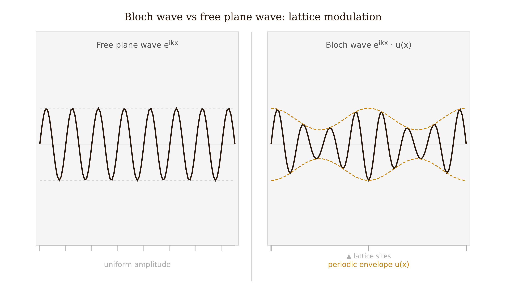
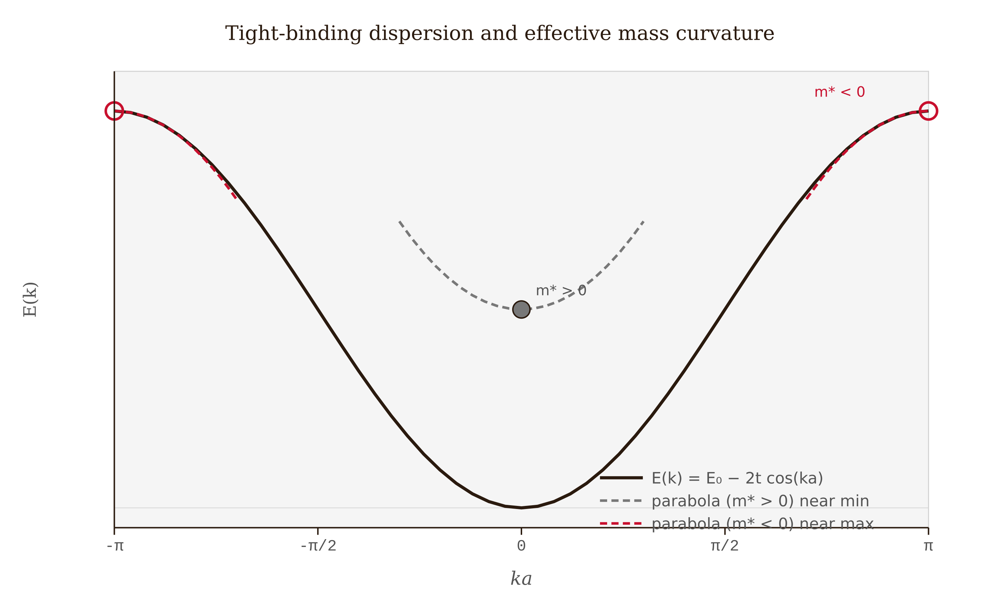
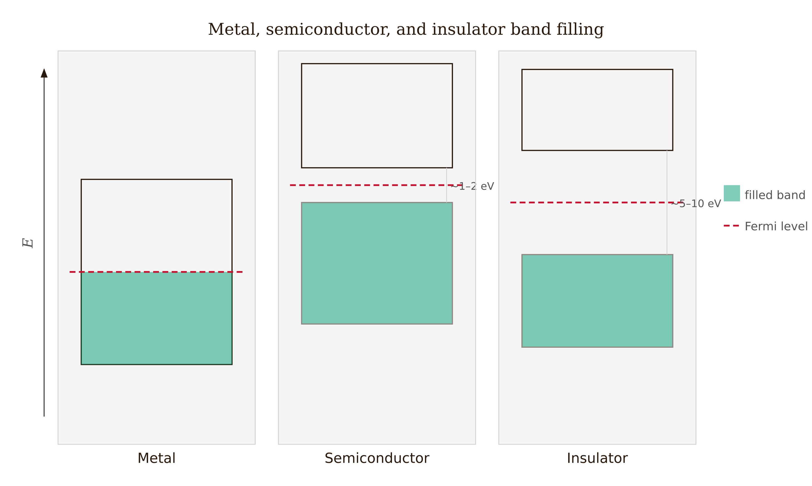

# Chapter 10 — Periodic Potentials and the Band Structure of Solids

A central result of solid-state physics is that a perfectly periodic potential does not scatter electrons. An electron placed in a crystal — a lattice of $10^{23}$ ions repeating every few ångströms — propagates through the entire crystal without deflection, as a modified plane wave. Real electrical resistance comes from imperfections: defects, impurities, and lattice vibrations (phonons) that break the periodicity. A perfect crystal at zero temperature has zero electrical resistance.

The underlying principle is Bloch's theorem. Understanding it reveals the structure of solid-state physics: bands, gaps, metals, insulators, and semiconductors. We develop the framework in one dimension, where the geometry is transparent.

---

## The Geometry

**The direct lattice.** A one-dimensional crystal consists of an atom (or group) repeated with period $a$. Lattice positions are $x_n = na$ for integers $n$. The lattice constant $a$ is typically 2–6 Å for real materials.

**The reciprocal lattice.** Every periodic structure has a dual: the reciprocal lattice at spatial frequencies $G_n = 2\pi n/a$. The **first Brillouin zone** (BZ) is the interval $k \in [-\pi/a, \pi/a]$. Bloch's theorem will show that $k$ and $k + G$ describe the same physical state, so all distinct crystal momenta fit inside one BZ.

---

## Bloch's Theorem

We consider an electron in a potential $V(x)$ satisfying $V(x+a) = V(x)$.

We define the **translation operator** $\hat{T}_a$ by $(\hat{T}_a f)(x) = f(x+a)$. Because the potential is periodic, $[\hat{H}, \hat{T}_a] = 0$: energy eigenstates can be chosen to simultaneously be eigenstates of $\hat{T}_a$. Since translation is unitary, its eigenvalues have magnitude 1 and can be written as $e^{ika}$ for real $k$:

$$\psi(x+a) = e^{ika}\psi(x).$$

Any state satisfying this condition can be written as

$$\psi_{n,k}(x) = e^{ikx}\,u_{n,k}(x)$$

where $u_{n,k}(x+a) = u_{n,k}(x)$ is periodic with the lattice period. This is **Bloch's theorem**. The proof is direct: set $u(x) = e^{-ikx}\psi(x)$; then $u(x+a) = e^{-ik(x+a)}e^{ika}\psi(x) = u(x)$.

The integer $n$ is the band index. At a given crystal momentum $k$, multiple solutions exist — these are the bands.

**Physical meaning.** Electrons in a perfectly periodic potential are not scattered — they propagate as Bloch waves with crystal momentum $\hbar k$ as a conserved quantum number. The key difference from free electrons is that $k$ is defined only modulo $G = 2\pi/a$, so all distinct values fit in the first BZ. The band index distinguishes the multiple solutions at the same $k$ once the lattice perturbs the free-electron parabola.

Bloch derived this result in 1928 as part of his PhD thesis under Heisenberg. The finding — that a periodic potential produces propagating rather than scattered waves — was unexpected, since physicists had expected electrons to bounce off every atom.

*Figure 10.5 — A free plane wave $e^{ikx}$ (left) carries uniform amplitude, while a Bloch wave $e^{ikx}u_{n,k}(x)$ (right) has the same carrier frequency but its amplitude is modulated by the lattice-periodic function $u_{n,k}(x)$, shown here with lattice sites marked below each panel.*

---

## The Kronig-Penney Model

The Kronig-Penney model (1931) is the standard analytically tractable periodic potential. We use the delta-function version, which captures the full physics with minimal algebra.

**Setup.** The potential is a sequence of delta-function barriers:

$$V(x) = \frac{\hbar^2 P}{ma}\sum_n\delta(x - na),$$

where $P$ is a dimensionless barrier strength. The limit $P \to 0$ recovers free electrons; $P \to \infty$ approaches an array of isolated atoms.

**Derivation.** Between delta functions the Schrödinger equation is that of a free particle with $E = \hbar^2\alpha^2/2m$. In the region $0 < x < a$, the solution is $Ae^{i\alpha x} + Be^{-i\alpha x}$. Applying Bloch periodicity at $x = a$ and the continuity and jump conditions at the delta function at $x = 0$, the consistency condition (vanishing determinant) gives the **Kronig-Penney dispersion relation**:

$$\boxed{\cos(ka) = \cos(\alpha a) + \frac{P}{\alpha a}\sin(\alpha a).}$$

**Reading the dispersion relation.** Define the right-hand side as $f(\alpha a) = \cos(\alpha a) + (P/\alpha a)\sin(\alpha a)$. The left side is bounded: $|\cos(ka)| \leq 1$.

Where $|f(\alpha a)| \leq 1$: a real $k$ exists and the electron propagates — these are **allowed bands**.

Where $|f(\alpha a)| > 1$: no real $k$ exists — these are **forbidden gaps**.

As $\alpha a$ increases from zero, $f(\alpha a)$ oscillates with growing amplitude, periodically exceeding $\pm 1$. Each excursion creates a gap. The bands and gaps alternate, repeating roughly every $\pi$ in $\alpha a$.

**Effect of barrier strength.** As $P$ increases, the amplitude of oscillation in $f$ increases, making the excursions beyond $\pm 1$ wider. A larger $P$ means wider gaps and narrower bands. At $P = 0$: no gaps, continuous free-electron spectrum. As $P \to \infty$: bands shrink to zero width — the isolated-atom limit.

---

## Worked Example — The First Band Gap

We set $P = 3\pi/2 \approx 4.71$.

**Locating the gap.** We evaluate $f$ at $\alpha a = \pi$ (the first zone boundary for free electrons):

$$f(\pi) = \cos(\pi) + \frac{P}{\pi}\sin(\pi) = -1 + 0 = -1.$$

This is exactly at the boundary — the first allowed band ends here. Just above $\alpha a = \pi$, the term $-(P/\pi)\epsilon$ drives $f$ below $-1$ and the gap opens. Numerically, $f$ re-enters the interval $[-1,1]$ near $\alpha a \approx 4.71$, where the second band begins.

**In natural units** ($\hbar = 2m = a = 1$, energies in units of $\hbar^2/2ma^2$): the first gap runs from $E = \pi^2 \approx 9.87$ to $E \approx 22.2$. The gap width grows with $P$.

**The simulation procedure.** We sweep $\alpha a$ from $0$ to $6\pi$ in 5000 steps. At each point, we compute $f(\alpha a)$. If $|f| \leq 1$, we assign $k = \arccos(f)/a$ and fold into the first BZ; we then plot $(k, E = \hbar^2\alpha^2/2m)$. Allowed-band points are plotted in teal, and gap regions are shaded gray.

---

## The Nearly-Free-Electron Picture

The Kronig-Penney model treats the periodic potential exactly. The nearly-free-electron (NFE) model starts from free electrons and adds the lattice as a weak perturbation.

**Setup.** We write the potential as a Fourier series: $V(x) = \sum_G V_G e^{iGx}$. The unperturbed states are plane waves $|k\rangle$ with energies $E_k^{(0)} = \hbar^2k^2/2m$.

**Why normal perturbation theory fails at the zone boundary.** At $k = \pi/a$, the states $|k = \pi/a\rangle$ and $|k = -\pi/a\rangle$ are degenerate — they both have energy $\hbar^2\pi^2/2ma^2$. The perturbation denominator vanishes and we need degenerate perturbation theory.

**Degenerate perturbation theory.** We build the $2\times2$ matrix of $V$ between the two degenerate states. The diagonal elements vanish (setting the average potential to zero). The off-diagonal element is $V_{G_1}$, the first Fourier component of $V$:

$$W = \begin{pmatrix}0 & V_{G_1}^*\\V_{G_1} & 0\end{pmatrix}.$$

The eigenvalues are $\pm|V_{G_1}|$. The energy at the zone boundary splits into $E_\pm = \hbar^2\pi^2/2ma^2 \pm |V_{G_1}|$:

$$\boxed{\text{Band gap} = 2|V_{G_1}|.}$$

**The gap equals twice the magnitude of the relevant Fourier component of the potential.** A strong potential produces a wide gap; a weak potential produces a narrow gap; a zero potential produces no gap.

**Physical picture: Bragg reflection.** At $k = \pi/a$, the de Broglie wavelength $\lambda = 2a$ satisfies the Bragg condition for a lattice with spacing $a$. Forward and backward waves mix equally into standing waves:

$$\psi_+ \propto \cos(\pi x/a), \qquad \psi_- \propto \sin(\pi x/a).$$

The probability density $|\psi_+|^2$ peaks at the ion positions; $|\psi_-|^2$ peaks between them. In a crystal where ions attract electrons, $\psi_+$ sees lower potential energy and $\psi_-$ sees higher. Their energy difference is $2|V_{G_1}|$. This is the gap — two standing waves with the same kinetic energy, forced by symmetry to different positions and therefore sampling the potential differently.

<!-- → [FIGURE: Standing waves at zone boundary — |ψ+|² peaks at ion sites (lower energy), |ψ−|² peaks between sites (higher energy), with periodic lattice potential shown below] -->

*Figure 10.1 — Standing waves at zone boundary — |ψ+|² peaks at ion sites (lower energy), |ψ−|² peaks between sites (higher energy), with periodic lattice…*

---

## The Tight-Binding Picture

The NFE model works near the free-electron limit. The tight-binding (TB) model works near the atomic limit: we start from isolated atoms and turn on overlap between neighboring orbitals.

**Setup.** Each atom has a localized orbital $|\phi_n\rangle$ at site $na$ with energy $E_0$. We write the Bloch state as a sum with the correct Bloch phase:

$$|\psi_k\rangle = \frac{1}{\sqrt{N}}\sum_n e^{ikna}|\phi_n\rangle.$$

**The energy.** We evaluate $\langle\psi_k|\hat{H}|\psi_k\rangle$. The diagonal term gives $E_0$ (on-site energy, shifted slightly by the crystal environment). The nearest-neighbor off-diagonal terms define the **hopping integral** $t = -\langle\phi_{n+1}|\hat{H}|\phi_n\rangle > 0$. Keeping only nearest-neighbor hops:

$$\boxed{E(k) = E_0 - 2t\cos(ka).}$$

At $k = 0$: $E = E_0 - 2t$ (band bottom, symmetric superposition). At $k = \pm\pi/a$: $E = E_0 + 2t$ (band top, antisymmetric). Bandwidth: $4t$.

**Effective mass.** Expanding near the band bottom:

$$E(k) \approx (E_0 - 2t) + ta^2k^2 = E_\text{bottom} + \frac{\hbar^2k^2}{2m^*}, \qquad m^* = \frac{\hbar^2}{2ta^2}.$$

Strong hopping (large $t$) means a light effective mass — the electron propagates easily. Near the band top, $m^* < 0$: an electron behaves as a **hole**, a positively charged quasiparticle that moves opposite to the applied force.

*Figure 10.4 — Tight-binding dispersion $E(k)=E_0-2t\cos(ka)$ over $k\in[-\pi/a,\pi/a]$: the positive-curvature parabolic fit at the band minimum (dashed, $m^*>0$) and the negative-curvature fit at the band maximum (dashed, $m^*<0$) illustrate the sign change of the effective mass across the band.*

---

## Metals, Insulators, and Semiconductors

Band filling is governed by the Pauli exclusion principle: each $k$-state holds 2 electrons (spin up and down). The first BZ has one $k$-value per unit cell, so the first band holds 2 electrons per atom.

**One electron per atom** (alkali metals: Na, K, Li): half-filled band. The Fermi level cuts through the band. There are electrons right at the Fermi energy that can be accelerated by an applied field. **Metal.**

**Two electrons per atom, one orbital per atom** (alkaline earths in the simplest model): completely filled band, empty next band. If the gap is large compared to $k_BT$, **insulator** (diamond, gap 5.5 eV). If the gap is a few eV, **semiconductor** (Si: 1.12 eV; Ge: 0.67 eV; GaAs: 1.42 eV). The distinction between semiconductor and insulator is quantitative: semiconductors have a useful thermally-generated carrier density at room temperature; insulators do not.

**Band overlap** (graphite, the semimetals): the top of one band and the bottom of the next overlap in energy; the Fermi level cuts through both. **Semimetal**.

The three models — Kronig-Penney, NFE, tight-binding — describe the same physics from different starting points. Kronig-Penney interpolates between the limits as $P$ varies: at $P = 0$ it is NFE; as $P \to \infty$ it approaches isolated atoms. Real materials sit between the extremes. Density functional theory (DFT) handles them self-consistently, but the Bloch-wave structure is the same.

*Figure 10.3 — Band-filling classification: a metal has its Fermi level cutting through a partially filled band (left); a semiconductor has a fully filled valence band and a small gap (center); an insulator has the same structure with a much wider gap (right).*

<!-- → [FIGURE: Band-filling schematic — three panels showing metal (Fermi level in band), semiconductor (small gap), and insulator (large gap), each with Fermi level marked] -->

*Figure 10.2 — Band-filling schematic — three panels showing metal (Fermi level in band), semiconductor (small gap), and insulator (large gap), each with…*

---

## Zone Schemes

There are three standard ways to display the band structure:

**Extended zone scheme.** The first band occupies BZ 1 ($k\in[-\pi/a, \pi/a]$), the second band occupies BZ 2 (the next two segments), and so on. This shows the free-electron parabola ancestry — each band is a segment of $E = \hbar^2k^2/2m$, gapped and folded back.

**Reduced zone scheme.** All bands are folded into the first BZ by subtracting reciprocal lattice vectors. Every band appears as a distinct curve over $k\in[-\pi/a, \pi/a]$. This is the standard representation for real band diagrams.

**Repeated zone scheme.** The reduced-zone dispersion is extended periodically over all $k$. This representation is useful for visualizing group velocity $dE/dk$ continuity.

All three are physically equivalent. The reduced zone scheme is preferred because it makes explicit that all distinct crystal momenta lie in the first BZ.

---

## References

- Kronig, R. de L. and Penney, W.G. (1931). "Quantum mechanics of electrons in crystal lattices." *Proceedings of the Royal Society A*, 130, 499–513. [verify]
- Bloch, F. (1928). "Über die Quantenmechanik der Elektronen in Kristallgittern." *Zeitschrift für Physik*, 52, 555–600. [verify]
- Kittel, C. (2005). *Introduction to Solid State Physics*, 8th ed. Wiley. Ch. 7–9. [verify]
- Ashcroft, N.W. and Mermin, N.D. (1976). *Solid State Physics*. Holt, Rinehart and Winston. Ch. 8–10. [verify]
- Griffiths, D.J. and Schroeter, D.F. (2018). *Introduction to Quantum Mechanics*, 3rd ed. Cambridge University Press. §5.3. [verify]
- Cao, Y. et al. (2018). "Unconventional superconductivity in magic-angle graphene superlattices." *Nature*, 556, 43–50. [verify]
- Kane, C.L. and Mele, E.J. (2005). "Z₂ topological order and the quantum spin Hall effect." *Physical Review Letters*, 95, 146802. [verify]

---

*Chapter 11 follows: scattering in periodic structures — the structure factor and the diffraction condition that recovers Bragg's law as a consequence of the same reciprocal-lattice geometry developed here.*

