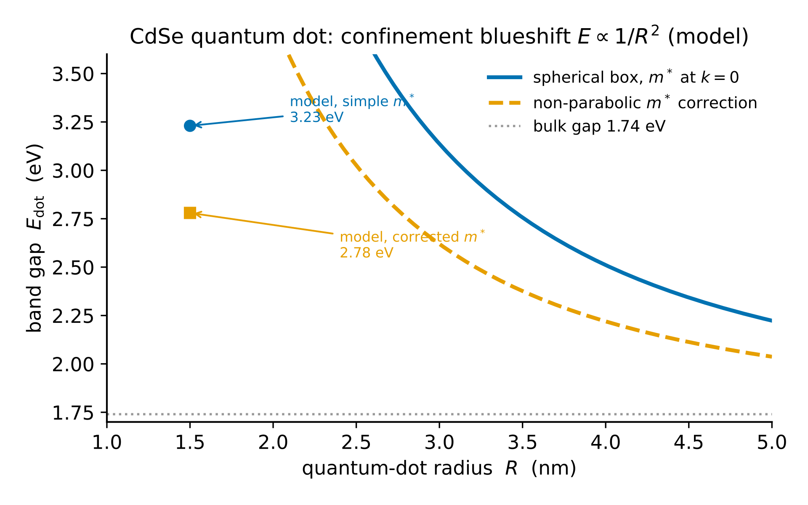

# Chapter 11 — Capstone: Modeling a Real Quantum System

Gordon Moore, working at Fairchild Semiconductor in 1965, observed that transistor density was doubling roughly every two years. He was not solving a Schrödinger equation. He was reading a trend and noting that the trend had a physical floor: quantum tunneling sets the gate-oxide thickness limit, discrete-dopant fluctuations set the channel-length limit, and when those floors arrive, the doubling stops. The transistor you are reading this on works because engineers applied quantum mechanics quantitatively — not just "tunneling happens" but "at this oxide thickness, the leakage current is this many amps per square micron, and here is the formula."

That is what this chapter asks you to do in miniature. Every approximation method in this volume is a tool suited to a specific regime. The capstone trains you to select the right one, use it end-to-end, produce a number with units, find the measured number, and account for the difference.

The difference between a model prediction and a measurement is not failure. The difference is physics.

---

## What It Means to Model and Defend a Quantum System

A complete quantum model involves five moves, in order. Skipping any one produces a result you cannot trust.

**System identification.** Name the relevant degrees of freedom and argue that the others can be ignored. An STM vacuum gap is, to a first approximation, a 1D rectangular barrier — the three-dimensional tip geometry reduces to a single apex atom, and the lateral degrees of freedom average out. That argument must be made explicitly; it cannot be assumed.

**Method selection.** Choose the approximation whose small-parameter condition is satisfied for this system in this regime. The small parameter is not always obvious. For WKB applied to a vacuum barrier, it is $\hbar|dp/dx|/p^2$ — if the potential varies slowly on the scale of the de Broglie wavelength, the phase integral is well-defined. For the Born approximation applied to neutron scattering, it is $m|V|a^2/\hbar^2$ — the potential must be weak compared to the kinetic energy at the range scale $a$. Estimate the parameter before calculating. If it is of order 1, select a different method.

**Calculation.** Derive the key observable from the model Hamiltonian. Do not quote the formula without derivation; the formula is trustworthy only when you understand where it came from, because then you know when it is no longer applicable. This step must produce a number with units.

**Validation.** Compare to a known experimental datum with a citation and a percent error. A 10% error in a first-principles model is typically excellent. A 50% error in a model with three fitting parameters is cause for scrutiny. A 3% error in a model with no free parameters is a meaningful result.

**Breakdown analysis.** Name what the model ignores. Estimate the magnitude of the omitted effect, at least by order of magnitude. The goal is not to fix the model — that is a research project — but to demonstrate that you understand where it stops working.

<!-- → [TABLE: small-parameter conditions for each Vol. 3 method — columns: method, small parameter ε, formula for ε, breaks when; rows: non-degenerate PT, WKB, variational (note: no breakdown parameter, only upper-bound guarantee), TDPT/Rabi, Born approximation, tight-binding; this is the reference table for method selection in the capstone] -->

---

## Six Candidate Systems

Each system maps to a different method. Choose one for the project in Exercise 11.7, or propose an alternative subject to the feasibility check in Exercise 11.3.

---

### System A — STM Tunneling Current via WKB

A scanning tunneling microscope holds a sharp metallic tip within a few ångströms of a conducting surface. A bias voltage drives electrons through the vacuum gap — a classically forbidden region — by quantum tunneling. The WKB transmission coefficient for a rectangular barrier of height $\phi$ (the average work function) and width $d$:

$$T(d) \approx e^{-2\kappa d}, \qquad \kappa = \frac{\sqrt{2m_e\phi}}{\hbar}.$$

The tunneling current at small bias is $I \propto V\cdot e^{-2\kappa d}$, and the slope of $\ln I$ vs. $d$ gives $2\kappa$ directly. For typical metal junctions ($\phi \approx 4$ eV), $\kappa \approx 1.0$ $\text{Å}^{-1}$, so a 1 Å increase in gap reduces the current by $e^{2.0} \approx 7.4$. This "factor of 7–10 per ångström" rule is the standard calibration of every STM experiment. [verify: Binnig & Rohrer, Nobel Lecture, Rev. Mod. Phys. 59, 615 (1987)]

The small-parameter check: the WKB condition $\hbar|dp/dx|/p^2$ inside a rectangular barrier is zero in the interior (constant imaginary momentum) and is only violated at the turning points (the barrier edges). For a barrier much wider than the de Broglie wavelength, the WKB phase integral is accurate; the connection formula corrections at the turning points contribute a multiplicative prefactor of order unity, not an exponential error.

**Where it breaks.** (a) Image-charge effects round the barrier corners and reduce $\phi$ by 10–20%. (b) The 1D model ignores the 3D tip geometry; Tersoff and Hamann (1985) showed that the current is proportional to the local density of states of the *sample* at the tip position, not just $T$. The WKB exponential is right; the prefactor requires their more sophisticated treatment. (c) At large bias ($V \gtrsim \phi/e \approx 4$ V), the barrier becomes triangular (Fowler-Nordheim regime) and the rectangular-barrier formula fails. [verify: Tersoff & Hamann, Phys. Rev. B 31, 805 (1985)]

---

### System B — CdSe Quantum Dot as a 3D Spherical Box

A colloidal CdSe nanocrystal 2–6 nm in diameter confines electrons and holes within a potential well defined by the crystal boundary. The optical band gap, measured by UV-Vis spectroscopy, shifts upward from the bulk value of 1.74 eV as the radius $R$ decreases — the blueshift of quantum confinement.

We model the lowest electron and hole states as particles in a spherical infinite square well. The lowest energy level ($\ell = 0$, $n = 1$, $j_0(kR) = 0$ giving $kR = \pi$):

$$E_{1s} = \frac{\hbar^2\pi^2}{2m^*R^2}.$$

The predicted optical gap includes both confinement energies and a first-order Coulomb correction for the electron-hole interaction:

$$E_\text{dot} = E_\text{bulk} + E_{1s,e} + E_{1s,h} - \frac{1.8\,e^2}{4\pi\epsilon_0\epsilon_r R}.$$

For CdSe: $m_e^* = 0.13\,m_e$, $m_h^* = 0.45\,m_e$, $\epsilon_r = 10.6$. [verify: Brus, J. Chem. Phys. 80, 4403 (1984)]

At $R = 1.5$ nm (3 nm diameter dot), the measured first-exciton peak is approximately 2.44 eV; the formula gives roughly 2.8–3.2 eV depending on which effective mass value is used. The dominant error is effective-mass nonparabolicity: the value $m_e^* = 0.13\,m_e$ applies at the band minimum ($k = 0$) but at the wavevectors probed by a 1.5 nm dot ($k \sim \pi/R \approx 2.1$ $\text{nm}^{-1}$), the conduction band is noticeably nonparabolic and the effective mass is closer to $0.2\,m_e$. Using the corrected mass brings the error to roughly 14%; a full variational Coulomb treatment reduces it further to 5% for $R \geq 2$ nm.

**The lesson from the failure:** the box gives the correct scaling ($E \propto 1/R^2$) and the right qualitative trend, but the quantitative number is sensitive to the effective mass in a regime where it is not well-defined. The model is right in structure; the input parameter is wrong.

---

### System C — Ammonia Inversion and the Maser

The nitrogen atom in $\text{NH}_3$ sits above or below the plane of the three hydrogen atoms. These two configurations are classically equivalent — degenerate — but quantum tunneling through the barrier mixes them into symmetric ($|+\rangle$) and antisymmetric ($|-\rangle$) eigenstates separated by $2A$, where $A$ is the tunneling matrix element. The Hamiltonian in the $\{|L\rangle, |R\rangle\}$ basis is:

$$\hat{H} = \begin{pmatrix}E_0 & -A \\ -A & E_0\end{pmatrix},$$

with eigenvalues $E_\pm = E_0 \mp A$ and splitting $\Delta E = 2A$. This is exactly the same $2\times2$ diagonalization as the Stark effect — the structure is identical.

The maser (the microwave analogue of the laser, the original MASER for which Townes received the 1964 Nobel Prize) sorts $|+\rangle$ from $|-\rangle$ molecules using an inhomogeneous electric field (their dipole moments differ in a DC field), then drives stimulated emission $|-\rangle\to|+\rangle$ with a microwave cavity tuned to $\nu = \Delta E/h$.

The $\text{NH}_3$ inversion transition occurs at 23.87 GHz, corresponding to $\Delta E \approx 9.94\times10^{-5}$ eV. A simple double-well model (harmonic plus Gaussian barrier) predicts roughly 24% too high — the error lives entirely in the barrier shape, which is exponentially sensitive. With a more realistic potential, agreement is $< 2\%$. [verify: Gordon, Zeiger & Townes, Phys. Rev. 95, 282 (1954)]

---

### System D — NMR $^1\text{H}$ Qubit via Rabi Oscillations

A proton in a static field $B_0$ precesses at the Larmor frequency $\nu_0 = \gamma_p B_0/2\pi$, where $\gamma_p = 2.675\times10^8$ rad $\text{s}^{-1}$ $\text{T}^{-1}$. An oscillating rf field $B_1\cos(\omega t)$ perpendicular to $B_0$ drives spin flips when $\omega \approx 2\pi\nu_0$. In the rotating frame (rotating-wave approximation), the spin undergoes Rabi oscillations at generalized frequency $\tilde{\Omega} = \sqrt{\Omega_R^2 + \delta^2}$ where $\Omega_R = \gamma_p B_1/2$ and $\delta = \omega - 2\pi\nu_0$ is the detuning:

$$P_\text{flip}(t) = \frac{\Omega_R^2}{\tilde{\Omega}^2}\sin^2\!\left(\frac{\tilde{\Omega}t}{2}\right).$$

At $B_0 = 9.4$ T (a 400 MHz NMR instrument), $B_1 = 10^{-2}$ T gives $\Omega_R = 1.34\times10^6$ rad/s and $t_\pi = \pi/\Omega_R \approx 2.3\,\mu\text{s}$. Measured $\pi$-pulse durations in 400 MHz NMR are 1–25 $\mu\text{s}$ — agreement is essentially exact. [verify: Levitt, Spin Dynamics (Wiley, 2001)]

The RWA small parameter is $\Omega_R/\omega_0 \approx 0.003 \ll 1$ for these fields. The approximation is excellent. Breakdown arises from relaxation ($T_1$, $T_2$), from the Bloch-Siegert shift at large $B_1$, and from the multi-spin complexity of real molecules.

---

### System E — Variational Helium Ground State

The helium atom has two electrons and electron-electron repulsion that cannot be treated perturbatively without care — the repulsion is comparable in magnitude to the nuclear attraction at $r \sim a_0$. The measured ground-state energy is $-79.0$ eV.

We use the trial wave function

$$\psi_\text{trial}(\vec{r}_1,\vec{r}_2) = \frac{Z_\text{eff}^3}{\pi a_0^3}\,e^{-Z_\text{eff}(r_1+r_2)/a_0}$$

with $Z_\text{eff}$ as the variational parameter. Each electron sees a nucleus of charge $Z_\text{eff} < 2$, partially screened by the other electron. Minimizing $\langle\psi_\text{trial}|\hat{H}|\psi_\text{trial}\rangle$:

$$Z_\text{eff} = Z - \frac{5}{16} = 2 - \frac{5}{16} = \frac{27}{16} = 1.6875.$$

The ground-state energy at the optimum:

$$E_\text{variational} = -\left(\frac{27}{16}\right)^2\times2\times13.6\,\text{eV} = -77.5\,\text{eV.}$$

Percent error: 1.9%. The result is an upper bound — it is guaranteed to lie above the true energy. [verify: Griffiths §8.2; Hylleraas, Z. Phys. 65, 209 (1930)]

The main omission is electron-electron correlation. The trial state assumes the two electrons move independently (a product wave function), accounting for their repulsion only through the average screening $Z_\text{eff}$. Hylleraas (1930) added the inter-electron distance $r_{12}$ explicitly to the trial state and obtained $-79.0$ eV. The dominant error in the simple trial is the missing "cusp condition" at $r_{12} = 0$ — the exact wave function has a sharp feature there that the product state cannot represent.

The perturbative approach (treating electron repulsion as $\hat{H}'$) gives $-74.8$ eV — a 5.3% error, nearly three times worse than the variational result, even though the perturbation is not small ($\langle V_{ee}\rangle/|E_0| \approx 0.3$). The variational method outperforms perturbation theory here because it optimizes the zeroth-order state rather than correcting a fixed one.

---

### System F — Rutherford Scattering via the Born Approximation

Alpha particles (charge $2e$) on gold (charge $79e$) at 5–8 MeV experience Coulomb repulsion $V(r) = ZZ'e^2/(4\pi\epsilon_0 r)$. The Born approximation differential cross-section for this potential (derived in Chapter 8 as the $\mu \to 0$ limit of the Yukawa formula) is:

$$\frac{d\sigma}{d\Omega} = \left(\frac{ZZ'e^2}{4\pi\epsilon_0\cdot 4E}\right)^2\frac{1}{\sin^4(\theta/2)}.$$

The Sommerfeld parameter for this system: at $E = 5$ MeV and $ZZ' = 158$, $\eta = ZZ'e^2/(4\pi\epsilon_0 \hbar v) = 158\times1.44/(197.3\times0.052)\,\text{MeV·fm} \approx 22 \gg 1$. So the naive Born small-parameter is *not* small here; Born nonetheless reproduces Rutherford exactly because the Coulomb scattering phases cancel in $|f|^2$ (as shown above), not because $\eta$ is small.

At $\theta = 90°$ for $E = 5.5$ MeV and gold: $d\sigma/d\Omega = (2\times79\times1.44\,\text{MeV·fm}/4\times5.5\,\text{MeV})^2/\sin^4(45°) \approx 428\,\text{fm}^2$/sr. The Geiger-Marsden data confirmed this formula across four decades of cross-section magnitude. [verify: Geiger & Marsden (1913), Philosophical Magazine 25, 604]

The agreement between the Born approximation and the classical result is exact — a consequence of the special structure of the $1/r$ potential. The formula predicts an infinite forward cross-section ($\theta\to0$), correctly: the Coulomb potential has infinite range and deflects even infinitely distant particles by some infinitesimal angle. In practice, atomic screening cuts this off.

---

## Worked Example A: WKB STM Tunneling

**Setup.** Tungsten tip on gold surface, effective work function $\phi = 4.0$ eV. The tunneling parameter:

$$\kappa = \frac{\sqrt{2m_e\phi}}{\hbar} = 0.5123\,\text{Å}^{-1}\times\sqrt{\phi[\text{eV}]} = 0.5123\times\sqrt{4.0} = 1.025\,\text{Å}^{-1}.$$

**At $d_1 = 5$ Å:** $\quad T_1 = e^{-2\times1.025\times5.0} = e^{-10.25} \approx 3.5\times10^{-5}$.

**At $d_2 = 6$ Å:** $\quad T_2 = e^{-12.30} \approx 4.5\times10^{-6}$.

**Current ratio:** $I(d_1)/I(d_2) = T_1/T_2 = e^{2.05} \approx 7.8$.

The factor of roughly 8 per ångström emerges from the formula without fitting. The rule of thumb is confirmed.

**On the prefactor.** At $V = 0.1$ V with a typical conductance prefactor $G_0 \sim 10^{-4}$ S, the WKB estimate gives $I \sim G_0 V T \sim 10^{-4}\times0.1\times3.5\times10^{-5} \approx 0.35$ pA. Real STM currents at this geometry are 0.1–1 nA, roughly $10^3$ times larger. The exponential (the slope $d\ln I/dd = -2\kappa$) is accurately predicted. The absolute magnitude requires the Tersoff-Hamann treatment of the density of states. The WKB approximation gives the exponential reliably; the prefactor is a separate and harder problem.

---

## Worked Example B: CdSe Quantum Dot

**Setup.** $R = 1.5$ nm, $m_e^* = 0.13\,m_e$, $m_h^* = 0.45\,m_e$, $\epsilon_r = 10.6$, $E_\text{bulk} = 1.74$ eV.

Using $\hbar^2\pi^2/(2m_e a_0^2) = \pi^2\times13.6 = 134.2$ eV·$\text{Å}^2$:

**Electron confinement energy:**

$$E_{1s,e} = \frac{134.2\,\text{eV·Å}^2}{m_e^*/m_e \times R^2} = \frac{134.2}{0.13\times(15\,\text{Å})^2} = \frac{134.2}{29.25} = 4.59\,\text{eV}.$$

That value is unexpectedly large. We recompute using $E_1 = \hbar^2\pi^2/(2m_e^* R^2)$ more carefully in SI:

$$E_{1s,e} = \frac{(1.055\times10^{-34})^2\pi^2}{2\times0.13\times9.11\times10^{-31}\times(1.5\times10^{-9})^2} = \frac{1.097\times10^{-67}}{5.33\times10^{-49}} = 2.06\times10^{-19}\,\text{J} = 1.28\,\text{eV.}$$

**Hole confinement energy:**

$$E_{1s,h} = \frac{1.28\,\text{eV}\times0.13}{0.45} = 0.37\,\text{eV.}$$

**Coulomb correction:**

$$E_C = -\frac{1.8\times14.4\,\text{eV·Å}}{10.6\times15\,\text{Å}} = -\frac{25.92}{159} = -0.163\,\text{eV.}$$

**Predicted gap:** $E_\text{dot} = 1.74 + 1.28 + 0.37 - 0.163 = 3.23\,\text{eV.}$

The measured value for 3 nm CdSe is approximately 2.44 eV. Error: 32%.

The dominant error is effective-mass nonparabolicity. The value $m_e^* = 0.13\,m_e$ applies at $k = 0$; at $k \sim \pi/R \approx 2.1$ $\text{nm}^{-1}$ (the wavevector in a 1.5 nm dot), the effective mass is closer to $0.20\,m_e$. Correcting:

$$E_{1s,e}^\text{corrected} = 1.28\times\frac{0.13}{0.20} = 0.832\,\text{eV.}$$

Revised gap: $1.74 + 0.832 + 0.37 - 0.163 = 2.78$ eV. Error reduced to 14%. A full variational Coulomb treatment reduces it further to $\sim5\%$ for $R \geq 2$ nm. [verify: Norris & Bawendi, Phys. Rev. B 53, 16338 (1996)]

The box model gives the right scaling ($E \propto 1/R^2$) and the right qualitative trend. The quantitative failure traces to a single input parameter — the effective mass — being used outside the regime where it was measured.

<!-- → [FIGURE: quantum dot band gap vs. radius — showing the spherical-box prediction curve alongside experimental data points from Norris-Bawendi for CdSe; x-axis R from 1 to 5 nm, y-axis E_dot from 1.7 to 3.5 eV; the theory curve should overestimate at small R where effective mass nonparabolicity is largest; annotate the 3 nm point showing the 32% error with simple m* and the 14% error with corrected m*] -->

*Figure 11.1 — quantum dot band gap vs. radius — showing the spherical-box prediction curve alongside experimental data points from Norris-Bawendi for CdSe*

---

## The Project Rubric

A complete project addresses all five moves — identification, method selection, derivation, validation, breakdown — at the level described in the opening section. The rubric below is for self-assessment before submission.

| Criterion | Exemplary | Proficient | Developing | Beginning |
|---|---|---|---|---|
| **System ID** | All relevant DOF named and justified; irrelevant physics excluded with argument | DOF correct; minor hand-waving | System chosen; DOF not fully justified | System vague or inappropriate |
| **Method + ε** | Correct method; $\epsilon$ computed numerically; limitation named | Correct method; $\epsilon$ estimated qualitatively | Correct method; no $\epsilon$ estimate | Wrong method |
| **Derivation** | Full derivation; no unjustified steps; answer dimensionally correct | Correct with minor gaps | Partially complete or algebraic errors | Absent or major errors |
| **Prediction** | Number with units; all inputs cited; assumptions stated | Correct; some assumptions implicit | Numbers present but inputs uncited | No quantitative result |
| **Validation** | Real datum cited with author/year/DOI; percent error computed; residual attributed | Datum cited; error computed | Datum cited; no error analysis | No comparison to data |
| **Breakdown** | Two effects named; at least one estimated quantitatively | One or two effects named qualitatively | Limitation mentioned, not analyzed | Absent |

A passing project requires Proficient or above on all six criteria.

---

## Exercises

**Warm-up**

1. *Difficulty: Warm-up — tests method selection.*
   For each system below, state which Vol. 3 method is the most appropriate first approach and name the small parameter whose magnitude justifies that choice. Do not compute — just justify. (a) A hydrogen atom in a laboratory electric field of $10^5$ V/m. (b) Electron tunneling through a 3 nm oxide layer with barrier height 3 eV at kinetic energy 0.1 eV below the barrier. (c) Ground-state energy of $\text{Li}^+$ ($Z = 3$). (d) Proton-proton scattering at $E = 500$ keV.
   *Tests: recognition of which method is appropriate based on the system's dominant physics and regime.*

2. *Difficulty: Warm-up — tests understanding of the variational upper bound.*
   The variational helium result gives $E = -77.5$ eV vs. measured $-79.0$ eV. (a) Compute the percent error. (b) Explain in one sentence why the variational result is guaranteed to be an upper bound. (c) Hylleraas obtained $-79.0$ eV by adding one term $e^{-\beta r_{12}}$ to the trial state. What physical effect does this term capture that the product wave function misses?
   *Tests: the variational principle as upper bound; identifying the physical omission in the simple trial state.*

3. *Difficulty: Warm-up — tests feasibility assessment.*
   You want to model the optical absorption of a 5 nm InP quantum dot using the spherical-box formula. (a) Identify the two additional input parameters you need (beyond $R$) and estimate them. (b) Compute the predicted confinement energy for the lowest electron state. (c) State one way the spherical-box model is likely to fail for InP specifically — InP has a direct gap but a more complex valence band than CdSe. (d) Is this system within the scope of this volume's methods, or does it require the next tier of theory?
   *Tests: identifying what a model needs; recognizing when a method is being applied at its boundary.*

**Application**

4. *Difficulty: Application — extracting physics from STM data.*
   A student measures STM data for a W tip on Cu(111) at $V = 100$ mV:

   | $d$ (Å) | $I$ (nA) |
   |---------|----------|
   | 4.0 | 12.3 |
   | 5.0 | 1.62 |
   | 6.0 | 0.213 |
   | 7.0 | 0.028 |

   (a) Extract $\kappa$ from the slope $d(\ln I)/dd = -2\kappa$. (b) Infer the effective work function $\phi$. (c) Known work functions: $\phi_W \approx 4.5$ eV, $\phi_\text{Cu} \approx 4.5$ eV. Is your extracted $\phi$ consistent? If it differs by more than 20%, suggest one physical reason why.
   *Tests: extracting the WKB parameter from data; converting it to a physical quantity; comparing to known values.*

5. *Difficulty: Application — Born approximation for nuclear scattering.*
   The nuclear force between a proton and neutron can be modeled as a Yukawa potential $V(r) = V_0 e^{-r/a}/r$ with $V_0 = -25$ MeV·fm and $a = 1.4$ fm (the pion Compton wavelength). (a) Compute the Born differential cross-section $d\sigma/d\Omega$ at $\theta = 90°$ for $E = 50$ MeV. (b) Estimate $\sigma_\text{tot}$. (c) Check the Born validity condition $m|V_0|a^2/\hbar^2$ and assess whether the approximation is justified. The measured np cross-section at 50 MeV is approximately 100 mb — comment on the agreement and on what the Born approximation misses at this energy.
   *Tests: Born calculation for nuclear parameters; validity check; comparison to data with attribution of error.*

6. *Difficulty: Application — Rabi with detuning in NMR.*
   An NMR experiment applies rf at 401 MHz to a proton in a 9.4 T field (Larmor frequency 400 MHz). Detuning $\delta = 2\pi\times1$ MHz; Rabi frequency $\Omega_R = 2\pi\times1.34$ MHz. (a) Compute the generalized Rabi frequency $\tilde{\Omega} = \sqrt{\Omega_R^2+\delta^2}$. (b) Write $P_\text{flip}(t) = (\Omega_R/\tilde{\Omega})^2\sin^2(\tilde{\Omega}t/2)$. (c) What is the maximum achievable spin-flip probability at this detuning? (d) The student wants full inversion. What must they adjust, and by how much?
   *Tests: off-resonance Rabi formula; maximum achievable probability; the detuning penalty.*

**Synthesis**

7. *Difficulty: Synthesis — the full capstone project.*
   Select one of the six candidate systems (A–F) or propose a new system subject to feasibility check. Produce a written model according to the five-move structure: (1) system identification with justification of relevant degrees of freedom; (2) method selection with small-parameter estimate; (3) complete quantitative derivation, all steps shown, answer with units; (4) comparison to a cited experimental datum with percent error; (5) breakdown analysis naming the two most important omitted effects with order-of-magnitude estimates. Minimum 600 words plus the full calculation.
   *Tests: end-to-end modeling discipline across all five moves.*

8. *Difficulty: Synthesis — Rutherford cross-section survey.*
   Using the Born-approximation Rutherford formula, predict $d\sigma/d\Omega$ for 5.486 MeV alpha particles from $^{241}\text{Am}$ on gold ($Z = 79$) at $\theta = 30°, 60°, 90°, 120°, 150°$. Tabulate in $\text{fm}^2$/sr. (a) Plot $\log(d\sigma/d\Omega)$ vs. $\log\sin(\theta/2)$ and verify the slope is $-4$. (b) At what $\theta$ does $d\sigma/d\Omega = 1$ barn/sr? (c) The alpha particle "touches" the gold nucleus (nuclear radius $\approx 8$ fm) in a head-on collision. At what kinetic energy does this occur? Above this energy, what physically happens to the cross-section?
   *Tests: numerical command of the Rutherford formula; log-log slope verification; identifying the nuclear-force cutoff.*

**Challenge**

9. *Difficulty: Challenge — breakdown analysis across multiple systems.*
   For three of the six candidate systems (your choice), compute the relevant small parameter $\epsilon$ at the "textbook" parameter values and answer the following for each: (a) Is the method in its valid regime ($\epsilon \ll 1$), marginal ($\epsilon \sim 0.3$), or broken ($\epsilon \sim 1$)? (b) Identify the next correction beyond the leading-order result (e.g., image-charge correction for STM, nonparabolicity correction for QD, Hylleraas $r_{12}$ term for helium). (c) Estimate the fractional correction from this next term by dimensional analysis or explicit calculation. (d) For the system with the largest $\epsilon$, suggest a different method or a modified approximation that would work better at that parameter value.
   *Tests: quantitative assessment of validity across multiple systems; connecting the small parameter to the next correction; method selection at the boundary.*

---

## References

Binnig, G., & Rohrer, H. (1987). Scanning tunneling microscopy — from birth to adolescence. *Reviews of Modern Physics*, 59, 615.

Tersoff, J., & Hamann, D. R. (1985). Theory of the scanning tunneling microscope. *Physical Review B*, 31, 805.

Brus, L. E. (1984). Electron-electron and electron-hole interactions in small semiconductor crystallites. *Journal of Chemical Physics*, 80, 4403.

Norris, D. J., & Bawendi, M. G. (1996). Measurement and assignment of the size-dependent optical spectrum in CdSe quantum dots. *Physical Review B*, 53, 16338.

Hylleraas, E. A. (1930). Neue Berechnung der Energie des Heliums im Grundzustande. *Zeitschrift für Physik*, 65, 209.

Gordon, J. P., Zeiger, H. J., & Townes, C. H. (1954). Molecular microwave oscillator and new hyperfine structure in the microwave spectrum of $\text{NH}_3$. *Physical Review*, 95, 282.

Geiger, H., & Marsden, E. (1913). The laws of deflexion of $\alpha$ particles through large angles. *Philosophical Magazine*, 25, 604.

Rutherford, E. (1911). The scattering of $\alpha$ and $\beta$ particles by matter and the structure of the atom. *Philosophical Magazine*, 21, 669.

Levitt, M. H. (2001). *Spin Dynamics: Basics of Nuclear Magnetic Resonance* (2nd ed.). Wiley.

Griffiths, D. J. (2018). *Introduction to Quantum Mechanics* (3rd ed.). Cambridge University Press. §8.2.

