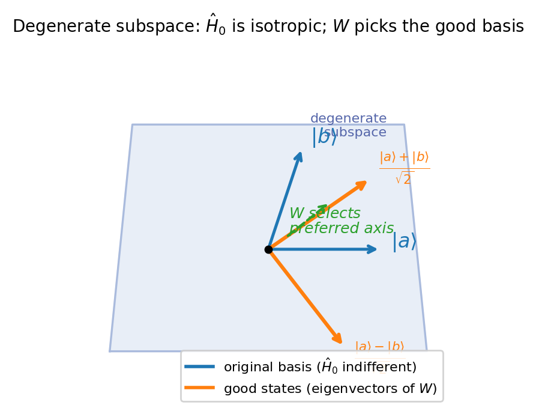
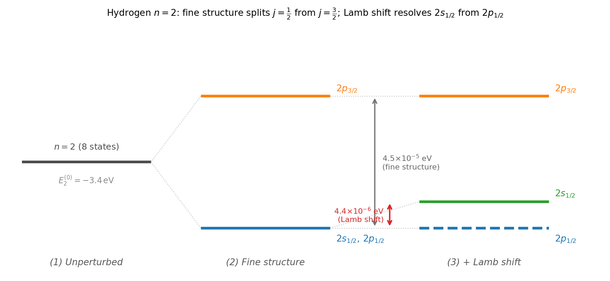

# Chapter 2 — Degenerate Perturbation Theory and Fine Structure

In 1913, Johannes Stark applied an electric field of about $10^5$ V/cm to hydrogen gas and observed the Balmer lines split. The $n=2$ level — fourfold degenerate in the unperturbed atom, with states $2s$, $2p_0$, $2p_{+1}$, $2p_{-1}$ all sitting at $-3.4$ eV — split into exactly three spectral lines. Not four. Three. One line shifted up, one shifted down by the same amount, and one that did not shift at all. The unshifted line was twice as intense as either shifted line, indicating that it contains two states.

This chapter explains these observations using degenerate perturbation theory, extends the same logic to hydrogen's fine structure, and identifies the boundary where this framework gives way to quantum electrodynamics.

---

## The Breakdown and the Fix

Recall the first-order state correction from Chapter 1:

$$|n^{(1)}\rangle = \sum_{m \neq n}\frac{\langle m^{(0)}|\hat{H}'|n^{(0)}\rangle}{E_n^{(0)} - E_m^{(0)}}\,|m^{(0)}\rangle.$$

Suppose two states share an energy: $E_a^{(0)} = E_b^{(0)}$. The term with $m = b$ in the sum for $|a^{(1)}\rangle$ has a zero denominator. The formula is undefined.

The difficulty here is not that perturbation theory cannot handle degenerate levels. It is that the *basis within the degenerate subspace* is ambiguous. If $\hat{H}_0|a\rangle = E^{(0)}|a\rangle$ and $\hat{H}_0|b\rangle = E^{(0)}|b\rangle$, then any linear combination $\alpha|a\rangle + \beta|b\rangle$ satisfies the unperturbed eigenvalue equation at the same energy. The unperturbed Hamiltonian cannot distinguish among these combinations.

The perturbation $\hat{H}'$ breaks this symmetry. As $\lambda$ is slowly turned up from zero, the eigenstates of the full $\hat{H}$ deform continuously from *specific* linear combinations of $|a\rangle$ and $|b\rangle$ — the ones that connect smoothly to the perturbed eigenstates — into the true eigenstates. These preferred combinations are the **good zeroth-order states**. The nondegenerate formula diverges precisely because it was applied starting from the wrong zeroth-order states; the zero denominator signals that the formula cannot determine which combination to use.

**The fix.** We restrict $\hat{H}'$ to the degenerate subspace and construct the matrix of its matrix elements:

$$W_{ij} = \langle i|\hat{H}'|j\rangle \quad i,j \in \text{degenerate subspace.}$$

We diagonalize $W$. The **eigenvalues** are the first-order energy corrections $E_n^{(1)}$. The **eigenvectors** are the good zeroth-order states — the correct starting basis from which nondegenerate perturbation theory proceeds without zero denominators.

This procedure is the general case, not a special trick. Nondegenerate perturbation theory is what happens when the degenerate subspace is one-dimensional and the diagonalization is trivial. Whenever the unperturbed Hamiltonian has a symmetry — and hydrogen has an unusually large one — the degenerate version is the appropriate tool.

---

## The Geometry of Good States

Before computing anything for hydrogen, it is helpful to visualize the geometry. The degenerate subspace is a plane in Hilbert space. Every vector in that plane is an equally valid zeroth-order state at energy $E^{(0)}$. The unperturbed Hamiltonian is isotropic in this plane — it cannot select a preferred direction.

The perturbation matrix $W$ can, and generically does, select a preferred direction. It identifies one axis in the plane along which the energy response to the perturbation is maximal and one along which it is minimal. These eigenvectors are the good states — the combinations that decouple from each other under the perturbation at first order.

For the Stark effect, the preferred directions turn out to be $(|2s\rangle \pm |2p_0\rangle)/\sqrt{2}$: probability clouds asymmetrically shifted along the field axis. That asymmetry is what allows them to couple to an electric field at first order.

<!-- → [FIGURE: geometric diagram of the degenerate subspace as a plane — showing the original basis vectors |a⟩ and |b⟩, the perturbation matrix W acting as an "arrow" in the plane, and the good states as the eigenvectors of W; the visual point is that W selects a preferred basis even though H₀ cannot] -->


*Figure 2.1 — geometric diagram of the degenerate subspace as a plane — showing the original basis vectors |a⟩ and |b⟩, the perturbation matrix W acting…*

---

## The Linear Stark Effect: Hydrogen $n=2$ in an Electric Field

We apply a uniform electric field along $\hat{z}$. The perturbation is $\hat{H}' = e\mathcal{E}\hat{z}$. The four degenerate $n=2$ states are $\{|2s\rangle, |2p_0\rangle, |2p_{+1}\rangle, |2p_{-1}\rangle\}$, with subscripts denoting $m_\ell$.

We need the $4\times4$ perturbation matrix. Selection rules eliminate most entries before any integral is computed.

**$m_\ell$ conservation.** The commutator $[\hat{H}', \hat{L}_z] = [e\mathcal{E}\hat{z}, \hat{L}_z] = 0$, because $\hat{z}$ is rotationally symmetric about $\hat{z}$. The perturbation $\hat{H}'$ cannot change $m_\ell$: any matrix element with $m_\ell' \neq m_\ell$ is exactly zero. This immediately zeroes out all entries coupling $|2s\rangle$ or $|2p_0\rangle$ to $|2p_{+1}\rangle$ or $|2p_{-1}\rangle$.

**Parity.** The operator $\hat{z}$ is odd under $\vec{r} \to -\vec{r}$. A diagonal matrix element $\langle\psi|\hat{z}|\psi\rangle$ with $|\psi\rangle$ of definite parity integrates to zero: parity-even $\times$ parity-odd $\times$ parity-even is parity-odd, and integrating an odd function over all space gives zero. All four states have definite parity ($\ell = 0$ is even; $\ell = 1$ is odd), so all diagonal entries vanish. The $|2p_0\rangle$–$|2p_{\pm1}\rangle$ entries also vanish by the $\Delta m_\ell = 0$ rule, and the $|2p_{+1}\rangle$–$|2p_{-1}\rangle$ entry by parity (both odd).

After both selection rules, the only possibly nonzero off-diagonal entry is $\langle 2s|\hat{z}|2p_0\rangle$: this mixes $\ell = 0$ (even) and $\ell = 1$ (odd) at the same $m_\ell = 0$, and parity allows it (even $\times$ odd $\times$ odd = even integrand).

**Computing the surviving element.** The hydrogenic wave functions are $\psi_{2s} = R_{20}(r)Y_0^0(\theta,\phi)$ and $\psi_{2p_0} = R_{21}(r)Y_1^0(\theta,\phi)$. Writing $\hat{z} = r\cos\theta$:

$$\langle 2s|\hat{z}|2p_0\rangle = \underbrace{\int Y_0^{0*}\cos\theta\, Y_1^0\,d\Omega}_{= 1/\sqrt{3}} \times \underbrace{\int_0^\infty R_{20}(r)\,r\,R_{21}(r)\,r^2\,dr}_{= -3\sqrt{6}\,a_0} = -3a_0.$$

The full $4\times4$ matrix $W = e\mathcal{E}\langle\cdot|\hat{z}|\cdot\rangle$, with rows and columns ordered $\{|2s\rangle, |2p_0\rangle, |2p_{+1}\rangle, |2p_{-1}\rangle\}$:

$$W = e\mathcal{E}\begin{pmatrix}0 & -3a_0 & 0 & 0 \\ -3a_0 & 0 & 0 & 0 \\ 0 & 0 & 0 & 0 \\ 0 & 0 & 0 & 0\end{pmatrix}.$$

This block-diagonalizes by inspection. The lower-right $2\times2$ block is zero — $|2p_{+1}\rangle$ and $|2p_{-1}\rangle$ are already good states with $E^{(1)} = 0$. The upper-left $2\times2$ block

$$\begin{pmatrix}0 & -3a_0 e\mathcal{E} \\ -3a_0 e\mathcal{E} & 0\end{pmatrix}$$

has eigenvalues $\pm 3a_0 e\mathcal{E}$ and eigenvectors $(|2s\rangle \mp |2p_0\rangle)/\sqrt{2}$.

**The result.** The $n=2$ level splits into three distinct energies:

- $E_2^{(0)} + 3a_0 e\mathcal{E}$: good state $(|2s\rangle - |2p_0\rangle)/\sqrt{2}$
- $E_2^{(0)} - 3a_0 e\mathcal{E}$: good state $(|2s\rangle + |2p_0\rangle)/\sqrt{2}$
- $E_2^{(0)}$: doubly degenerate, states $|2p_{+1}\rangle$ and $|2p_{-1}\rangle$

Three lines from four states. The middle line contains two states — hence its double intensity. The shifts are exactly symmetric (same up and down) because the $2\times2$ block is traceless: both diagonal entries vanish. The two shifted good states are probability clouds asymmetric along $\hat{z}$: one has more electron density above the nucleus, the other below. An asymmetric charge distribution couples to an electric field at first order. The $|2p_{\pm1}\rangle$ states are azimuthally symmetric about $\hat{z}$ and cannot polarize along it at first order.

We can compare this to the ground state: $\langle 1s|e\mathcal{E}\hat{z}|1s\rangle = 0$ by parity. There is no partner at the same energy to mix with at first order. The ground state acquires a second-order (quadratic) shift — proportional to $\mathcal{E}^2$, tiny for ordinary laboratory fields. The linear Stark effect of $n=2$ versus the quadratic Stark effect of $n=1$ is a direct consequence of degeneracy.

<!-- → [FIGURE: energy-level diagram of the hydrogen n=2 Stark effect — showing all four states degenerate at ε=0 on the left, then splitting into three lines as ε increases on the right; label the good states (|2s⟩ ± |2p₀⟩)/√2 with their ±3a₀eε shifts, and the two unsplit |2p±₁⟩ states; note the double intensity of the middle line] -->


*Figure 2.2 — energy-level diagram of the hydrogen n=2 Stark effect — showing all four states degenerate at ε=0 on the left, then splitting into three lines as ε increases on the right; label the good states (|2s⟩ ± |2p₀⟩)/√2 with their ±3a₀eε shifts, and the two unsplit |2p±₁⟩ states; note the double intensity of the middle line*

---

## Hydrogen Fine Structure: Three Perturbations

High-resolution spectroscopy reveals that hydrogen's energy levels depend not only on $n$ but also on $j$, at the level of $\alpha^2|E_n^{(0)}| \sim 10^{-4}$ eV for $n=2$, where $\alpha = e^2/(4\pi\epsilon_0\hbar c) \approx 1/137$ is the fine-structure constant. Three perturbations — all of order $\alpha^2$ relative to $\hat{H}_0$ — produce this fine structure. All three must be treated simultaneously, because they are the same order of magnitude.

### Perturbation 1: Relativistic Kinetic Energy

The nonrelativistic kinetic energy $\hat{p}^2/2m$ is the leading term in the expansion of $\sqrt{\hat{p}^2c^2 + m^2c^4} - mc^2$ for $\hat{p} \ll mc$:

$$\sqrt{\hat{p}^2c^2 + m^2c^4} - mc^2 = \frac{\hat{p}^2}{2m} - \frac{\hat{p}^4}{8m^3c^2} + \cdots$$

The next term is the relativistic kinetic correction:

$$\hat{H}'_\text{rel} = -\frac{\hat{p}^4}{8m^3c^2}.$$

This shifts every level, including $\ell = 0$ states. Its first-order correction uses $\langle\hat{p}^4\rangle_{n\ell}$, computed via $\hat{p}^2 = 2m(\hat{H}_0 + e^2/4\pi\epsilon_0 r)$ and the expectation values $\langle 1/r\rangle_{n\ell}$ and $\langle 1/r^2\rangle_{n\ell}$ for hydrogen. [verify]

### Perturbation 2: Spin-Orbit Coupling

In the electron's rest frame, the orbiting nucleus creates a magnetic field. The naive approach — boost the electric field and couple the electron's spin magnetic moment to the resulting magnetic field — gives the wrong answer by a factor of 2.

The correction is the **Thomas precession**: the electron's rest frame is non-inertial (it accelerates in orbit), and a non-inertial frame rotating in a magnetic field acquires an extra spin precession at exactly $-\frac{1}{2}$ the naive rate. After including the Thomas factor:

$$\hat{H}'_\text{SO} = \frac{e^2}{8\pi\epsilon_0 m^2c^2}\cdot\frac{\hat{\vec{L}}\cdot\hat{\vec{S}}}{r^3}.$$

The factor of $\frac{1}{2}$ is required. Omitting it gives a spin-orbit splitting twice as large. It arises from the Lorentz covariance of the electromagnetic field tensor — a purely kinematic, not dynamic, effect. The Dirac equation produces this factor automatically. [verify]

The spin-orbit term couples $\hat{\vec{L}}$ and $\hat{\vec{S}}$, making individual projections $m_\ell$ and $m_s$ no longer good quantum numbers. The appropriate quantum number is $j = \ell \pm s$, and in the $|n,\ell,j,m_j\rangle$ basis:

$$\hat{\vec{L}}\cdot\hat{\vec{S}} = \frac{1}{2}(\hat{J}^2 - \hat{L}^2 - \hat{S}^2) = \frac{\hbar^2}{2}\left[j(j+1) - \ell(\ell+1) - \tfrac{3}{4}\right].$$

The radial expectation value $\langle 1/r^3\rangle_{n\ell}$ diverges as $\ell \to 0$, but the pre-factor $j(j+1) - \ell(\ell+1) - \frac{3}{4}$ evaluates to zero for $\ell = 0$ (since $j = s = \frac{1}{2}$ gives $\frac{3}{4} - 0 - \frac{3}{4} = 0$). The spin-orbit energy correction therefore vanishes for all $s$-states — physically expected, since there is no orbital angular momentum to couple.

### Perturbation 3: The Darwin Term

A third correction arises from the Dirac equation. It can be motivated by **Zitterbewegung**: the rapid quantum jitter of a relativistic electron at the scale of the Compton wavelength $\hbar/mc$ smears the electron over a tiny volume, so it sees the average Coulomb potential over a small sphere rather than the exact value at $\vec{r}$. The leading correction for a potential $V(r)$ from this smearing is proportional to $\nabla^2 V$. For the Coulomb potential, $\nabla^2\!\left(-\dfrac{e^2}{4\pi\epsilon_0 r}\right) = \dfrac{e^2}{\epsilon_0}\delta^3(\vec{r})$, giving:

$$\hat{H}'_\text{Darwin} = \frac{\pi\hbar^2}{2m^2c^2}\cdot\frac{e^2}{4\pi\epsilon_0}\,\delta^3(\vec{r}).$$

The delta function means the Darwin correction is nonzero **only for $\ell = 0$ states**, because only $s$-wave functions have $|\psi(0)|^2 \neq 0$.

The complementarity is worth noting: spin-orbit vanishes for $\ell = 0$; Darwin vanishes for $\ell \neq 0$. They partition the corrections between $s$-states and all others.

<!-- → [TABLE: summary of the three fine-structure perturbations — columns: name, operator, which states it affects (ℓ=0, ℓ≠0, all), physical origin, order in α²; this is the reference table for the three-correction structure] -->

---

## The Combined Formula and What It Reveals

All three perturbations are the same order $\alpha^2 E_n^{(0)}$, so we treat them simultaneously. The unperturbed $n$-level is $2n^2$-fold degenerate (including spin). To diagonalize the sum $\hat{H}'_\text{rel} + \hat{H}'_\text{SO} + \hat{H}'_\text{Darwin}$ in this subspace, we need the good quantum numbers. All three terms commute with $\hat{J}^2$ and $\hat{J}_z$ — the total angular momentum basis $(n, \ell, j, m_j)$ diagonalizes the perturbation. Computing each correction and summing gives the combined fine-structure formula: [verify]

$$\boxed{E_n^\text{fs} = -\frac{(E_n^{(0)})^2}{2mc^2}\left(\frac{4n}{j+\tfrac{1}{2}} - 3\right).}$$

This result depends on $n$ and $j$ only — not on $\ell$ separately. This cancellation is notable: the relativistic correction and spin-orbit correction individually depend on $\ell$, but their sum does not (for $\ell \neq 0$; the Darwin term handles $\ell = 0$ to yield the same formula). The $\ell$-independence is a signature of the hidden SO(4) symmetry of the Coulomb problem — the same symmetry that makes the unperturbed levels depend only on $n$. Relativistic corrections partially break this symmetry, but only down to SO(3), which is why $j$ survives as the distinguishing quantum number.

---

## Worked Example: Hydrogen $n=2$ Fine Structure

For $n=2$, the allowed $j$ values are:

- $j = \frac{1}{2}$: accessible from $\ell = 0$ (the $2s$ state, $j = s = \frac{1}{2}$) and from $\ell = 1$ (the $2p$ state with $j = \ell - s = \frac{1}{2}$), giving the $2s_{1/2}$ and $2p_{1/2}$ states.
- $j = \frac{3}{2}$: accessible from $\ell = 1$ only (the $2p$ state with $j = \ell + s = \frac{3}{2}$), giving the $2p_{3/2}$ state.

We compute the corrections. The prefactor is $(E_2^{(0)})^2/(2mc^2) = (3.4)^2/(2\times511000) = 1.131\times10^{-5}$ eV.

**For $j = \frac{1}{2}$** (states $2s_{1/2}$ and $2p_{1/2}$):

$$E_2^\text{fs}\Big|_{j=1/2} = -1.131\times10^{-5}\,\text{eV}\times\left(\frac{4\times 2}{1} - 3\right) = -5.66\times10^{-5}\,\text{eV.}$$

**For $j = \frac{3}{2}$** (state $2p_{3/2}$):

$$E_2^\text{fs}\Big|_{j=3/2} = -1.131\times10^{-5}\,\text{eV}\times\left(\frac{4\times 2}{2} - 3\right) = -1.13\times10^{-5}\,\text{eV.}$$

Both corrections are negative. The $j = \frac{1}{2}$ states shift down by $5.66\times10^{-5}$ eV; the $2p_{3/2}$ shifts down by only $1.13\times10^{-5}$ eV. Therefore $2p_{3/2}$ sits *above* the $j=\frac{1}{2}$ pair:

$$\Delta E_\text{FS} = (-1.13 + 5.66)\times10^{-5}\,\text{eV} \approx 4.5\times10^{-5}\,\text{eV.}$$

The formula predicts $2s_{1/2}$ and $2p_{1/2}$ exactly degenerate — both have $j = \frac{1}{2}$, and the formula depends only on $n$ and $j$.

---

## The Boundary: Where This Framework Ends

In 1947, Willis Lamb and Robert Retherford tested the predicted degeneracy of $2s_{1/2}$ and $2p_{1/2}$ directly, using microwave spectroscopy. The two levels are not degenerate: $2s_{1/2}$ lies about 1057 MHz ($\approx 4.4\times10^{-6}$ eV) above $2p_{1/2}$.

The Lamb shift has nothing to do with the three corrections above. It arises from quantum electrodynamics: the electron interacts not just with the classical Coulomb field but with the quantum fluctuations of the electromagnetic field itself. Vacuum fluctuations shift the electron's position slightly, shifting its energy. The $2s_{1/2}$ state (finite probability at the nucleus, more sensitive to short-distance physics) is shifted more than $2p_{1/2}$. Computing the Lamb shift requires quantizing the electromagnetic field — a framework beyond this chapter.

The Lamb shift was the first precision test of renormalized QED, and Lamb shared the 1955 Nobel Prize in Physics for it. The hierarchy for $n=2$ hydrogen makes the scaling clear:

$$\underbrace{E_2^{(0)} = -3.4\,\text{eV}}_\text{Bohr/Coulomb} \quad\to\quad \underbrace{\Delta E_\text{FS} \approx 4.5\times10^{-5}\,\text{eV}}_\text{fine structure (this chapter)} \quad\to\quad \underbrace{\Delta E_\text{Lamb} \approx 4\times10^{-6}\,\text{eV}}_\text{Lamb shift (QED).}$$

Each step is roughly an order of magnitude smaller. The fine-structure formula marks a boundary: within it, semiclassical perturbation theory applies. The Lamb shift is the first correction beyond that boundary, and it requires a fundamentally different framework.

<!-- → [FIGURE: n=2 hydrogen energy-level diagram showing three stages — (1) the unperturbed level with all 8 states degenerate, (2) after fine structure with 2p₃/₂ above 2s₁/₂/2p₁/₂, (3) after Lamb shift with 2s₁/₂ slightly above 2p₁/₂; annotate each splitting with its numerical value and physical origin; the Lamb shift arrow should be visibly much smaller than the fine-structure arrow] -->


*Figure 2.3 — n=2 hydrogen energy-level diagram showing three stages — (1) the unperturbed level with all 8 states degenerate, (2) after fine structure…*

---

## Exercises

**Warm-up**

1. *Difficulty: Warm-up — tests conceptual understanding of the degenerate PT breakdown.*
   Explain in your own words why the formula $|n^{(1)}\rangle = \sum_{m\neq n}\langle m|\hat{H}'|n\rangle/(E_n^{(0)}-E_m^{(0)})|m\rangle$ breaks down when two unperturbed states share the same energy. Your explanation should identify (a) which term in the sum causes the problem and (b) why the problem is a basis ambiguity rather than a fundamental failure of perturbation theory.
   *Tests: distinguishing basis ambiguity from a breakdown of the perturbative approach itself.*

2. *Difficulty: Warm-up — tests selection rules before any calculation.*
   State the two selection rules that eliminate most entries of the $4\times4$ Stark matrix for the hydrogen $n=2$ manifold before computing any integral. For each of the six distinct pairs $\{|2s\rangle,|2p_0\rangle\}$, $\{|2s\rangle,|2p_{+1}\rangle\}$, $\{|2s\rangle,|2p_{-1}\rangle\}$, $\{|2p_0\rangle,|2p_{+1}\rangle\}$, $\{|2p_0\rangle,|2p_{-1}\rangle\}$, $\{|2p_{+1}\rangle,|2p_{-1}\rangle\}$: state which rule kills the matrix element, or confirm it survives. How many distinct integrals actually need to be computed?
   *Tests: applying symmetry arguments before brute-force calculation; identifying which entries survive both selection rules.*

3. *Difficulty: Warm-up — tests the complementarity of the Darwin and spin-orbit terms.*
   For each of the three $n=2$ fine-structure corrections (relativistic kinetic, spin-orbit, Darwin): state whether it is nonzero for $2s_{1/2}$, $2p_{1/2}$, and $2p_{3/2}$. Explain in one sentence each why the spin-orbit correction vanishes for the $2s_{1/2}$ state and why the Darwin correction vanishes for all $p$-states.
   *Tests: the Darwin/spin-orbit complementarity and its physical basis.*

**Application**

4. *Difficulty: Application — numerical evaluation of the fine-structure formula.*
   Using $E_n^\text{fs} = -(E_n^{(0)})^2/(2mc^2)\times(4n/(j+\tfrac{1}{2})-3)$ with $E_2^{(0)} = -3.4$ eV and $mc^2 = 0.511$ MeV: (a) compute $E_2^\text{fs}$ for $j=\frac{1}{2}$ and $j=\frac{3}{2}$ numerically in eV; (b) confirm which state sits lower; (c) compute the splitting $\Delta E_\text{FS}$ and express it as a multiple of $\alpha^2|E_2^{(0)}|$ using $\alpha \approx 1/137$; (d) compute the ratio $\Delta E_\text{FS}/\Delta E_\text{Lamb}$ where $\Delta E_\text{Lamb} \approx 4\times10^{-6}$ eV.
   *Tests: numerical command of the formula; placing both splittings in the hierarchy.*

5. *Difficulty: Application — sign analysis for the spin-orbit term.*
   The spin-orbit correction is proportional to $\langle\hat{\vec{L}}\cdot\hat{\vec{S}}\rangle = \frac{\hbar^2}{2}[j(j+1)-\ell(\ell+1)-\frac{3}{4}]$. (a) Evaluate this for the $2p_{1/2}$ state ($\ell=1$, $j=\frac{1}{2}$) and the $2p_{3/2}$ state ($\ell=1$, $j=\frac{3}{2}$). What are the signs? (b) The $2p_{1/2}$ spin-orbit correction is negative (spin antiparallel to orbital angular momentum). Explain physically why antiparallel alignment has lower energy than parallel alignment. (c) Why is the spin-orbit correction exactly zero for $2s_{1/2}$? Give both the algebraic reason and the physical reason.
   *Tests: evaluating $\vec{L}\cdot\vec{S}$ eigenvalue; connecting the sign to physical alignment; identifying the ℓ=0 special case.*

6. *Difficulty: Application — good states under a differently oriented field.*
   In the Stark effect as computed, the field points along $\hat{z}$ and the good states are $(|2s\rangle \pm |2p_0\rangle)/\sqrt{2}$. Now suppose the field is along $\hat{x}$ instead, so $\hat{H}' = e\mathcal{E}\hat{x}$. (a) The $m_\ell$ conservation rule changes: using $\hat{x} = -r/\sqrt{2}(Y_1^{+1} - Y_1^{-1})\sin\phi + \ldots$, identify which $m_\ell$ values can now mix. (b) Which pairs of states from $\{|2s\rangle, |2p_{-1}\rangle, |2p_0\rangle, |2p_{+1}\rangle\}$ have nonzero matrix elements under $\hat{H}' = e\mathcal{E}\hat{x}$? (c) By physical symmetry, should the magnitude of the energy splittings (the eigenvalues) change when the field direction rotates from $\hat{z}$ to $\hat{x}$? Justify your answer without computing.
   *Tests: how good states depend on perturbation direction; recognizing when physical symmetry fixes the answer.*

**Synthesis**

7. *Difficulty: Synthesis — diagonalizing the general two-state degenerate problem.*
   Two states $|a\rangle$ and $|b\rangle$ share energy $E^{(0)}$. The perturbation matrix restricted to this subspace is
   $W = \bigl(\begin{smallmatrix}\alpha & \beta \\ \beta^* & \alpha\end{smallmatrix}\bigr)$
   where $\alpha$ is real and $\beta$ may be complex. (a) Find the two eigenvalues of $W$. (b) Find the eigenvectors (the good states). (c) Identify which case in the Stark $W$ matrix this is (what are $\alpha$ and $\beta$ for the $\{|2s\rangle, |2p_0\rangle\}$ block?). (d) For $|\beta| \ll |\alpha|$, expand the eigenvalues to leading order in $\beta/\alpha$. When does the off-diagonal mixing become negligible relative to the diagonal splitting?
   *Tests: diagonalizing the general 2×2 degenerate PT problem; extracting the Stark case as a special instance; understanding when mixing is suppressed.*

8. *Difficulty: Synthesis — fine-structure level diagram for $n=3$.*
   Hydrogen $n=3$ has $j$-values $\frac{1}{2}$ (from $3s_{1/2}$ and $3p_{1/2}$), $\frac{3}{2}$ (from $3p_{3/2}$ and $3d_{3/2}$), and $\frac{5}{2}$ (from $3d_{5/2}$). (a) Compute $E_3^\text{fs}$ for each $j$ from the formula. (b) Draw a labeled energy-level diagram showing the $n=3$ manifold split by fine structure; mark each level with its $j$-value and spectroscopic labels. (c) Which levels are degenerate according to the fine-structure formula? What would the Lamb shift do to these pairs? (d) How many distinct spectral lines would you observe in $n=3 \to n=2$ transitions including fine structure but ignoring the Lamb shift?
   *Tests: applying the combined formula to a higher manifold; drawing and reading a level diagram; counting transition lines.*

**Challenge**

9. *Difficulty: Challenge — the Thomas factor from kinematic first principles.*
   A classical electron orbiting the proton at radius $r$ with orbital frequency $\omega$ experiences in its rest frame a magnetic field $\vec{B}_\text{naive} = -\vec{v}\times\vec{E}/c^2$ from the Lorentz boost of the Coulomb field. (a) Compute $\vec{B}_\text{naive}$ in terms of $r$, $\omega$, and fundamental constants, and write the resulting spin-orbit coupling $\hat{H}_\text{naive} = -\vec{\mu}\cdot\vec{B}_\text{naive}$ where $\vec{\mu} = -g_e\mu_B\hat{\vec{S}}/\hbar$ with $g_e \approx 2$. (b) The Thomas precession adds a term $-\vec{\Omega}_T\cdot\hat{\vec{S}}$ where the Thomas precession rate is $\vec{\Omega}_T = -(1/2c^2)\vec{a}\times\vec{v}$ and $\vec{a}$ is the electron's centripetal acceleration. Show that for a circular orbit, $\vec{\Omega}_T = -\frac{1}{2}\vec{\omega}$ where $\vec{\omega}$ is the orbital angular velocity vector. (c) Combine the naive coupling and the Thomas correction to show the net spin-orbit Hamiltonian has a factor of $\frac{1}{2}$ relative to the naive result. (d) At what step does the identification $g_e \approx 2$ (rather than $g_e = 1$) enter, and how does the Thomas correction interact with the $g$-factor to give the correct spin-orbit coupling?
   *Tests: deriving the Thomas factor from classical kinematics; understanding how the $g$-factor and Thomas precession conspire to give the correct coefficient.*

---

## LLM Exercises

The following exercises are designed to be worked with a large language model as a thinking partner — not to obtain derivations, but to probe reasoning, test the limits of the chapter's claims, and build physical intuition.

1. Ask an LLM to explain why the good zeroth-order states are eigenvectors of the perturbation matrix $W$, not of the full Hamiltonian. Specifically: what property of the good states makes the nondegenerate first-order state-correction formula finite (rather than divergent) when you use them as the starting basis? Ask it to walk through the argument with an explicit two-state example.

2. Ask an LLM to explain the physical origin of the Stark effect's linear versus quadratic distinction: why does $n=2$ show a linear shift (proportional to $\mathcal{E}$) while $n=1$ shows only a quadratic shift (proportional to $\mathcal{E}^2$)? The explanation should use the words "parity," "degeneracy," and "first-order." Evaluate whether its answer correctly identifies both conditions (definite parity kills diagonal matrix elements; degeneracy between opposite-parity states is required for off-diagonal elements to contribute at first order).

3. The Thomas factor of $\frac{1}{2}$ in spin-orbit coupling is a kinematic relativistic effect, not a dynamical one. Ask an LLM to explain what distinguishes kinematic from dynamical relativistic effects in this context, and to confirm that the Dirac equation automatically produces the Thomas factor without any additional input. Ask it to explain the qualitative reason why a non-inertial reference frame (the electron's orbit is accelerating) produces a spin precession.

4. Ask an LLM to verify the claim that the combined fine-structure formula $E_n^\text{fs} = -(E_n^{(0)})^2/(2mc^2)(4n/(j+\frac{1}{2})-3)$ depends on $n$ and $j$ only, even though the three individual corrections each depend on $\ell$. Ask it to show the cancellation explicitly for the $n=2$ case by computing each of the three corrections separately for the $2p_{1/2}$ state and demonstrating that their sum equals the formula evaluated at $j=\frac{1}{2}$.

5. The Lamb shift lifts the degeneracy of $2s_{1/2}$ and $2p_{1/2}$ that fine structure predicts. Ask an LLM to explain in physical terms why $2s_{1/2}$ shifts more than $2p_{1/2}$: the answer should involve the electron's probability density at the nucleus, the sensitivity of $s$-states versus $p$-states to short-distance vacuum fluctuations, and the concept of "charge renormalization" in QED. Evaluate whether the explanation correctly identifies all three ingredients.

---

## References

Griffiths, D. J., & Schroeter, D. F. (2018). *Introduction to Quantum Mechanics* (3rd ed.). Cambridge University Press. §7.3.

Townsend, J. S. (2012). *A Modern Approach to Quantum Mechanics* (2nd ed.). University Science Books. §§3.3–3.4.

Lamb, W. E., & Retherford, R. C. (1947). Fine structure of the hydrogen atom by a microwave method. *Physical Review*, 72(3), 241–243. doi:10.1103/PhysRev.72.241

Stark, J. (1914). Beobachtungen über den Effekt des elektrischen Feldes auf Spektrallinien. *Annalen der Physik*, 348(7), 965–982.

Zwiebach, B. (2018). *Quantum Physics III* (MIT OCW 8.06). Massachusetts Institute of Technology.

---

## Running Project — Model a Real Quantum System, End to End

**This chapter adds:** degenerate perturbation theory to the toolkit, and the fine-structure scale $\varepsilon = \alpha^2 \approx (1/137)^2$ as a second row of the method-selection table — the row that governs any system whose leading splitting is set by relativistic/spin-orbit corrections (a candidate for the linear Stark and hydrogen-field systems in the capstone).

Today's table entry: **degenerate PT — $\varepsilon = \alpha^2 = (e^2/4\pi\epsilon_0\hbar c)^2 \approx 5.3\times10^{-5}$ for fine structure — applies when the unperturbed level is degenerate and the splitting is small relative to the level itself; breaks at the next order (the Lamb shift), which needs QED.** The key discipline this chapter contributes to the capstone: when states are degenerate, we must *diagonalize $\hat{H}'$ in the subspace first* — applying the non-degenerate formula naively gives a zero denominator, the formula's way of indicating that the basis was wrong.

### Exercise R1 — When to Use AI
**The judgment:** In this chapter's project work, AI assistance is appropriate for:
- Applying the two selection rules ($\Delta m_\ell = 0$, parity) to enumerate which of the six $n=2$ Stark matrix pairs survive — *Why AI works here:* it is a finite case check you can verify entry by entry against the symmetry argument.
- Building and diagonalizing a small symbolic/numeric $W$ matrix and reading off eigenvalues $\pm 3a_0 e\mathcal{E}$ and eigenvectors $(|2s\rangle\mp|2p_0\rangle)/\sqrt2$ — *Why AI works here:* a $4\times4$ diagonalization is mechanical and checkable against the traceless-block structure.
- Plugging numbers into $E_n^\text{fs}=-(E_n^{(0)})^2/(2mc^2)(4n/(j+\tfrac12)-3)$ — *Why AI works here:* arithmetic with a fixed formula, checkable by hand.

**The tell:** You are using AI well when you have an independent check — here, the block-diagonal structure of $W$ and the $\ell$-independence of the combined fine-structure formula.

### Exercise R2 — When NOT to Use AI
**The judgment:** These tasks require your judgment; AI output here can't be trusted without redoing the work:
- Deciding whether the field is "weak" (use degenerate PT in the $j$ basis) or "strong" (Paschen-Back, uncoupled basis) for *your* parameters — *Why AI fails here:* it will pick a regime without checking $\mu_B B$ against $\Delta E_\text{fs}$, and the intermediate regime has no closed form at all. This is a small-parameter call.
- Trusting the spin-orbit factor of $\tfrac12$ (Thomas precession) or the Darwin/spin-orbit complementarity — *Why AI fails here:* a factor-of-2 error here is exactly the kind of plausible-but-wrong mistake an LLM will not flag, and it doubles the predicted splitting.

**The tell:** If you could not explain the result without the AI — if the AI is your *reason* rather than your *tool* — it did work that should have been yours.

**Physics-judgment connection:** This trains comparing a computed splitting against the known hierarchy ($E^{(0)} \gg \Delta E_\text{fs} \sim \alpha^2 E^{(0)} \gg \Delta E_\text{Lamb}$) — checking that your number lands in the right decade before believing it.

### Exercise R3 — LLM Exercise
**What you're building this chapter:** the degenerate-PT row of the running table, plus a verified fine-structure splitting for hydrogen $n=2$.
**Tool:** Claude Project — append to the same running table started in Chapter 1.
**The Prompt:**
```
Append a second row to my method-selection table for DEGENERATE
perturbation theory. Columns: method | small parameter epsilon | formula for
epsilon | breaks when. For fine structure, epsilon = alpha^2 where
alpha = e^2/(4 pi eps0 hbar c) ~ 1/137, so epsilon ~ 5.3e-5. "Breaks when":
when the perturbation is NOT small relative to the level spacing, OR at the
next order where QED (Lamb shift) enters. Note in the cell that the method
requires diagonalizing H' in the degenerate subspace first.

Then compute, showing all arithmetic, the hydrogen n=2 fine-structure
energies from E_fs = -(E_n^0)^2/(2 m c^2) * (4n/(j+1/2) - 3) with
E_2^0 = -3.4 eV and m c^2 = 0.511 MeV, for j=1/2 and j=3/2. Report the
splitting Delta E_FS between them in eV, and express it as a multiple of
alpha^2 |E_2^0|.

Do NOT tell me whether a given external field is "weak" or "strong" for any
particular B — I will check mu_B B against Delta E_fs myself. Do NOT silently
change the Thomas factor of 1/2.
```
**What this produces:** the table's second row and a fine-structure splitting ($\approx 4.5\times10^{-5}$ eV) you check against the chapter's worked example.
**How to adapt:** *Your system:* if your capstone is the ammonia/maser two-state splitting, note that the same $2\times2$ diagonalization structure recurs there. *ChatGPT/Gemini:* watch for the model dropping the Thomas $\tfrac12$ or mislabeling which state sits higher. *Claude Project:* keep the running table in project instructions so the row persists.
**Builds on:** Chapter 1's table seed and the non-degenerate breakdown (zero denominator).  **Next:** Chapter 3 adds the variational row — the one method with *no* breakdown parameter, only an upper-bound guarantee.

### Exercise R4 — CLI Exercise
**What you're building this chapter:** an appended table row and a script that diagonalizes the $4\times4$ Stark $W$ matrix and the hydrogen $n=2$ fine-structure levels.
**Tool:** Claude Code
**Skill level:** Beginner
**Setup — confirm:**
- [ ] `method-table.md` from Chapter 1 exists in the project directory.
- [ ] Python 3 + numpy.
- [ ] `CLAUDE.md` rule from Chapter 1 (append-only table) is present.
**The Task:**
```
In the running-project directory:
1. Append the degenerate-PT row to method-table.md (do not edit existing rows).
2. Create check_degenerate.py that:
   - builds the 4x4 Stark matrix W = e*E_field * [[0,-3a0,0,0],[-3a0,0,0,0],
     [0,0,0,0],[0,0,0,0]] (use e=a0=E_field=1 for structure), diagonalizes it,
     and prints eigenvalues and eigenvectors; confirm eigenvalues +/-3 and two 0s.
   - computes E_fs for j=1/2 and j=3/2 from the fine-structure formula with
     E_2^0=-3.4 eV, m c^2=0.511e6 eV; prints both and their difference.
3. Run it. Confirm the W eigenvectors are (|2s> -/+ |2p0>)/sqrt(2) and that
   Delta E_FS ~ 4.5e-5 eV.
Touch no files outside this directory. Report the eigenvalues and the splitting.
```
**Expected output:** appended table row; console listing $W$ eigenvalues $\{+3,-3,0,0\}$, the good-state eigenvectors, and $\Delta E_\text{FS}\approx 4.5\times10^{-5}$ eV.
**What to inspect:** the two shifted eigenvalues are equal and opposite (traceless block); the two unshifted states are $|2p_{\pm1}\rangle$; the splitting lands in the $10^{-5}$ eV decade.
**If it goes wrong:** if the splitting comes out near $10^{-4}$ eV, the script likely doubled the spin-orbit term (missing Thomas $\tfrac12$) or used $j+\tfrac12$ wrong — print the $(4n/(j+\tfrac12)-3)$ factor for each $j$ and check against $5$ and $1$.
**CLAUDE.md / AGENTS.md note:** add "When a level is degenerate, diagonalize the perturbation in the subspace; never apply the non-degenerate energy-denominator formula across a degeneracy."

### Exercise R5 — AI Validation Exercise
**What you're validating:** the R4 fine-structure splitting and Stark good-state eigenvectors.
**Validation type:** Numerical result
**Risk level:** Medium — the factor-of-2 Thomas error and the $j+\tfrac12$ vs $j$ confusion are classic silent mistakes.
**Setup:** use your R4 output.
**The Validation Task:** Evaluate against this checklist; mark Pass / Fail / Cannot determine with reasoning.
```
Validation Checklist — Degenerate PT and Fine Structure
□ Correctness: are the W eigenvalues +/-3 a0 e E_field and 0, 0?
□ Completeness: are the good states reported as (|2s> -/+ |2p0>)/sqrt(2),
  and identified which sits higher?
□ Scope: did the script append (not overwrite) the table row?
□ Hierarchy: does Delta E_FS land near 4.5e-5 eV (the alpha^2 |E_2^0| decade)?
□ Ordering: is 2p_{3/2} ABOVE the j=1/2 pair (both shifts negative, j=1/2 more)?
□ Failure-mode check: any of —
  - factor-of-2: spin-orbit term doubled (Thomas 1/2 dropped) -> splitting ~1e-4
  - hallucinated constant: wrong m c^2 or alpha
  - using j instead of j+1/2 in the formula
```
**What to do with findings:** pass → record $\Delta E_\text{FS}$ as a project datum and note the QED-Lamb-shift boundary. one fail → fix the formula, re-run, document. multiple fails → recompute the $(4n/(j+\tfrac12)-3)$ factor by hand.
**AI Use Disclosure (mandatory, two sentences):**
> *1:* What AI produced and how you used it.
> *2:* One specific thing the AI could not determine that required your judgment.
**Physics-judgment connection:** this validation trains checking a result against a known energy hierarchy and against a level-ordering theorem before trusting it — the discipline of asking "is this number in the right decade, and does it have the right sign structure?"
