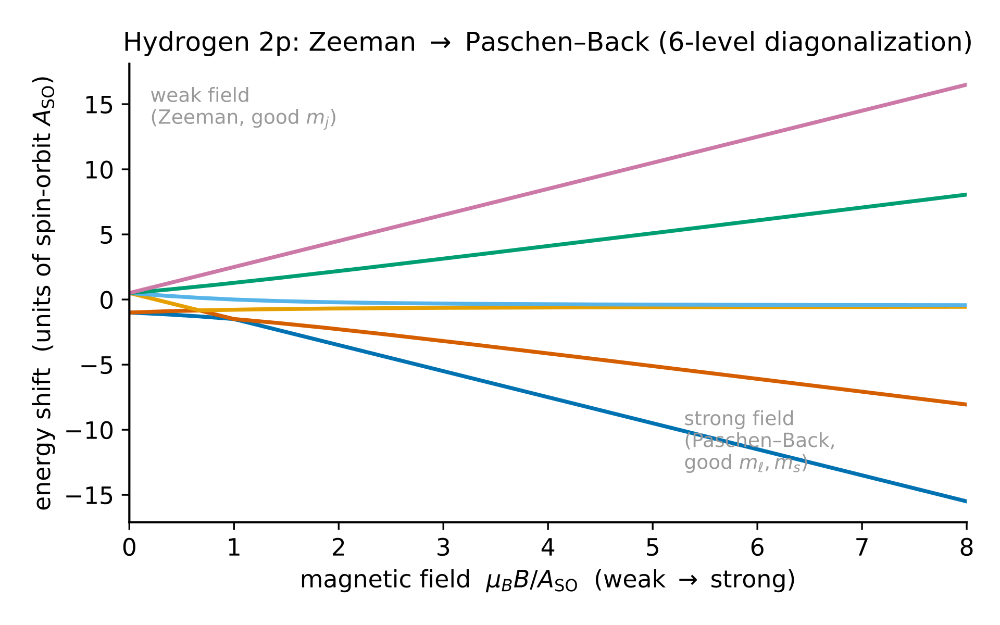
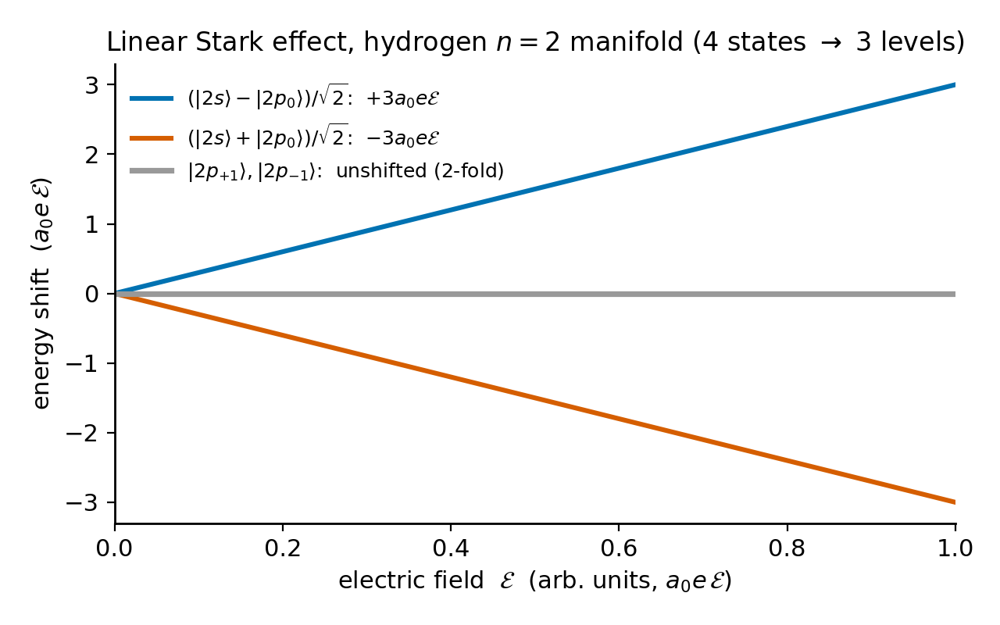
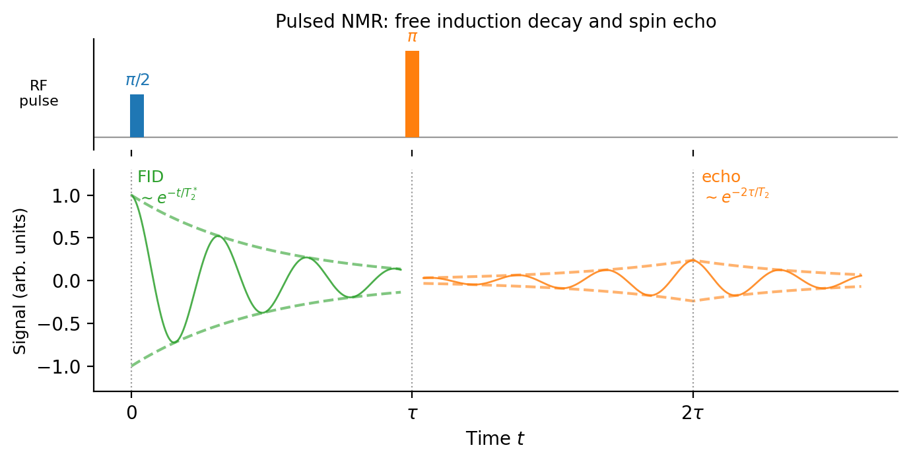

# Chapter 9 — Atoms in Fields: Zeeman, Stark, and Magnetic Resonance

In 1896, Pieter Zeeman investigated whether a strong magnetic field would change the color of spectral lines emitted by a flame. He ran the experiment in Leiden, found that the lines split, and received an explanation from his supervisor Hendrik Lorentz: if the line came from an oscillating charged particle, a magnetic field splits the oscillation into three frequencies. Theory and experiment matched, producing a clean triplet.

Then the problem became more complex. Atoms with unpaired electron spins showed not a clean triplet but six lines, eight lines, or asymmetric patterns with irrational spacing ratios. This was called the "anomalous" Zeeman effect.

The anomaly persisted for thirty years. Its resolution required electron spin, the quantum mechanics of angular-momentum addition, and a single number called the Landé g-factor that encodes how orbital and spin angular momentum combine to produce the observed pattern. Once the g-factor is in hand, the anomalous Zeeman effect is fully explained — it is ordinary Zeeman physics done with spin included.

This chapter develops three related phenomena: the Zeeman effect in both weak- and strong-field limits, the Stark effect in electric fields, and magnetic resonance. The perturbation-theory framework is the same throughout; the physical content of each application is what varies.

---

## The Magnetic Perturbation

We place a hydrogen-like atom in a uniform external magnetic field $\mathbf{B} = B\hat{z}$. Two contributions couple the atom to the field.

The orbital motion produces a magnetic moment $\boldsymbol{\mu}_L = -(e/2m_e)\mathbf{L}$, where $e > 0$ and the minus sign reflects the electron's negative charge. The electron's spin produces a different moment:

$$\boldsymbol{\mu}_S = -\frac{e}{m_e}\mathbf{S}.$$

The factor of 2 difference between orbital and spin contributions is the source of the anomalous Zeeman pattern. It comes from the Dirac equation — the electron is a fundamental spin-$\tfrac{1}{2}$ particle, not a tiny current loop. (The true g-factor is $g_s = 2.002319\ldots$ rather than exactly 2; the small correction is a quantum electrodynamics effect and is discussed further in Still Puzzling.)

The perturbation Hamiltonian is:

$$\hat{H}' = -(\boldsymbol{\mu}_L + \boldsymbol{\mu}_S)\cdot\mathbf{B} = \frac{eB}{2m_e}(\hat{L}_z + 2\hat{S}_z) = \frac{\mu_B}{\hbar}B(\hat{L}_z + 2\hat{S}_z),$$

where the **Bohr magneton** $\mu_B = e\hbar/2m_e \approx 5.788\times10^{-5}$ eV/T. Writing $\hat{L}_z + 2\hat{S}_z = \hat{J}_z + \hat{S}_z$: the $\hat{J}_z$ piece is diagonal in the $|j, m_j\rangle$ basis; the $\hat{S}_z$ piece is not. That leftover $\hat{S}_z$ term is the origin of all the complexity in Zeeman physics.

---

## The Weak-Field Zeeman Effect

When the external field is weak — meaning $\mu_B B \ll \Delta E_\text{fs}$, the fine-structure splitting — the spin-orbit coupling dominates the internal dynamics. The atom's $\mathbf{L}$ and $\mathbf{S}$ are locked together, precessing rapidly around their sum $\mathbf{J}$. The external field then causes $\mathbf{J}$ to precess slowly around $\hat{z}$.

In this regime the good quantum numbers are $n, \ell, j, m_j$. The perturbation is averaged over the rapid internal precession, leaving only the components of $\boldsymbol{\mu}_L + \boldsymbol{\mu}_S$ along $\mathbf{J}$. The projection is evaluated by writing $\hat{S}_z = \hat{J}_z - \hat{L}_z$ and using the identity:

$$\langle\hat{\mathbf{S}}\cdot\hat{\mathbf{J}}\rangle = \frac{\hbar^2}{2}[j(j+1) + s(s+1) - \ell(\ell+1)]$$

to replace $\hat{S}_z$ with its projected value. The energy shift is:

$$\boxed{\Delta E = g_J\,\mu_B\,B\,m_j,}$$

with the **Landé g-factor**:

$$\boxed{g_J = 1 + \frac{j(j+1) + s(s+1) - \ell(\ell+1)}{2j(j+1)}.}$$

This formula is the key to understanding the anomalous Zeeman effect. Each fine-structure level — labeled by a particular $(n, \ell, j)$ — has its own $g_J$ and therefore its own pattern of equally-spaced sublevels. The spacing between adjacent levels is $g_J\mu_B B$, which varies from level to level because $g_J$ depends on $\ell$ and $j$. That variation is why the multi-line patterns appear irregular — the spacings differ because the g-factors differ. There is nothing anomalous once spin is included.

For hydrogen with $s = 1/2$:

<!-- → [TABLE: Landé g-factor values for s-states (ℓ=0, j=1/2, g_J=2), 2p_{1/2} (ℓ=1, j=1/2, g_J=2/3), and 2p_{3/2} (ℓ=1, j=3/2, g_J=4/3) — three columns: state, j, g_J] -->

When $\ell = 0$: there is no orbital angular momentum, and $g_J = 2$ (pure spin). When $\ell \neq 0$: spin and orbital moments partially cancel or reinforce, giving a g-factor that is neither 1 (pure orbital) nor 2 (pure spin) but a mixture determined by $\ell$ and $j$.

---

## The Strong-Field Zeeman Effect (Paschen–Back)

When $\mu_B B \gg \Delta E_\text{fs}$, the external field overwhelms the spin-orbit coupling. In this limit, $\mathbf{L}$ and $\mathbf{S}$ precess independently around $\hat{z}$ rather than jointly. The appropriate quantum numbers change to $m_\ell$ and $m_s$ (the uncoupled basis), and the energy shift is:

$$\Delta E = \mu_B B(m_\ell + 2m_s).$$

The spin-orbit term $\hat{H}'_\text{SO} \propto \mathbf{L}\cdot\mathbf{S}$ becomes a small perturbation on top of this dominant Zeeman splitting — it adds a correction $\propto m_\ell m_s$ that lifts remaining degeneracies.

The Paschen–Back pattern is simpler than the anomalous pattern: essentially a normal triplet from the $m_\ell$ splitting, with each line further split by spin. The irregular multi-line anomalous pattern becomes more regular as the field strength increases.

**The intermediate-field regime** — where $\mu_B B \sim \Delta E_\text{fs}$ — has no simple analytic form. Both the external-field and spin-orbit terms must be diagonalized simultaneously. The resulting energy-versus-field curves form a web of level crossings and avoided crossings: levels that start in the Zeeman pattern at weak field connect smoothly to levels in the Paschen–Back pattern at strong field, with the crossover requiring numerical diagonalization.

<!-- → [FIGURE: energy-vs.-B diagram for hydrogen 2p manifold from B=0 to ~10T, showing the weak-field Zeeman fan of six lines splitting into the Paschen-Back pattern, with the crossover region marked; m_j labels at right edge, m_ℓ and m_s labels at strong-field edge] -->


*Figure 9.1 — energy-vs.-B diagram for hydrogen 2p manifold from B=0 to ~10T, showing the weak-field Zeeman fan of six lines splitting into the…*

---

## The Stark Effect

We now apply an electric field $\mathcal{E}$ along $\hat{z}$ instead of a magnetic field. The perturbation is $\hat{H}' = e\mathcal{E}\hat{z}$.

**The ground state: quadratic Stark effect.** The first-order shift $\langle 1s|e\mathcal{E}\hat{z}|1s\rangle$ vanishes: $|1s\rangle$ is parity-even, $\hat{z}$ is parity-odd, and the integrand is parity-odd and integrates to zero over all space. The first nonvanishing correction is second-order:

$$E^{(2)}_{1s} = \sum_{n\neq 1s}\frac{|\langle n|e\mathcal{E}\hat{z}|1s\rangle|^2}{E^{(0)}_{1s} - E^{(0)}_n} = -\frac{9}{2}a_0^3\mathcal{E}^2.$$

This defines the polarizability $\alpha_\text{pol} = 9a_0^3/2$. The shift is **quadratic in $\mathcal{E}$** — the ground state develops an induced dipole, lowering its energy.

**The $n=2$ manifold: linear Stark effect.** The $n=2$ level of hydrogen is fourfold degenerate: $|2s\rangle$, $|2p_0\rangle$, $|2p_{+1}\rangle$, $|2p_{-1}\rangle$ all share $E^{(0)}_2 = -13.6/4$ eV. This is the *accidental degeneracy* of the Coulomb potential: states with the same $n$ but different $\ell$ coincide in energy because the $1/r$ potential has an additional conserved quantity — the Runge–Lenz vector.

Degenerate perturbation theory requires constructing the $4\times 4$ matrix of $\hat{H}' = e\mathcal{E}\hat{z}$ in this subspace and diagonalizing.

Selection rules simplify the matrix before any integral is computed. The operator $\hat{z}$ commutes with $\hat{L}_z$, so $\Delta m = 0$ exactly — any matrix element with $\Delta m \neq 0$ vanishes, zeroing out all entries involving $|2p_{\pm 1}\rangle$. Parity eliminates all diagonal elements: $\langle 2s|\hat{z}|2s\rangle = 0$ and $\langle 2p_0|\hat{z}|2p_0\rangle = 0$, because the states have definite parity, $\hat{z}$ is parity-odd, and the integrand is always odd.

The only surviving entry is $\langle 2s|e\mathcal{E}\hat{z}|2p_0\rangle = -3a_0\,e\mathcal{E}$. The full perturbation matrix:

$$W = e\mathcal{E}\begin{pmatrix} 0 & -3a_0 & 0 & 0 \\ -3a_0 & 0 & 0 & 0 \\ 0 & 0 & 0 & 0 \\ 0 & 0 & 0 & 0 \end{pmatrix}, \quad \text{ordered }|2s\rangle, |2p_0\rangle, |2p_{+1}\rangle, |2p_{-1}\rangle.$$

This matrix block-diagonalizes immediately. The lower $2\times 2$ block is zero: $|2p_{\pm 1}\rangle$ do not shift. The upper $2\times 2$ has eigenvalues $\pm 3a_0\,e\mathcal{E}$, with eigenstates $(|2s\rangle \mp |2p_0\rangle)/\sqrt{2}$.

The $n=2$ level splits into **three lines** from four states:

- Up by $+3a_0\,e\mathcal{E}$: eigenstate $(|2s\rangle - |2p_0\rangle)/\sqrt{2}$
- Unshifted (doubly degenerate): $|2p_{+1}\rangle$, $|2p_{-1}\rangle$  
- Down by $-3a_0\,e\mathcal{E}$: eigenstate $(|2s\rangle + |2p_0\rangle)/\sqrt{2}$

The splitting is **linear in $\mathcal{E}$** — a **linear Stark effect** — because the degeneracy allows mixing at first order. The good eigenstates are superpositions of $s$ and $p$ states that have permanent electric dipole moments along $\hat{z}$, which couple directly to the applied field.

<!-- → [FIGURE: Stark energy diagram for n=2 manifold — two splitting lines (±3a₀eℰ) diverging linearly with field, two flat lines; eigenstates labeled at right edge; contrast with the curved quadratic ground-state shift shown below] -->


*Figure 9.2 — Stark energy diagram for n=2 manifold — two splitting lines (±3a₀eℰ) diverging linearly with field, two flat lines*

**Why hydrogen is special.** The linear Stark effect requires degenerate states of opposite parity at the same energy. Hydrogen's Coulomb degeneracy provides this condition. In multi-electron atoms, the quantum defect splits $s$ and $p$ states at the same principal quantum number — there is no accidental degeneracy, and the Stark effect is always quadratic. Rydberg atoms (large $n$) recover near-degeneracy and show large quadratic Stark shifts scaling as $n^7$.

---

## Magnetic Resonance

The third phenomenon in this chapter is qualitatively different from the first two: it is exact rather than perturbative, and it involves time.

**Setup.** A spin-$\tfrac{1}{2}$ particle in a static field $B_0\hat{z}$ precesses at the **Larmor frequency** $\omega_0 = \gamma B_0$, where $\gamma$ is the gyromagnetic ratio. We add a weak transverse rotating field:

$$\mathbf{B}_1(t) = B_1(\hat{x}\cos\omega t + \hat{y}\sin\omega t).$$

This field rotates in the $xy$-plane at frequency $\omega$. In principle this problem requires time-dependent perturbation theory, but an exact solution is available through a change of reference frame.

**The rotating frame.** We transform to a frame rotating at frequency $\omega$ around $\hat{z}$. In this frame: the static field $B_0$ appears reduced to an effective z-component $B_0 - \omega/\gamma$; the rotating transverse field appears stationary, pointing along $\hat{x}'$. The effective Hamiltonian is:

$$\hat{H}_R = -\hbar(\omega_0 - \omega)\hat{S}_z/\hbar - \hbar\omega_1\hat{S}_{x'}/\hbar,$$

where $\omega_1 = \gamma B_1$ is the **Rabi frequency**.

**At resonance** ($\omega = \omega_0$): the $\hat{S}_z$ term vanishes. The Hamiltonian reduces to a pure transverse field $-\hbar\omega_1\hat{S}_{x'}$, and the spin precesses around $\hat{x}'$ at frequency $\omega_1$. In the lab frame, starting from spin-up, the spin oscillates between up and down — **Rabi oscillations**:

$$P_\downarrow(t) = \sin^2\!\left(\frac{\omega_1 t}{2}\right).$$

At time $t = \pi/\omega_1$ (a "$\pi$ pulse") the spin has completely flipped. This is the basis of Rabi's 1938 molecular-beam experiment: the RF frequency is swept; when $\omega = \omega_0$, the spin flips and the beam is deflected. The resonance appears as a sharp dip in the detector count.

**Off resonance.** The effective field in the rotating frame has both $z$ and $x'$ components. The spin precesses around the tilted effective field with reduced flip probability:

$$P_\downarrow(t) = \frac{\omega_1^2}{\Omega^2}\sin^2\!\left(\frac{\Omega t}{2}\right), \qquad \Omega = \sqrt{(\omega-\omega_0)^2 + \omega_1^2}.$$

Far from resonance, $\Omega \gg \omega_1$ and the flip probability is small.

**The Bloch equations and relaxation.** In a macroscopic sample, the bulk magnetization $\mathbf{M}$ obeys:

$$\frac{d\mathbf{M}}{dt} = \gamma\mathbf{M}\times\mathbf{B} - \frac{M_x\hat{x} + M_y\hat{y}}{T_2} - \frac{(M_z - M_0)\hat{z}}{T_1}.$$

$T_1$ (longitudinal relaxation, spin-lattice) is the timescale for $M_z$ to return to equilibrium. $T_2$ (transverse relaxation, spin-spin) is the timescale for transverse magnetization to dephase. In general $T_1 \geq T_2$: transverse dephasing occurs through spin-spin interactions and field inhomogeneity that do not affect $T_1$. MRI contrast exploits the fact that different tissues have different $T_1/T_2$ ratios.

Pulsed NMR: a $\pi/2$ pulse tips the magnetization into the transverse plane; it precesses at $\omega_0$ and induces an oscillating EMF in a pickup coil — the **free induction decay**. A subsequent $\pi$ pulse at time $\tau$ reverses the dephasing, producing a **spin echo** at time $2\tau$ with amplitude $e^{-2\tau/T_2}$. Comparing echo amplitudes at different $\tau$ gives $T_2$ free of static field inhomogeneity. Adding a gradient field encodes spatial information as different Larmor frequencies — the basis of MRI.

<!-- → [DIAGRAM: pulsed NMR sequence — π/2 pulse at t=0, magnetization tipping into transverse plane, FID envelope decaying as e^{-t/T₂*}, π pulse at t=τ, spin echo at t=2τ with amplitude e^{-2τ/T₂}; labeled] -->


*Figure 9.3 — pulsed NMR sequence — π/2 pulse at t=0, magnetization tipping into transverse plane, FID envelope decaying as e^{-t/T₂*}, π pulse at t=τ,…*

**ESR.** The same physics applies at microwave frequencies. Because $\gamma_e/\gamma_N \approx 1836$, electron spin resonance occurs at GHz rather than MHz for the same field. It is used to study radicals, transition-metal complexes, and spin-labeled proteins.

---

## A Worked Calculation: Zeeman Splitting of the Hydrogen 2p Levels

We consider a hydrogen atom in a field $B = 0.5$ T and compute the energy shifts of all sublevels in the $n=2$, $\ell=1$ manifold.

We begin with the fine structure: the $2p$ manifold splits into $2p_{1/2}$ ($j = 1/2$, states $m_j = \pm\tfrac{1}{2}$) and $2p_{3/2}$ ($j = 3/2$, states $m_j = -\tfrac{3}{2}, -\tfrac{1}{2}, +\tfrac{1}{2}, +\tfrac{3}{2}$), separated by $\Delta E_\text{fs}(2p) \approx 4.5\times10^{-5}$ eV.

We check the weak-field condition: $\mu_B B = (5.788\times10^{-5})(0.5) = 2.9\times10^{-5}$ eV, which is about $65\%$ of $\Delta E_\text{fs}$. Strictly this places us near the intermediate-field regime, but we proceed with the weak-field formula and note the caveat.

**Compute $g_J$ for each sublevel.** With $\ell = 1$, $s = \tfrac{1}{2}$:

For $2p_{3/2}$ ($j = \tfrac{3}{2}$):
$$g_J = 1 + \frac{\frac{3}{2}\cdot\frac{5}{2} + \frac{1}{2}\cdot\frac{3}{2} - 1\cdot2}{2\cdot\frac{3}{2}\cdot\frac{5}{2}} = 1 + \frac{\frac{15}{4} + \frac{3}{4} - 2}{\frac{15}{2}} = 1 + \frac{\frac{10}{4}}{\frac{15}{2}} = 1 + \frac{1}{3} = \frac{4}{3}.$$

For $2p_{1/2}$ ($j = \tfrac{1}{2}$):
$$g_J = 1 + \frac{\frac{1}{2}\cdot\frac{3}{2} + \frac{1}{2}\cdot\frac{3}{2} - 1\cdot2}{2\cdot\frac{1}{2}\cdot\frac{3}{2}} = 1 + \frac{\frac{3}{4} + \frac{3}{4} - 2}{\frac{3}{2}} = 1 - \frac{1}{3} = \frac{2}{3}.$$

**Energy shifts $\Delta E = g_J\mu_B B\,m_j$**, with $\mu_B B = 2.9\times10^{-5}$ eV:

For $2p_{3/2}$ ($g_J = \tfrac{4}{3}$): shifts are $+2\mu_B B$, $+\tfrac{2}{3}\mu_B B$, $-\tfrac{2}{3}\mu_B B$, $-2\mu_B B$ for $m_j = +\tfrac{3}{2}, +\tfrac{1}{2}, -\tfrac{1}{2}, -\tfrac{3}{2}$.

For $2p_{1/2}$ ($g_J = \tfrac{2}{3}$): shifts are $+\tfrac{1}{3}\mu_B B$, $-\tfrac{1}{3}\mu_B B$ for $m_j = \pm\tfrac{1}{2}$.

The result is six distinct energy levels from eight original states. The $2p_{3/2}$ quartet has adjacent spacing $\tfrac{2}{3}\mu_B B$; the $2p_{1/2}$ doublet also has spacing $\tfrac{2}{3}\mu_B B$ — but the overall scale and arrangement differ. When optical transitions are allowed between these levels and the split $1s$ state, the emission pattern is an irregular multiplet with unequal spacings. This is the "anomalous" Zeeman pattern, and it has a complete mechanical explanation.

For an accurate treatment at $B = 0.5$ T, the Zeeman and fine-structure terms must be diagonalized together in the full $j$-manifold. There is no simple analytic formula for the crossover — it requires numerical diagonalization, which is what the simulation exercise constructs.

---

## LLM Exercises

### Part 1 — Update PROJECT.md

```
Append a new entry to PROJECT.md describing this chapter's simulation:

Chapter 9 — Atoms in Fields
Deliverable: 10-atoms-in-fields.html
Status: in progress

The simulation has two modes selectable by tabs: "Zeeman" and "Stark".

ZEEMAN MODE
Energy-level diagram for the hydrogen 2p manifold (j=1/2 and j=3/2
sub-levels) as a function of magnetic field B from 0 to 10 T.
At B=0, the fine-structure splitting Delta_E_fs ≈ 4.5e-5 eV separates
the two groups. For B > 0, each level splits according to:
  weak-field approximation: Delta E = g_J * mu_B * B * m_j
  strong-field approximation: Delta E = mu_B * B * (m_l + 2*m_s)
The simulation shows both limiting formulas as dashed curves and
(optionally) a numerical interpolation via 6x6 diagonalization as
solid curves. Slider for B, 0 to 10 T.

STARK MODE
Energy-level diagram for the hydrogen n=2 manifold as a function of
electric field strength E_field from 0 to 0.05 atomic units. Four
states at E_field = 0; as the field increases, two states shift by
+3*a0*e*E_field and -3*a0*e*E_field, two states remain flat. Annotate
eigenstates at the right edge. Show the 4x4 matrix live on the right.
```

### Part 2 — The simulation prompt

```
You are working in my directory which contains CLAUDE.md, DESIGN.md, and
PROJECT.md. Read all three first.

Build 10-atoms-in-fields.html: a single self-contained HTML file using
D3 v7 from a CDN. No other external dependencies. Two modes, selectable
by tab: "Zeeman" and "Stark".

ZEEMAN MODE
SVG canvas 1100 x 600. Left panel: energy vs. B diagram for the hydrogen
2p manifold. Pin the y-axis from -0.0004 eV to +0.0004 eV relative to
the unperturbed 2p energy. Fine-structure baseline: 2p_{3/2} (j=3/2)
sits at +Delta_fs/2 = +2.25e-5 eV; 2p_{1/2} (j=1/2) sits at
-Delta_fs/2 = -2.25e-5 eV (fine-structure splitting approximately
4.5e-5 eV). For each sub-level, draw the weak-field energy curve
  E = E_fine + g_J * mu_B * B * m_j
as colored lines (teal for j=3/2, orange for j=1/2). Label each curve
with its m_j value at the right edge. Slider for B from 0 to 5 T.

Right panel: a legend showing g_J for each j value and the Landé
formula displayed as rendered math.

STARK MODE
SVG canvas 1100 x 600. Four horizontal energy lines starting at E=0
(in Hartree relative to unperturbed n=2 level) when E_field = 0.
As E_field increases from 0 to 0.05 atomic units, the lines move:
  top line: +3 * a0 * e * E_field = +3*E_field (in a.u. with a0=e=1)
  bottom line: -3 * E_field
  two middle lines: stay at 0
Label each line with its eigenstate at the right edge.
Show the 4x4 perturbation matrix W live on the right, with the only
nonzero entry highlighted in teal.
Slider for E_field from 0 to 0.05 a.u.

GLOBAL
mu_B = 5.788e-5 eV/T. Delta_fs(2p) = 4.5e-5 eV. a0 = 1 in atomic units.
Comments at every physics step. No dead code.
Runtime sanity check: at B=0, all lines should lie within 1e-10 eV of
their fine-structure baseline. At E_field=0, all Stark lines at 0.
```

### Part 3 — Exploration tasks

**Task 1: Zeeman crossover.** Increase $B$ slowly from 0 to 5 T. At what value does the energy spread of the $j=3/2$ quartet equal the fine-structure splitting $\Delta E_{FS}$? This is approximately where the weak-field formula breaks down. (The actual crossover requires the full diagonalization, but the simulation shows the limiting formula continuing past its range of validity — which is a deliberate teaching point.)

**Task 2: Level ordering at $B = 1$ T.** The $j=3/2$, $m_j = -\tfrac{1}{2}$ sublevel has $\Delta E = -\tfrac{4}{3}\cdot\tfrac{1}{2}\mu_B B$. The $j=1/2$, $m_j = +\tfrac{1}{2}$ sublevel has $\Delta E = +\tfrac{2}{3}\cdot\tfrac{1}{2}\mu_B B$. Do these ever cross? If the weak-field curves cross, what would a crossing mean physically, and why does the full calculation produce an avoided crossing instead?

**Task 3: Stark linear splitting.** Set $\mathcal{E} = 0.01$ a.u. Verify from the simulation that the upper eigenvalue is exactly $+0.03$ Hartree and the lower is $-0.03$ Hartree. Confirm the two middle lines remain at zero.

**Task 4: Stark ionization.** Push $\mathcal{E}$ to $0.04$ a.u. At this field strength the electron can classically escape over the Stark-tilted Coulomb barrier. The simulation continues showing linear splitting — its energy lines keep moving. Note where the simulation physics ends and real physics begins: above the ionization threshold, these are not bound-state energies.

**Extension prompt:**

```
Extend 10-atoms-in-fields.html to add a "Rabi oscillations" panel (a
third tab). Display P_down(t) = sin^2(omega_1 * t / 2) at resonance
and the off-resonant form P_down(t) = (omega_1^2 / Omega^2) *
sin^2(Omega * t / 2) where Omega = sqrt((omega - omega_0)^2 + omega_1^2).
Sliders: omega_1 (Rabi frequency, 0 to 2*pi*10 kHz), detuning
delta = omega - omega_0 (0 to 5 * omega_1_max).
The x-axis should be time from 0 to 2*pi / omega_1 * 5 (five full cycles).
Show that at delta = 0 the spin fully inverts; at delta = 2*omega_1 the
maximum flip probability is 1/5.
```

---

## Still Puzzling

The true electron g-factor is $g_s = 2.002319304\ldots$, not exactly 2. The correction $a_e = (g_s - 2)/2 \approx 1.16\times10^{-3}$ is the **anomalous magnetic moment** and is one of the most precise tests of quantum electrodynamics. The current theoretical prediction (Schwinger term plus higher-order QED diagrams) agrees with the experimental measurement of Hanneke, Fogwell, and Gabrielse (2008) to better than one part in $10^{12}$. The correction shifts Zeeman levels by a small amount that is observable in precision spectroscopy. Using $g_J$ in the Landé formula with the QED-corrected $g_s$ rather than $g_s = 2$ accounts for this shift.

The hydrogen ground state is also split by the hyperfine interaction: the electron's magnetic moment couples to the proton's nuclear magnetic moment. This hyperfine splitting is roughly $m_e/m_p \approx 1/1836$ times smaller than the fine-structure splitting. For the hydrogen ground state it is 1420 MHz — a wavelength of 21 cm — the most prominent line in radio astronomy. The 21-cm line has been used to map the Milky Way's spiral arms, detect neutral hydrogen in external galaxies, and is a candidate signal in SETI searches. Its physics is exactly the Zeeman effect of the electron's spin in the magnetic field of the proton, treated via degenerate perturbation theory in the coupled $\{|F, m_F\rangle\}$ basis.

The intermediate-field Zeeman crossover has no simple analytic form. The energy-versus-field curves form a dense web of avoided crossings that must be computed numerically. Selection rules allow some crossings (states with different $m_j$ that cannot mix) and forbid others (states that can mix produce avoided crossings). The full calculation is worked numerically in spectroscopy databases and has rich structure.

---

## Exercises

**Warm-up**

1. *[Landé g-factor and Zeeman splitting]* A hydrogen atom in the $2s$ state ($\ell=0$, $j=\tfrac{1}{2}$) is placed in $B = 1.0$ T. (a) Compute $g_J$. (b) Compute the two energy shifts $\Delta E = g_J\mu_B B\,m_j$ for $m_j = \pm\tfrac{1}{2}$. (c) What frequency of radiation drives transitions between these two levels? In which part of the spectrum?
*What this tests: Landé formula for a pure-spin state; connecting energy splitting to a photon frequency.*

2. *[Stark selection rules]* State the selection rule eliminating $\langle 2p_{+1}|e\mathcal{E}\hat{z}|2s\rangle$ from the Stark matrix. State the rule eliminating $\langle 2p_0|e\mathcal{E}\hat{z}|2p_0\rangle$. For each, identify the conserved quantity that enforces it.
*What this tests: tracing which physical symmetry kills which matrix element, without memorization.*

3. *[Eigenstate verification]* Verify by explicit substitution that $(|2s\rangle - |2p_0\rangle)/\sqrt{2}$ is an eigenstate of $W$ with eigenvalue $+3a_0\,e\mathcal{E}$. Verify its norm is 1.
*What this tests: direct check of the diagonalization result; reinforces what an eigenstate calculation actually involves.*

**Application**

4. *[$3d_{3/2}$ Zeeman splitting]* A hydrogen atom is in the $3d_{3/2}$ state ($n=3$, $\ell=2$, $j=\tfrac{3}{2}$). (a) Compute $g_J$. (b) List all $m_j$ values and compute the energy shift of each at $B = 2.0$ T. (c) How many distinct spectral lines appear in emission from $3d_{3/2} \to 2p_{1/2}$ in this field? Use $\Delta m_j = 0, \pm 1$; count distinct frequency differences.
*What this tests: g-factor calculation for $j=\tfrac{3}{2}$; transition counting from the splitting pattern.*

5. *[Off-resonance Rabi oscillations]* A spin-$\tfrac{1}{2}$ nucleus has $\omega_0 = 300$ MHz. A weak oscillating field is applied at $\omega = 300.001$ MHz with $\omega_1 = 2\pi\times 1$ kHz. (a) Compute $\omega - \omega_0$ in Hz. (b) Compute $\Omega = \sqrt{(\omega-\omega_0)^2 + \omega_1^2}$. (c) What is the maximum flip probability $\omega_1^2/\Omega^2$? (d) With a hard $\pi$-pulse of duration $\pi/\omega_1$ applied at this detuning, what fraction of the target spins actually flip?
*What this tests: off-resonance Rabi formula; practical consequence of frequency error in NMR pulse calibration.*

6. *[Quadratic Stark effect]* The hydrogen ground-state polarizability gives $\Delta E = -(9/2)a_0^3\mathcal{E}^2$ (Gaussian) $= -(9/2)(4\pi\epsilon_0)a_0^3\mathcal{E}^2$ (SI). (a) Express as a polarizability $\alpha_\text{pol}$ via $\Delta E = -\tfrac{1}{2}\alpha_\text{pol}\mathcal{E}^2$. (b) Estimate $\Delta E$ at $\mathcal{E} = 10^7$ V/m. (c) Compare to the fine-structure splitting $\sim 10^{-4}$ eV. Is Stark perturbation theory valid at this field?
*What this tests: polarizability definition; numerical estimate; checking the validity condition for perturbation theory.*

**Synthesis**

7. *[Derivation of the Landé g-factor]* (a) Write $\hat{L}_z + 2\hat{S}_z = \hat{J}_z + \hat{S}_z$. (b) The projection theorem gives $\langle\hat{S}_z\rangle = \langle\hat{\mathbf{S}}\cdot\hat{\mathbf{J}}\rangle\,m_j/[j(j+1)]$. Evaluate $\langle\hat{\mathbf{S}}\cdot\hat{\mathbf{J}}\rangle$ using $\mathbf{J}^2 = (\mathbf{L}+\mathbf{S})^2$. (c) Substitute into $\langle\hat{L}_z + 2\hat{S}_z\rangle = m_j + \langle\hat{S}_z\rangle$ and factor out $m_j$ to read off $g_J$.
*What this tests: deriving a key result from angular-momentum identities; using the projection theorem.*

8. *[Paschen–Back regime]* Consider hydrogen $2p$ ($\ell=1$, $s=\tfrac{1}{2}$) in a very strong field. (a) List all $(m_\ell, m_s)$ combinations and compute $\mu_B B(m_\ell + 2m_s)$ for each. (b) How many distinct energy levels are there? (c) Add the spin-orbit correction $\propto m_\ell m_s$ as a small perturbation. How does this lift remaining degeneracies?
*What this tests: uncoupled-basis calculation; counting Paschen–Back levels; spin-orbit as a perturbation in the strong-field limit.*

9. *[Spin echo]* (a) After a $\pi/2$ pulse tips magnetization into the transverse plane, different spins accumulate different phases due to static field inhomogeneity. Explain qualitatively why a $\pi$ pulse at time $\tau$ causes rephasing at time $2\tau$. (b) Echo amplitudes at $2\tau = 50, 100, 200$ ms are $M/M_0 = 0.85, 0.72, 0.52$. Fit these to $e^{-2\tau/T_2}$ to estimate $T_2$. (c) Why is the spin-echo $T_2$ immune to static field inhomogeneity while a simple FID measurement is not?
*What this tests: conceptual understanding of spin echo; exponential fitting; the $T_2$ vs. $T_2^*$ distinction.*

**Challenge**

10. *[Intermediate-field Zeeman via diagonalization]* For the hydrogen $2p$ manifold ($\ell=1$, $s=\tfrac{1}{2}$), write the $6\times 6$ Hamiltonian matrix in the uncoupled basis $|m_\ell, m_s\rangle$ as the sum of the fine-structure term $\hat{H}_\text{fs} = A\,\hat{\mathbf{L}}\cdot\hat{\mathbf{S}}$ and the Zeeman term $\hat{H}_Z = \mu_B B(\hat{L}_z + 2\hat{S}_z)/\hbar$. (a) Express the matrix elements of $\hat{\mathbf{L}}\cdot\hat{\mathbf{S}} = \hat{L}_z\hat{S}_z + \tfrac{1}{2}(\hat{L}_+\hat{S}_- + \hat{L}_-\hat{S}_+)$ in the $|m_\ell, m_s\rangle$ basis using the ladder formulas from Chapter 6. (b) Verify that at $B = 0$ the eigenvalues reproduce $E = A\hbar^2[\ell(\ell+1)/2 - j(j+1)/2 + s(s+1)/2]$ (the fine-structure splitting) for $j = \tfrac{1}{2}$ and $j = \tfrac{3}{2}$. (c) Diagonalize numerically at $\mu_B B = \Delta E_\text{fs}/2$ and at $\mu_B B = 5\Delta E_\text{fs}$, and verify that the weak-field and strong-field formulas respectively approximate the eigenvalues in these limits.
*What this tests: constructing the full intermediate-field Hamiltonian; numerical diagonalization; verification of both limiting formulas.*

---

## References

Zeeman, P. (1897). On the influence of magnetism on the nature of the light emitted by a substance. *Philosophical Magazine*, 43, 226.

Rabi, I. I., Zacharias, J. R., Millman, S., & Kusch, P. (1938). A new method of measuring nuclear magnetic moment. *Physical Review*, 53, 318.

Bloch, F. (1946). Nuclear induction. *Physical Review*, 70, 460.

Stark, J. (1914). Beobachtungen über den Effekt des elektrischen Feldes auf Spektrallinien. *Annalen der Physik*, 348, 965.

Hanneke, D., Fogwell, S., & Gabrielse, G. (2008). New measurement of the electron magnetic moment and the fine structure constant. *Physical Review Letters*, 100, 120801.

Griffiths, D. J., & Schroeter, D. F. (2018). *Introduction to Quantum Mechanics* (3rd ed.). Cambridge University Press. Chapter 6.

Sakurai, J. J., & Napolitano, J. (2021). *Modern Quantum Mechanics* (3rd ed.). Cambridge University Press. Chapter 5.

Townsend, J. S. (2012). *A Modern Approach to Quantum Mechanics* (2nd ed.). University Science Books.

---

## Running Project — Model a Real Quantum System, End to End

**This chapter adds:** the atoms-in-fields machinery (Zeeman, Stark, magnetic resonance) to the toolkit, with the regime small parameter $\mu_B B / \Delta E_\text{fs}$ as a table row — and it supplies the model for the capstone's **System C — ammonia inversion and the maser**, whose two-state $2\times2$ tunneling diagonalization is structurally identical to the Stark and weak-field Zeeman problems.

Today's table entry: **atoms in fields — $\varepsilon = \mu_B B/\Delta E_\text{fs}$ — weak field ($\varepsilon\ll1$): Landé $g_J$ in the $|j,m_j\rangle$ basis; strong field ($\varepsilon\gg1$): Paschen-Back in the $|m_\ell,m_s\rangle$ basis; the intermediate regime $\varepsilon\sim1$ has no closed form and needs numerical diagonalization.** The capstone lesson: the same $2\times2$ structure ($E_0$ on the diagonal, a tunneling/coupling matrix element off-diagonal) recurs across the Stark effect, the ammonia maser, and any two-level splitting — recognizing it tells you which method to reach for.

### Exercise R1 — When to Use AI
**The judgment:** In this chapter's project work, AI assistance is appropriate for:
- Computing the Landé $g_J = 1 + [j(j+1)+s(s+1)-\ell(\ell+1)]/2j(j+1)$ and the Zeeman shifts $g_J\mu_B B m_j$ — *Why AI works here:* a formula plug-in checkable against the $g_J=2,\tfrac23,\tfrac43$ values for $s$, $2p_{1/2}$, $2p_{3/2}$.
- Diagonalizing the $2\times2$ ammonia/Stark Hamiltonian to get $E_\pm=E_0\mp A$ and the splitting $2A$ — *Why AI works here:* a trivial diagonalization with a structural check (traceless off-diagonal block).
- Converting the maser transition frequency 23.87 GHz to $\Delta E$ in eV — *Why AI works here:* a unit conversion ($\Delta E = h\nu$).

**The tell:** You are using AI well when you have an independent check — here, the $2\times2$ block structure and the measured 23.87 GHz inversion line.

### Exercise R2 — When NOT to Use AI
**The judgment:** These tasks require your judgment; AI output here cannot be trusted without redoing the work:
- Deciding which Zeeman regime applies for *your* field — checking $\mu_B B$ against $\Delta E_\text{fs}$ — *Why AI fails here:* at $B=0.5$ T the ratio is $\sim0.65$, right in the intermediate regime where neither limiting formula is valid, and the AI will apply the weak-field $g_J$ formula anyway without flagging that the small parameter is near 1. This is the small-parameter call.
- Trusting a double-well barrier-shape model for the ammonia splitting — *Why AI fails here:* the tunneling matrix element $A$ is *exponentially* sensitive to the barrier shape, so a naive model can be off by 24% and a "better" shape by $<2\%$; judging which model is adequate is a physics call, and the AI will quote a splitting without owning that exponential sensitivity.
- Attributing the maser model's residual error — *Why AI fails here:* the breakdown lives entirely in the barrier shape, which it will not estimate.

**The tell:** If you could not explain the result without the AI — if the AI is your *reason* rather than your *tool* — it did work that should have been yours.

**Physics-judgment connection:** This trains checking $\mu_B B/\Delta E_\text{fs}$ to pick the regime *before* applying a formula, and comparing a computed splitting against a cited measured line (the 23.87 GHz ammonia inversion) — with eyes open to exponential barrier-shape sensitivity.

### Exercise R3 — LLM Exercise
**What you're building this chapter:** moves 2–3 of the capstone's System C (ammonia maser) — the two-state tunneling model and its splitting — plus the atoms-in-fields table row.
**Tool:** Claude Project — store as System C alongside your other candidates.
**The Prompt:**
```
I am drafting a five-move quantum model of the ammonia (NH3) inversion
splitting that drives the maser. Help me with moves 2-3 (method selection,
calculation); I will write moves 1, 4, 5.

METHOD SELECTION: justify treating NH3 inversion as a TWO-STATE system: the
nitrogen sits above or below the H3 plane (|L>, |R>), tunneling through a
barrier mixes them. Write the 2x2 Hamiltonian [[E0, -A],[-A, E0]] and state
that this is the SAME structure as the Stark and weak-field Zeeman 2x2 blocks.
Emphasize that the tunneling matrix element A is EXPONENTIALLY sensitive to the
barrier shape — this is the dominant model uncertainty.

CALCULATION: diagonalize to get E_pm = E0 -/+ A and splitting Delta E = 2A.
Convert the measured inversion frequency 23.87 GHz to Delta E in eV via
Delta E = h nu (expect ~9.94e-5 eV). Show units.

Do NOT tell me whether a given double-well barrier model's 24% error is
"acceptable" — that is my judgment. Do NOT quote A from a barrier model without
flagging its exponential sensitivity.
```
**What this produces:** the two-state splitting structure and $\Delta E\approx9.94\times10^{-5}$ eV from the measured line, ready for validation.
**How to adapt:** *Your system:* for the weak-field Zeeman $g$-factor, reuse the $2\times2$ recognition but compute $g_J$ instead; same structural insight. *ChatGPT/Gemini:* check it flags the exponential barrier sensitivity rather than quoting a single confident $A$. *Claude Project:* store as System C.
**Builds on:** Chapter 2's degenerate-PT $2\times2$ diagonalization (Stark) — now applied to a molecular tunneling doublet.  **Next:** Chapter 10 adds tight-binding / band structure and the hopping small parameter — the route to the quantum-dot band-gap candidate.

### Exercise R4 — CLI Exercise
**What you're building this chapter:** the atoms-in-fields table row and a script that diagonalizes the two-state ammonia Hamiltonian and computes Zeeman $g_J$ shifts, checking the regime parameter.
**Tool:** Claude Code
**Skill level:** Intermediate
**Setup — confirm:**
- [ ] `method-table.md` with Ch 1–8 rows.
- [ ] Python 3 + numpy.
- [ ] `CLAUDE.md` rule: "Before applying a weak-field (g_J) or strong-field (Paschen-Back) Zeeman formula, compute mu_B B / Delta_E_fs and confirm it is << 1 or >> 1; if it is near 1, neither limiting formula is valid."
**The Task:**
```
In the running-project directory:
1. Append the atoms-in-fields row to method-table.md (epsilon = mu_B B/Delta_E_fs).
2. Create atoms_in_fields.py that:
   - diagonalizes [[E0,-A],[-A,E0]] symbolically/numerically; confirms
     E_pm = E0 -/+ A and splitting 2A,
   - converts nu=23.87 GHz to Delta E in eV (Delta E = h nu); prints it,
   - computes g_J for 2s (g=2), 2p_1/2 (g=2/3), 2p_3/2 (g=4/3) and the Zeeman
     shifts g_J mu_B B m_j at B=0.5 T,
   - computes mu_B B / Delta_E_fs at B=0.5 T (Delta_E_fs=4.5e-5 eV) and prints a
     WARNING if it is between 0.1 and 10 (intermediate regime).
3. Run it. Confirm Delta E(maser) ~ 9.94e-5 eV and the intermediate-regime
   warning fires at B=0.5 T.
Touch no files outside this directory. Report Delta E(maser), the three g_J,
and whether the regime warning fired.
```
**Expected output:** appended row; console showing $\Delta E\approx9.94\times10^{-5}$ eV, the three $g_J$ values, and an intermediate-regime warning at 0.5 T.
**What to inspect:** the maser splitting matches $h\times23.87$ GHz; the $g_J$ values are $2,\tfrac23,\tfrac43$; the regime warning correctly fires because $\mu_B B/\Delta E_\text{fs}\approx0.65$.
**If it goes wrong:** if $\Delta E$ comes out near $10^{-4}$ eV instead of $\sim10^{-4}$… check the GHz→Hz and $h$ in eV·s conversion; print $h\nu$ in joules then convert.
**CLAUDE.md / AGENTS.md note:** add "A two-state splitting set by a tunneling matrix element is exponentially sensitive to barrier shape; report such splittings with that caveat, never as a single confident number from a crude barrier model."

### Exercise R5 — AI Validation Exercise
**What you're validating:** the R3/R4 ammonia maser splitting and the Zeeman regime check.
**Validation type:** Numerical result
**Risk level:** Medium — the conversion is simple, but the regime call and the barrier-sensitivity caveat are where judgment is needed.
**Setup:** use your R4 output.
**The Validation Task:** Evaluate against this checklist; mark Pass / Fail / Cannot determine with reasoning.
```
Validation Checklist — Atoms in Fields
□ Correctness: does Delta E(maser) = h * 23.87 GHz ~ 9.94e-5 eV?
□ Completeness: is the 2x2 structure shown, and the exponential barrier-shape
  sensitivity of A flagged?
□ Scope: are the three g_J values (2, 2/3, 4/3) computed correctly?
□ Regime: is mu_B B/Delta_E_fs computed at B=0.5 T, and the intermediate-regime
  warning fired (ratio ~0.65, neither limit valid)?
□ Structural insight: is it stated that Stark, weak-field Zeeman, and ammonia
  share the SAME 2x2 diagonalization?
□ Failure-mode check: any of —
  - fluent but wrong (weak-field g_J formula applied at B=0.5 T without caveat)
  - GHz/Hz or h-unit conversion slip
  - quoting a barrier-model A without the exponential-sensitivity flag
  - g_J formula errors (sign, j(j+1) factors)
```
**What to do with findings:** pass → record System C's splitting; cite Gordon-Zeiger-Townes for validation. one fail → fix the conversion/regime check, re-run, document. multiple fails → recompute $h\nu$ and one $g_J$ by hand.
**AI Use Disclosure (mandatory, two sentences):**
> *1:* What AI produced and how you used it.
> *2:* One specific thing the AI could not determine that required your judgment.
**Physics-judgment connection:** this validation trains checking a regime parameter ($\mu_B B/\Delta E_\text{fs}$) before applying a limiting formula and comparing a computed splitting against a cited measured spectral line — while keeping the exponential barrier-shape sensitivity in view as a breakdown source.
