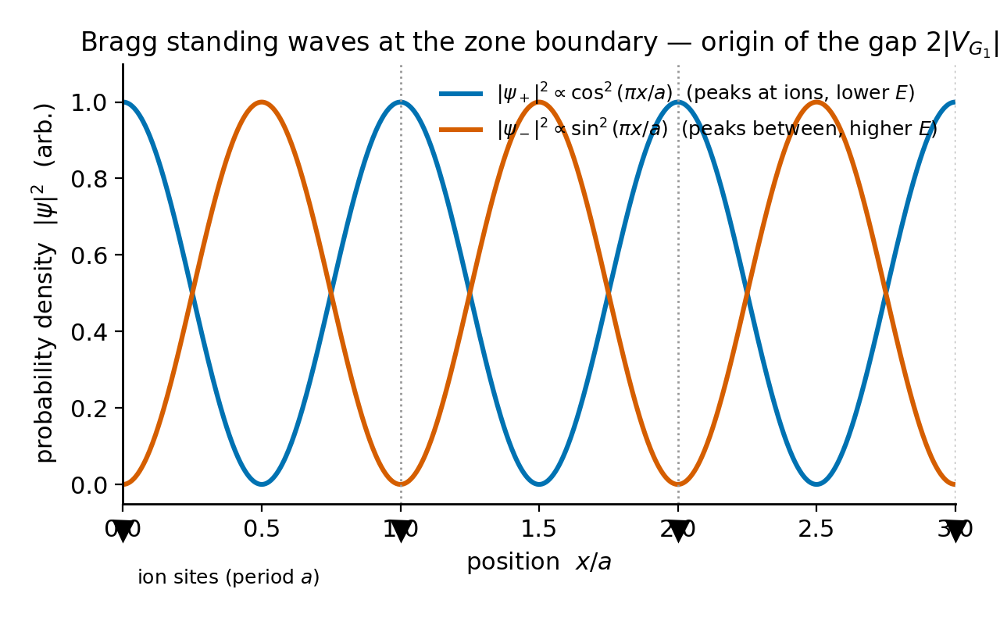
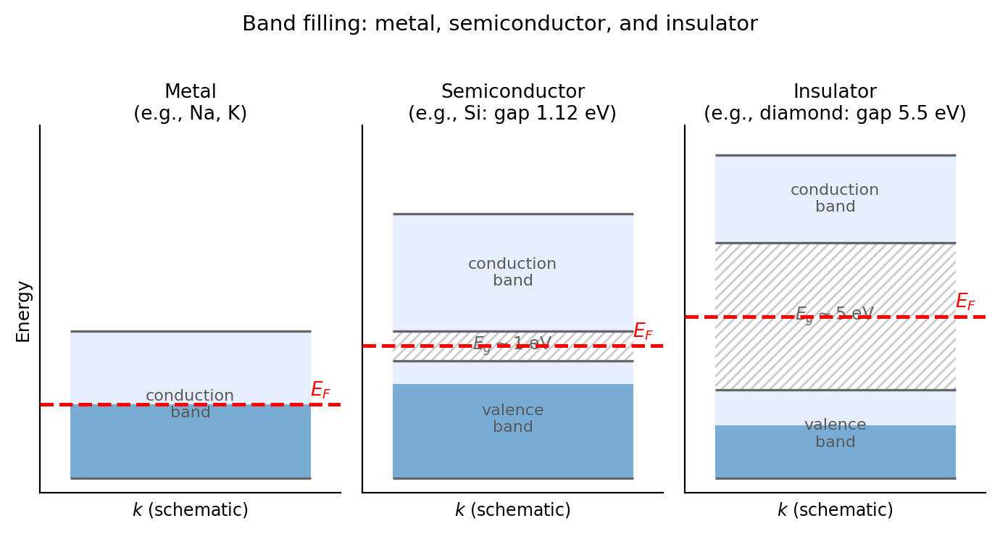

# Chapter 10 — Periodic Potentials and the Band Structure of Solids

A central result of solid-state physics is that a perfectly periodic potential does not scatter electrons. An electron placed in a crystal — a lattice of $10^{23}$ ions repeating every few ångströms — propagates through the entire crystal without deflection, as a modified plane wave. Real electrical resistance comes from imperfections: defects, impurities, and lattice vibrations (phonons) that break the periodicity. A perfect crystal at zero temperature has zero electrical resistance.

The underlying principle is Bloch's theorem. Understanding it reveals the structure of solid-state physics: bands, gaps, metals, insulators, and semiconductors. We develop the framework in one dimension, where the geometry is transparent.

---

## The Geometry

**The direct lattice.** A one-dimensional crystal consists of an atom (or group) repeated with period $a$. Lattice positions are $x_n = na$ for integers $n$. The lattice constant $a$ is typically 2–6 Å for real materials.

**The reciprocal lattice.** Every periodic structure has a dual: the reciprocal lattice at spatial frequencies $G_n = 2\pi n/a$. The **first Brillouin zone** (BZ) is the interval $k \in [-\pi/a, \pi/a]$. Bloch's theorem will show that $k$ and $k + G$ describe the same physical state, so all distinct crystal momenta fit inside one BZ.

---

## Bloch's Theorem

We consider an electron in a potential $V(x)$ satisfying $V(x+a) = V(x)$.

We define the **translation operator** $\hat{T}_a$ by $(\hat{T}_a f)(x) = f(x+a)$. Because the potential is periodic, $[\hat{H}, \hat{T}_a] = 0$: energy eigenstates can be chosen to simultaneously be eigenstates of $\hat{T}_a$. Since translation is unitary, its eigenvalues have magnitude 1 and can be written as $e^{ika}$ for real $k$:

$$\psi(x+a) = e^{ika}\psi(x).$$

Any state satisfying this condition can be written as

$$\psi_{n,k}(x) = e^{ikx}\,u_{n,k}(x)$$

where $u_{n,k}(x+a) = u_{n,k}(x)$ is periodic with the lattice period. This is **Bloch's theorem**. The proof is direct: set $u(x) = e^{-ikx}\psi(x)$; then $u(x+a) = e^{-ik(x+a)}e^{ika}\psi(x) = u(x)$.

The integer $n$ is the band index. At a given crystal momentum $k$, multiple solutions exist — these are the bands.

**Physical meaning.** Electrons in a perfectly periodic potential are not scattered — they propagate as Bloch waves with crystal momentum $\hbar k$ as a conserved quantum number. The key difference from free electrons is that $k$ is defined only modulo $G = 2\pi/a$, so all distinct values fit in the first BZ. The band index distinguishes the multiple solutions at the same $k$ once the lattice perturbs the free-electron parabola.

Bloch derived this result in 1928 as part of his PhD thesis under Heisenberg. The finding — that a periodic potential produces propagating rather than scattered waves — was unexpected, since physicists had expected electrons to bounce off every atom.

---

## The Kronig-Penney Model

The Kronig-Penney model (1931) is the standard analytically tractable periodic potential. We use the delta-function version, which captures the full physics with minimal algebra.

**Setup.** The potential is a sequence of delta-function barriers:

$$V(x) = \frac{\hbar^2 P}{ma}\sum_n\delta(x - na),$$

where $P$ is a dimensionless barrier strength. The limit $P \to 0$ recovers free electrons; $P \to \infty$ approaches an array of isolated atoms.

**Derivation.** Between delta functions the Schrödinger equation is that of a free particle with $E = \hbar^2\alpha^2/2m$. In the region $0 < x < a$, the solution is $Ae^{i\alpha x} + Be^{-i\alpha x}$. Applying Bloch periodicity at $x = a$ and the continuity and jump conditions at the delta function at $x = 0$, the consistency condition (vanishing determinant) gives the **Kronig-Penney dispersion relation**:

$$\boxed{\cos(ka) = \cos(\alpha a) + \frac{P}{\alpha a}\sin(\alpha a).}$$

**Reading the dispersion relation.** Define the right-hand side as $f(\alpha a) = \cos(\alpha a) + (P/\alpha a)\sin(\alpha a)$. The left side is bounded: $|\cos(ka)| \leq 1$.

Where $|f(\alpha a)| \leq 1$: a real $k$ exists and the electron propagates — these are **allowed bands**.

Where $|f(\alpha a)| > 1$: no real $k$ exists — these are **forbidden gaps**.

As $\alpha a$ increases from zero, $f(\alpha a)$ oscillates with growing amplitude, periodically exceeding $\pm 1$. Each excursion creates a gap. The bands and gaps alternate, repeating roughly every $\pi$ in $\alpha a$.

**Effect of barrier strength.** As $P$ increases, the amplitude of oscillation in $f$ increases, making the excursions beyond $\pm 1$ wider. A larger $P$ means wider gaps and narrower bands. At $P = 0$: no gaps, continuous free-electron spectrum. As $P \to \infty$: bands shrink to zero width — the isolated-atom limit.

---

## Worked Example — The First Band Gap

We set $P = 3\pi/2 \approx 4.71$.

**Locating the gap.** We evaluate $f$ at $\alpha a = \pi$ (the first zone boundary for free electrons):

$$f(\pi) = \cos(\pi) + \frac{P}{\pi}\sin(\pi) = -1 + 0 = -1.$$

This is exactly at the boundary — the first allowed band ends here. Just above $\alpha a = \pi$, the term $-(P/\pi)\epsilon$ drives $f$ below $-1$ and the gap opens. Numerically, $f$ re-enters the interval $[-1,1]$ near $\alpha a \approx 4.71$, where the second band begins.

**In natural units** ($\hbar = 2m = a = 1$, energies in units of $\hbar^2/2ma^2$): the first gap runs from $E = \pi^2 \approx 9.87$ to $E \approx 22.2$. The gap width grows with $P$.

**The simulation procedure.** We sweep $\alpha a$ from $0$ to $6\pi$ in 5000 steps. At each point, we compute $f(\alpha a)$. If $|f| \leq 1$, we assign $k = \arccos(f)/a$ and fold into the first BZ; we then plot $(k, E = \hbar^2\alpha^2/2m)$. Allowed-band points are plotted in teal, and gap regions are shaded gray.

---

## The Nearly-Free-Electron Picture

The Kronig-Penney model treats the periodic potential exactly. The nearly-free-electron (NFE) model starts from free electrons and adds the lattice as a weak perturbation.

**Setup.** We write the potential as a Fourier series: $V(x) = \sum_G V_G e^{iGx}$. The unperturbed states are plane waves $|k\rangle$ with energies $E_k^{(0)} = \hbar^2k^2/2m$.

**Why normal perturbation theory fails at the zone boundary.** At $k = \pi/a$, the states $|k = \pi/a\rangle$ and $|k = -\pi/a\rangle$ are degenerate — they both have energy $\hbar^2\pi^2/2ma^2$. The perturbation denominator vanishes and we need degenerate perturbation theory.

**Degenerate perturbation theory.** We build the $2\times2$ matrix of $V$ between the two degenerate states. The diagonal elements vanish (setting the average potential to zero). The off-diagonal element is $V_{G_1}$, the first Fourier component of $V$:

$$W = \begin{pmatrix}0 & V_{G_1}^*\\V_{G_1} & 0\end{pmatrix}.$$

The eigenvalues are $\pm|V_{G_1}|$. The energy at the zone boundary splits into $E_\pm = \hbar^2\pi^2/2ma^2 \pm |V_{G_1}|$:

$$\boxed{\text{Band gap} = 2|V_{G_1}|.}$$

**The gap equals twice the magnitude of the relevant Fourier component of the potential.** A strong potential produces a wide gap; a weak potential produces a narrow gap; a zero potential produces no gap.

**Physical picture: Bragg reflection.** At $k = \pi/a$, the de Broglie wavelength $\lambda = 2a$ satisfies the Bragg condition for a lattice with spacing $a$. Forward and backward waves mix equally into standing waves:

$$\psi_+ \propto \cos(\pi x/a), \qquad \psi_- \propto \sin(\pi x/a).$$

The probability density $|\psi_+|^2$ peaks at the ion positions; $|\psi_-|^2$ peaks between them. In a crystal where ions attract electrons, $\psi_+$ sees lower potential energy and $\psi_-$ sees higher. Their energy difference is $2|V_{G_1}|$. This is the gap — two standing waves with the same kinetic energy, forced by symmetry to different positions and therefore sampling the potential differently.

<!-- → [FIGURE: Standing waves at zone boundary — |ψ+|² peaks at ion sites (lower energy), |ψ−|² peaks between sites (higher energy), with periodic lattice potential shown below] -->


*Figure 10.1 — Standing waves at zone boundary — |ψ+|² peaks at ion sites (lower energy), |ψ−|² peaks between sites (higher energy), with periodic lattice…*

---

## The Tight-Binding Picture

The NFE model works near the free-electron limit. The tight-binding (TB) model works near the atomic limit: we start from isolated atoms and turn on overlap between neighboring orbitals.

**Setup.** Each atom has a localized orbital $|\phi_n\rangle$ at site $na$ with energy $E_0$. We write the Bloch state as a sum with the correct Bloch phase:

$$|\psi_k\rangle = \frac{1}{\sqrt{N}}\sum_n e^{ikna}|\phi_n\rangle.$$

**The energy.** We evaluate $\langle\psi_k|\hat{H}|\psi_k\rangle$. The diagonal term gives $E_0$ (on-site energy, shifted slightly by the crystal environment). The nearest-neighbor off-diagonal terms define the **hopping integral** $t = -\langle\phi_{n+1}|\hat{H}|\phi_n\rangle > 0$. Keeping only nearest-neighbor hops:

$$\boxed{E(k) = E_0 - 2t\cos(ka).}$$

At $k = 0$: $E = E_0 - 2t$ (band bottom, symmetric superposition). At $k = \pm\pi/a$: $E = E_0 + 2t$ (band top, antisymmetric). Bandwidth: $4t$.

**Effective mass.** Expanding near the band bottom:

$$E(k) \approx (E_0 - 2t) + ta^2k^2 = E_\text{bottom} + \frac{\hbar^2k^2}{2m^*}, \qquad m^* = \frac{\hbar^2}{2ta^2}.$$

Strong hopping (large $t$) means a light effective mass — the electron propagates easily. Near the band top, $m^* < 0$: an electron behaves as a **hole**, a positively charged quasiparticle that moves opposite to the applied force.

---

## Metals, Insulators, and Semiconductors

Band filling is governed by the Pauli exclusion principle: each $k$-state holds 2 electrons (spin up and down). The first BZ has one $k$-value per unit cell, so the first band holds 2 electrons per atom.

**One electron per atom** (alkali metals: Na, K, Li): half-filled band. The Fermi level cuts through the band. There are electrons right at the Fermi energy that can be accelerated by an applied field. **Metal.**

**Two electrons per atom, one orbital per atom** (alkaline earths in the simplest model): completely filled band, empty next band. If the gap is large compared to $k_BT$, **insulator** (diamond, gap 5.5 eV). If the gap is a few eV, **semiconductor** (Si: 1.12 eV; Ge: 0.67 eV; GaAs: 1.42 eV). The distinction between semiconductor and insulator is quantitative: semiconductors have a useful thermally-generated carrier density at room temperature; insulators do not.

**Band overlap** (graphite, the semimetals): the top of one band and the bottom of the next overlap in energy; the Fermi level cuts through both. **Semimetal**.

The three models — Kronig-Penney, NFE, tight-binding — describe the same physics from different starting points. Kronig-Penney interpolates between the limits as $P$ varies: at $P = 0$ it is NFE; as $P \to \infty$ it approaches isolated atoms. Real materials sit between the extremes. Density functional theory (DFT) handles them self-consistently, but the Bloch-wave structure is the same.

<!-- → [FIGURE: Band-filling schematic — three panels showing metal (Fermi level in band), semiconductor (small gap), and insulator (large gap), each with Fermi level marked] -->


*Figure 10.2 — Band-filling schematic — three panels showing metal (Fermi level in band), semiconductor (small gap), and insulator (large gap), each with…*

---

## Zone Schemes

There are three standard ways to display the band structure:

**Extended zone scheme.** The first band occupies BZ 1 ($k\in[-\pi/a, \pi/a]$), the second band occupies BZ 2 (the next two segments), and so on. This shows the free-electron parabola ancestry — each band is a segment of $E = \hbar^2k^2/2m$, gapped and folded back.

**Reduced zone scheme.** All bands are folded into the first BZ by subtracting reciprocal lattice vectors. Every band appears as a distinct curve over $k\in[-\pi/a, \pi/a]$. This is the standard representation for real band diagrams.

**Repeated zone scheme.** The reduced-zone dispersion is extended periodically over all $k$. This representation is useful for visualizing group velocity $dE/dk$ continuity.

All three are physically equivalent. The reduced zone scheme is preferred because it makes explicit that all distinct crystal momenta lie in the first BZ.

---

## Still Puzzling

**Topological insulators.** Beginning in the 1980s, theorists began asking not just how wide the band gap is, but what path the Bloch functions $u_{n,k}$ trace out as $k$ sweeps around the BZ. This is a topological question — it measures a global property of the wavefunction bundle over $k$-space, not a local one. The relevant invariant (the Chern number or $\mathbb{Z}_2$ index) distinguishes a normal insulator (invariant = 0) from a topological insulator (invariant = 1). Topological insulators are bulk insulators with conducting surface states that cannot be removed without closing the bulk gap — not because of chemistry or disorder, but because of topology. Predicted around 2005–2007 (Kane and Mele; Bernevig, Hughes, and Zhang) and confirmed in Bi-Sb alloys and HgTe quantum wells, topological materials are now a major research frontier.

**Flat bands and magic-angle graphene.** The tight-binding bandwidth is $4t$. In moiré superlattices — two graphene layers twisted by a small angle $\theta$ — the effective period is the moiré period $a_M \sim a/\theta$, much larger than $a$. Hopping across the moiré unit cell is tiny, and bands become nearly flat ($4t \to 0$). In flat bands the kinetic energy is quenched and electron-electron interactions dominate. At the "magic angle" of $\sim 1.1°$, twisted bilayer graphene becomes superconducting at $\sim 1.7$ K (Cao et al., 2018). The Kronig-Penney model with a very large $P$ is a simplified version of the same physics — narrow bands, strong correlations.

**The band-gap problem in DFT.** The local density approximation systematically underestimates semiconductor gaps by 30–50%: silicon's calculated gap is $\sim 0.6$ eV versus the measured 1.12 eV. The Kohn-Sham eigenvalues are not quasiparticle energies. Corrections from the GW approximation or hybrid functionals bring computed gaps into agreement with experiment, but this remains an active area of research.

---

## The +1 — Simulation Exercise

The deliverable is `11-periodic-potentials.html`: a D3 simulation with two modes — the Kronig-Penney dispersion in both $f(\alpha a)$ and reduced-zone $E(k)$ representations, and a tight-binding comparison overlay.

### `PROJECT.md` Update

````
Append to PROJECT.md:

Chapter 10 — Periodic Potentials and Band Structure
Deliverable: 11-periodic-potentials.html
Status: in progress

Two modes: "Kronig-Penney dispersion" and "Tight-binding comparison".

KRONIG-PENNEY MODE
Left panel (600px): f(alpha*a) vs. alpha*a from 0 to 6*pi.
  f = cos(alpha*a) + (P / (alpha*a)) * sin(alpha*a).
  Teal shading where |f| <= 1 (allowed); gray where |f| > 1 (forbidden).
  Dashed red lines at f = ±1.

Right panel (500px): reduced-zone E(k). For each alpha*a where |f| <= 1:
  k = arccos(f) / a, folded by band index into [-pi/a, pi/a].
  E = (alpha*a)^2 in natural units (hbar=m=a=1).
  Teal dots. Gray shading on E-axis for gap regions.
  P slider from 0 to 6*pi, step 0.1.

TIGHT-BINDING COMPARISON MODE
Same right panel plus orange overlay: E(k) = E_0 - 2t*cos(k).
Fit: E_0 = (E_top + E_bottom)/2, t = (E_top - E_bottom)/4.
Band selector (band 1 or 2). Display fitted t value.
````

### The Simulation Prompt

````
Read CLAUDE.md, DESIGN.md, and PROJECT.md first.

Build 11-periodic-potentials.html: single self-contained HTML, D3 v7 from CDN.
No other external dependencies. Two modes via tabs.

KRONIG-PENNEY MODE
Left SVG 550 × 500:
  x-axis: alpha*a from 0 to 6*pi, ticks at pi, 2*pi, ..., 6*pi
  y-axis: f from -3 to +3
  Plot f(alpha*a) = cos(alpha*a) + (P / (alpha*a)) * sin(alpha*a).
  At alpha*a → 0, f → 1 + P (L'Hopital limit; handle separately).
  Teal fill where |f| <= 1. Dashed red lines at ±1.

Right SVG 550 × 500:
  x-axis: k from -pi to pi. y-axis: E auto-scaled, show at least 4 bands.
  For each alpha*a in [0, 6*pi] (5000 steps) where |f| <= 1:
    band_index = floor(alpha*a / pi)
    k_raw = arccos(f) / 1    (with a=1)
    k = k_raw if band_index even; k = pi - k_raw if band_index odd
    E = (alpha*a)^2
  Plot (k, E) as teal dots. Gray shading for gap E-ranges.

Controls: P slider 0 to 6*pi, step 0.05, default 3*pi/2.

Console sanity checks:
  P=0: all points allowed, log N_forbidden = 0.
  P=3*pi/2: log gap 1 boundaries in alpha*a.

TIGHT-BINDING COMPARISON MODE
Add orange curve over the KP right panel for selected band:
  Find E_bottom, E_top of the selected band.
  t = (E_top - E_bottom) / 4, E_0 = (E_top + E_bottom) / 2.
  Plot E_0 - 2*t*cos(k) in orange.
  Display: "Tight-binding fit: E_0 = [val], t = [val]"
Band toggle: band 1 / band 2.

Comments at every physics step.
````

### Exploration Tasks

**Map the bands.** At $P = 3\pi/2$, from the left panel, identify the first three allowed bands and first two gaps. Read off the approximate $\alpha a$ values at each boundary.

**Barrier strength scaling.** Increase $P$ from $3\pi/2$ to $6\pi$. Describe how the width of the first band changes relative to the width of the first gap. As $P \to \infty$, what does the band structure approach?

**Weak potential.** Set $P = 0.5$. Is a gap visible? In natural units, the NFE prediction is $\Delta E \approx 2P$ for weak delta-function barriers. Compare the simulation's gap width to this estimate.

**Tight-binding comparison.** For band 1 at $P = 3\pi/2$, record the fitted $t$ value. Switch to band 2 — is $t$ larger or smaller? (Higher bands are typically wider, corresponding to larger effective $t$.) At $k \approx \pi/2$, where does the tight-binding fit agree best and worst with the KP dispersion?

---

## References

- Kronig, R. de L. and Penney, W.G. (1931). "Quantum mechanics of electrons in crystal lattices." *Proceedings of the Royal Society A*, 130, 499–513. [verify]
- Bloch, F. (1928). "Über die Quantenmechanik der Elektronen in Kristallgittern." *Zeitschrift für Physik*, 52, 555–600. [verify]
- Kittel, C. (2005). *Introduction to Solid State Physics*, 8th ed. Wiley. Ch. 7–9. [verify]
- Ashcroft, N.W. and Mermin, N.D. (1976). *Solid State Physics*. Holt, Rinehart and Winston. Ch. 8–10. [verify]
- Griffiths, D.J. and Schroeter, D.F. (2018). *Introduction to Quantum Mechanics*, 3rd ed. Cambridge University Press. §5.3. [verify]
- Cao, Y. et al. (2018). "Unconventional superconductivity in magic-angle graphene superlattices." *Nature*, 556, 43–50. [verify]
- Kane, C.L. and Mele, E.J. (2005). "Z₂ topological order and the quantum spin Hall effect." *Physical Review Letters*, 95, 146802. [verify]

---

*Chapter 11 follows: scattering in periodic structures — the structure factor and the diffraction condition that recovers Bragg's law as a consequence of the same reciprocal-lattice geometry developed here.*

---

## Running Project — Model a Real Quantum System, End to End

**This chapter adds:** the tight-binding and nearly-free-electron band-structure methods to the toolkit, with two small parameters — the tight-binding hopping ratio $t/E_0 \ll 1$ (atomic limit) and the NFE gap $2|V_{G}|$ relative to the bandwidth — as the last methods row before the capstone. It also supplies the confinement-energy scaling ($E\propto 1/R^2$) that anchors the capstone's **System B — CdSe quantum dot band gap**.

Today's table entry: **tight-binding / band structure — $\varepsilon = t/E_0$ (hopping small vs on-site energy, atomic limit) or, in NFE, the gap $2|V_G|$ small vs the free-electron bandwidth — tight-binding "breaks" toward NFE as $t$ grows; the gap is $2|V_{G_1}|$, twice the relevant Fourier component of the potential.** *Honest mapping note:* the quantum dot in System B is modeled as a 3D spherical box (a confinement problem), and this chapter's direct contribution is the *scaling law* $E_\text{confine}\propto1/R^2$ and the band-gap concept; the effective mass that enters $E_{1s}=\hbar^2\pi^2/2m^*R^2$ is itself a band-structure quantity (inverse band curvature), which is precisely why System B's dominant error — effective-mass nonparabolicity at small $R$ — is a *band-structure* failure. The toolkit method recorded here is tight-binding; its conceptual gift to the capstone is the meaning of $m^*$ and the gap.

### Exercise R1 — When to Use AI
**The judgment:** In this chapter's project work, AI assistance is appropriate for:
- Computing the tight-binding dispersion $E(k)=E_0-2t\cos(ka)$, the bandwidth $4t$, and the effective mass $m^*=\hbar^2/2ta^2$ — *Why AI works here:* closed forms checkable against the band edges $E_0\mp2t$.
- Evaluating the quantum-dot confinement energy $E_{1s}=\hbar^2\pi^2/2m^*R^2$ for given $R$, $m^*$ — *Why AI works here:* a plug-in checkable against the worked example's 1.28 eV at $R=1.5$ nm.
- Computing the NFE gap $2|V_{G_1}|$ from a Fourier component — *Why AI works here:* a one-line relation.

**The tell:** You are using AI well when you have an independent check — here, the band-edge values and the worked CdSe confinement energy.

### Exercise R2 — When NOT to Use AI
**The judgment:** These tasks require your judgment; AI output here cannot be trusted without redoing the work:
- Choosing the effective mass $m^*$ for *your* dot size — *Why AI fails here:* $m^*=0.13\,m_e$ holds at the band minimum ($k=0$), but at $k\sim\pi/R$ in a 1.5 nm dot the band is nonparabolic and $m^*$ is closer to $0.20\,m_e$; the AI will use the band-edge value and produce a 32% error, then not flag that the input parameter was used outside its regime. This is the central judgment of System B.
- Deciding whether tight-binding or NFE is the right starting point for *your* material — checking $t/E_0$ — *Why AI fails here:* it will pick a model without estimating where the material sits between the atomic and free-electron limits.
- Attributing the quantum-dot model's residual error — *Why AI fails here:* the breakdown (nonparabolicity, then Coulomb correlation) requires estimating *which* dominates at your $R$, an order-of-magnitude physics call.

**The tell:** If you could not explain the result without the AI — if the AI is your *reason* rather than your *tool* — it did work that should have been yours.

**Physics-judgment connection:** This trains the System B lesson directly — the box model gets the *scaling* ($E\propto1/R^2$) right while a single input parameter ($m^*$, used outside the $k=0$ regime where it was measured) drives the quantitative error; checking an input's regime of validity is as important as checking the method's.

### Exercise R3 — LLM Exercise
**What you're building this chapter:** moves 2–3 of the capstone's System B (CdSe quantum dot) — the spherical-box confinement model and its known failure — plus the band-structure table row.
**Tool:** Claude Project — store as System B; it is the candidate that best teaches "right structure, wrong input parameter."
**The Prompt:**
```
I am drafting a five-move quantum model of the CdSe quantum-dot optical band
gap. Help me with moves 2-3 (method selection, calculation); I will write moves
1, 4, 5.

METHOD SELECTION: justify modeling the lowest electron and hole states as a 3D
spherical infinite square well (confinement), giving E_1s = hbar^2 pi^2 /
(2 m* R^2). State that this gives the correct SCALING E ~ 1/R^2. Explain that
the effective mass m* is a band-structure quantity (inverse band curvature at
k=0) and that the small parameter governing its validity is how far k ~ pi/R is
from the band minimum.

CALCULATION: for R=1.5 nm, m_e*=0.13 m_e, m_h*=0.45 m_e, eps_r=10.6,
E_bulk=1.74 eV: compute E_1s,e, E_1s,h, the Coulomb correction
-1.8 e^2/(4 pi eps0 eps_r R), and the predicted gap. Show units.

Do NOT silently use m_e*=0.13 as if it were valid at k~pi/R — I know the band
is nonparabolic there and m* is closer to 0.20 m_e; I will handle that in the
breakdown move. Do NOT judge whether the resulting ~32% error is "acceptable".
```
**What this produces:** the predicted gap ($\approx3.2$ eV with band-edge $m^*$), set up so the breakdown move can show the nonparabolicity correction bringing it to $\sim14\%$.
**How to adapt:** *Your system:* for an InP dot, note the more complex valence band makes the box model fail differently. *ChatGPT/Gemini:* watch for it "correcting" $m^*$ silently and hiding the teaching point. *Claude Project:* store as System B.
**Builds on:** the whole toolkit — by now the running table has eight method rows and several full candidates.  **Next:** Chapter 11 — the capstone integration: assemble one system through all five moves and validate it against a cited measured datum.

### Exercise R4 — CLI Exercise
**What you're building this chapter:** the band-structure table row and a script that computes the CdSe gap with band-edge $m^*$ and with the nonparabolicity-corrected $m^*$, reporting both percent errors.
**Tool:** Claude Code
**Skill level:** Advanced
**Setup — confirm:**
- [ ] `method-table.md` with Ch 1–9 rows.
- [ ] Python 3 + numpy.
- [ ] `CLAUDE.md` rule: "An input parameter (e.g. effective mass) used outside the regime where it was measured is a silent error source; always report which regime the input is valid in."
**The Task:**
```
In the running-project directory:
1. Append the tight-binding/band-structure row to method-table.md (epsilon =
   t/E0 atomic limit; NFE gap = 2|V_G1|). Add a note that the quantum-dot m* is
   the inverse band curvature.
2. Create quantum_dot.py that:
   - computes E_1s,e = hbar^2 pi^2/(2 m_e* R^2), E_1s,h likewise, and the Coulomb
     correction, for R=1.5 nm, m_e*=0.13 m_e, m_h*=0.45 m_e, eps_r=10.6,
     E_bulk=1.74 eV; prints the predicted gap,
   - prints percent error vs the measured 3 nm CdSe gap ~2.44 eV (expect ~32%),
   - recomputes E_1s,e with the nonparabolicity-corrected m_e*=0.20 m_e and
     prints the revised gap and percent error (expect ~14%).
3. Run it. Confirm the band-edge m* gives ~32% error and the corrected m* gives
   ~14%.
Touch no files outside this directory. Report both gaps and both percent errors.
```
**Expected output:** appended row; console showing the band-edge prediction ($\sim3.2$ eV, $\sim32\%$ error) and the corrected prediction ($\sim2.78$ eV, $\sim14\%$ error) against the cited 2.44 eV.
**What to inspect:** the $1/R^2$ scaling is correct; the band-edge $m^*$ overestimates the gap; the corrected $m^*$ roughly halves the error — demonstrating "right structure, wrong input."
**If it goes wrong:** if $E_{1s,e}$ comes out near 4.6 eV (the chapter's own cautionary mis-step), the eV·Å² shortcut was applied without the $1/R^2$ in SI — recompute $E_{1s,e}$ in SI from $\hbar^2\pi^2/2m^*R^2$ and confirm $\approx1.28$ eV.
**CLAUDE.md / AGENTS.md note:** add "Report the regime of validity of every input parameter, not just of the method; an in-regime method with an out-of-regime input still fails."

### Exercise R5 — AI Validation Exercise
**What you're validating:** the R3/R4 CdSe quantum-dot gap with both effective-mass choices.
**Validation type:** Numerical result
**Risk level:** Medium — the formula is simple but unit slips (the 4.6 eV trap) and the $m^*$-regime judgment make this error-prone.
**Setup:** use your R4 output.
**The Validation Task:** Evaluate against this checklist; mark Pass / Fail / Cannot determine with reasoning.
```
Validation Checklist — Periodic Potentials and Band Structure
□ Correctness: does E_1s,e ~ 1.28 eV at R=1.5 nm with m*=0.13 (SI computation)?
□ Completeness: is the 1/R^2 scaling stated, and m* identified as a band-structure
  quantity (inverse curvature)?
□ Scope: are BOTH the band-edge (32%) and corrected (14%) errors reported vs the
  cited 2.44 eV?
□ Regime: is it made explicit that m*=0.13 is a k=0 value, invalid at k~pi/R?
□ Coulomb: is the -1.8 e^2/(4 pi eps0 eps_r R) correction included?
□ Failure-mode check: any of —
  - fluent but wrong (E_1s,e ~ 4.6 eV from the eV*A^2 shortcut without 1/R^2)
  - using corrected m* silently and hiding the teaching point
  - dropping the Coulomb correction
  - claiming 14% is "good" without owning that it is the reader's judgment
```
**What to do with findings:** pass → record System B with BOTH errors; this candidate teaches input-regime failure. one fail → fix the SI computation, re-run, document. multiple fails → recompute $E_{1s,e}$ in SI by hand.
**AI Use Disclosure (mandatory, two sentences):**
> *1:* What AI produced and how you used it.
> *2:* One specific thing the AI could not determine that required your judgment.
**Physics-judgment connection:** this validation trains checking the regime of validity of an *input parameter* (the effective mass at $k\sim\pi/R$), not just of the method — and comparing the prediction against a cited measured gap with percent error, the exact validation discipline the capstone demands.
